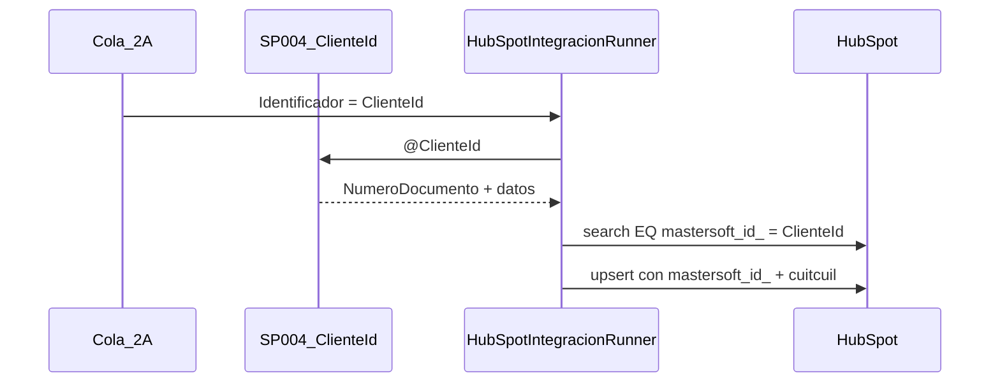
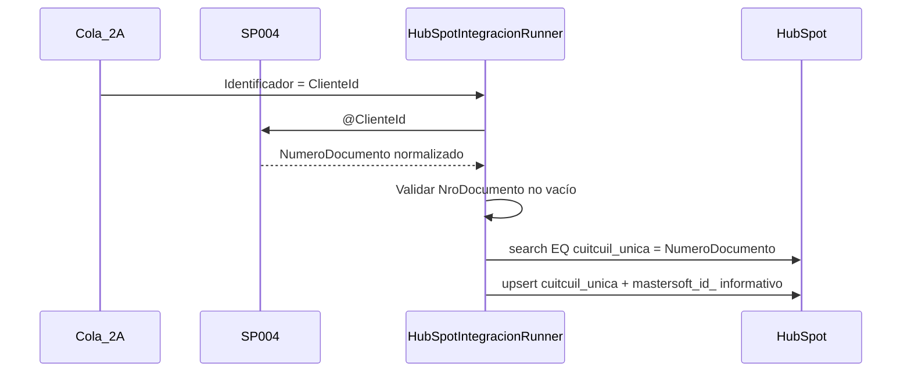

# Plan: correlación HubSpot por `cuitcuil_unica` (NroDocumento)

## Contexto actual



**Puntos de acoplamiento hoy** (todos usan `ClienteId.ToString()` como clave HubSpot):

- [`HubSpotIntegracionRunner.cs`](SolucionInterfazHubSpot/InterfazHubSpot.Business/HubSpot/HubSpotIntegracionRunner.cs): `SincronizarClienteColaAsync` (2A), `EjecutarSincronizacionCuentaCorriente` (2B), `BuildCompanyProperties`, métodos diagnóstico.
- [`HubSpotCrmClient.cs`](SolucionInterfazHubSpot/InterfazHubSpot.Business/HubSpot/HubSpotCrmClient.cs): `SearchCompanyIdByMastersoftIdAsync` filtra por `HubSpot:PropertyMastersoftId`.
- SP [`004`](scriptsSQL/004_InterfazHubSpot_Cliente_Obtener.sql) ya devuelve `NumeroDocumento` normalizado (sin `-`, `.`, `,`).
- SP [`006`](scriptsSQL/006_InterfazHubSpot_CuentaCorriente_Pagina.sql) **no** devuelve `NroDocumento` — bloqueante para 2B.

**Qué NO cambia** (decisión de alcance):

- Cola `ProcesosSpertaHubSpot.Identificador` sigue siendo `ClienteId` (INT) vía [`IntegracionColaIdentificador`](SolucionInterfazHubSpot/InterfazHubSpot.Business/Integration/IntegracionColaIdentificador.cs).
- SPs 004/005/010 siguen parametrizados por `@ClienteId`.
- Trazas MVC siguen aceptando `?clienteId=` para invocar SPs; internamente la búsqueda HubSpot usará el CUIT del SP.
- `mastersoft_id_` **se sigue enviando** en create/patch como dato informativo (ClienteId string).
- Propiedad `cuitcuil` **deja de enviarse**; solo `cuitcuil_unica`.

---

## Estado objetivo



---

## 1. Configuración

**Archivo:** [`HubSpotConfiguration`](SolucionInterfazHubSpot/InterfazHubSpot.Business/HubSpot/HubSpotCrmClient.cs) + plantillas config.

| Clave nueva | Default | Uso |
|-------------|---------|-----|
| `HubSpot:PropertyCuitCuilUnica` | `cuitcuil_unica` | **Búsqueda** y valor de correlación en upsert |

| Clave existente | Default | Uso nuevo |
|-----------------|---------|-----------|
| `HubSpot:PropertyMastersoftId` | `mastersoft_id_` | Solo payload informativo (ClienteId) |

Actualizar: [`Web.config.example`](SolucionInterfazHubSpot/Web.config.example), [`App.config.example`](SolucionInterfazHubSpot/InterfazHubSpot.BatchProcess/App.config.example), [`implementacion/.../App.config.example`](implementacion/ServicioInterfazHubSpot_Implementacion/App.config.example), [`docs/reference/configuracion.md`](docs/reference/configuracion.md).

**Deploy:** agregar la clave en configs reales de IIS y servicio Windows (no versionados).

---

## 2. Helper de normalización y validación

**Nuevo archivo sugerido:** `SolucionInterfazHubSpot/InterfazHubSpot.Business/Integration/HubSpotCuitCuilHelper.cs`

```csharp
// Normalización idempotente (misma regla que SP 004)
public static string Normalizar(string nroDocumento)
    => nroDocumento?.Replace("-","").Replace(".","").Replace(",","").Trim();

public static bool TryGetClaveUnica(string numeroDocumento, out string clave, out string error)
// clave vacía → error: "NroDocumento requerido para correlación HubSpot (cuitcuil_unica)."
```

**Tests unitarios** en `InterfazHubSpot.Tests.Unit/Integration/HubSpotCuitCuilHelperTests.cs`: vacío, con guiones, ya normalizado.

---

## 3. HubSpotCrmClient — búsqueda

Refactorizar en [`HubSpotCrmClient.cs`](SolucionInterfazHubSpot/InterfazHubSpot.Business/HubSpot/HubSpotCrmClient.cs):

- Renombrar `SearchCompanyIdByMastersoftIdAsync` → `SearchCompanyIdByCuitCuilUnicaAsync` (o método genérico `SearchCompanyIdByPropertyAsync` si se prefiere menos acoplamiento).
- Filtro search: `propertyName = _cfg.PropertyCuitCuilUnica`, `value = clave normalizada`.
- `properties` en request: incluir `PropertyCuitCuilUnica` + `name`.

Actualizar callers y tests: [`HubSpotCrmClientEndpointsTests.cs`](SolucionInterfazHubSpot/InterfazHubSpot.Tests.Unit/HubSpot/HubSpotCrmClientEndpointsTests.cs), [`HubSpotInternalsTests.cs`](SolucionInterfazHubSpot/InterfazHubSpot.Tests.Unit/HubSpotInternalsTests.cs), [`DevelopmentHubSpotStubTests.cs`](SolucionInterfazHubSpot/InterfazHubSpot.Tests.Unit/DevelopmentHubSpotStubTests.cs).

---

## 4. Flujo 2A — `HubSpotIntegracionRunner`

### 4.1 `SincronizarClienteColaAsync`

Tras `ObtenerClienteParaHubSpot(clienteIdCola)`:

1. **Validar** `TryGetClaveUnica(dto.Cliente?.NumeroDocumento, out cuitCuilUnica, out err)` — si falla → `InvalidOperationException` → cola `Error` (sin reintento).
2. **Buscar** company: `SearchCompanyIdByCuitCuilUnicaAsync(cuitCuilUnica)`.
3. Trazas: renombrar pasos `search_by_mastersoft` → `search_by_cuitcuil_unica`; payload JSON con `cuitCuilUnica` (no `mastersoftKey`).

### 4.2 `BuildCompanyProperties`

En [`BuildCompanyProperties`](SolucionInterfazHubSpot/InterfazHubSpot.Business/HubSpot/HubSpotIntegracionRunner.cs) (~L526):

| Antes | Después |
|-------|---------|
| `["cuitcuil"] = nroDoc` | **Eliminar** |
| `[_hubCfg.PropertyMastersoftId] = clientePk.ToString()` | **Mantener** (informativo) |
| *(no existía)* | `[_hubCfg.PropertyCuitCuilUnica] = clave normalizada` |

Pasar `cuitCuilUnica` ya normalizado como parámetro adicional al método.

### 4.3 Diagnóstico MVC

- `DiagnosticarBuscarEmpresaHubSpot(int clienteId)`: cargar SP 004 vía manager, validar NroDocumento, buscar por `cuitcuil_unica`.
- `DiagnosticarUpsertEmpresaHubSpot`: mismo patrón.

### 4.4 UI MVC

- [`Index.cshtml`](SolucionInterfazHubSpot/InterfazHubSpot/Views/Home/Index.cshtml) paso 3: texto "por `cuitcuil_unica` (CUIT/CUIL del cliente)".
- Comentarios en [`HomeController.cs`](SolucionInterfazHubSpot/InterfazHubSpot/Controllers/HomeController.cs).

---

## 5. Flujo 2B — cuenta corriente batch

### 5.1 SQL — SP 006

En [`006_InterfazHubSpot_CuentaCorriente_Pagina.sql`](scriptsSQL/006_InterfazHubSpot_CuentaCorriente_Pagina.sql), agregar al SELECT final:

```sql
NumeroDocumento = REPLACE(REPLACE(REPLACE(c.NroDocumento, '-',''), '.',''), ',','')
-- JOIN dbo.Clientes c ON c.ClienteID = pc.ClienteID
```

Redeploy vía [`000_Deploy_All.sql`](scriptsSQL/000_Deploy_All.sql) o script incremental `011_*` si el equipo prefiere migración atómica.

### 5.2 DTO + mapper

- [`ItemCuentaCorrienteDto`](SolucionInterfazHubSpot/InterfazHubSpot.Business/Integration/Dtos/ClienteIntegracionDto.cs): propiedad `NumeroDocumento`.
- [`ClienteIntegracionMapper.MapearPaginaCuentaCorriente`](SolucionInterfazHubSpot/InterfazHubSpot.Business/Integration/ClienteIntegracionMapper.cs): mapear columna.
- Tests: [`ClienteIntegracionMapperTests.cs`](SolucionInterfazHubSpot/InterfazHubSpot.Tests.Unit/Managers/ClienteIntegracionMapperTests.cs).

### 5.3 Loop 2B en runner

Reemplazar (~L278-299):

```csharp
// Antes
var mastersoftKey = clienteId.ToString(...);
hubCompanyId = await _hub.SearchCompanyIdByMastersoftIdAsync(mastersoftKey);

// Después
if (!TryGetClaveUnica(it.NumeroDocumento, out var cuitCuilUnica, out _))
{
    _log.Registrar(..., "BatchCcSinNroDocumento", false, ...);
    continue;
}
hubCompanyId = await _hub.SearchCompanyIdByCuitCuilUnicaAsync(cuitCuilUnica);
```

Mensajes de log: referenciar `cuitcuil_unica={cuitCuilUnica}` en lugar de `PropertyMastersoftId`.

---

## 6. Tests — resumen de impacto

| Archivo | Cambio |
|---------|--------|
| `HubSpotIntegracionRunnerPayloadTests.cs` | Assert `cuitcuil_unica` en payload; sin `cuitcuil`; `mastersoft_id_` sigue presente |
| `HubSpotCrmClientEndpointsTests.cs` | Body search usa `PropertyCuitCuilUnica` |
| `ClienteIntegracionMapperTests.cs` | Columna `NumeroDocumento` en pagina CC |
| **Nuevo** `HubSpotCuitCuilHelperTests.cs` | Normalización + validación |
| **Nuevo** (opcional) test runner 2A sin NroDocumento → excepción | Via reflexión o test de integración ligero |
| `IntegracionColaIdentificadorTests.cs` | **Sin cambios** (cola sigue con ClienteId) |

Verificación final: `pwsh -NoProfile -File scriptsPS1/Verify-InterfazHubSpot.ps1 -LibrariesOnly`

---

## 7. Documentación

| Documento | Actualización |
|-----------|---------------|
| [`docs/PRD_Integracion_HubSpot_2A_2B.md`](docs/PRD_Integracion_HubSpot_2A_2B.md) | Tabla campos SP→HubSpot: correlación = `cuitcuil_unica` ← `NroDocumento`; `mastersoft_id_` informativo; flujos 2A/2B paso search |
| [`docs/reference/hubspot-crm.md`](docs/reference/hubspot-crm.md) | Nueva clave config; endpoint search por CUIT |
| [`docs/reference/configuracion.md`](docs/reference/configuracion.md) | `PropertyCuitCuilUnica` |
| [`docs/reference/base-datos.md`](docs/reference/base-datos.md) | SP 006 devuelve `NumeroDocumento` |
| [`docs/explanation/flujos-2a-2b.md`](docs/explanation/flujos-2a-2b.md) | Diagramas y bullets de correlación |
| [`docs/explanation/dominio.md`](docs/explanation/dominio.md) | `PropMS` → `PropCuitCuilUnica` en diagrama |
| [`docs/reference/consola-mvc.md`](docs/reference/consola-mvc.md) | Paso 3 busca por CUIT |
| [`.planning/REQUIREMENTS.md`](.planning/REQUIREMENTS.md) | 2A-03, 2B-06 wording |

---

## 8. Postman

### Environment [`InterfazHubSpot-Dev.postman_environment.json`](postman/InterfazHubSpot-Dev.postman_environment.json)

| Variable | Acción |
|----------|--------|
| `mastersoftId` | Mantener — ClienteId para SP/trazas MVC |
| `cuitCuilUnica` | **Nueva** — ej. `30999999990` (normalizado, sin guiones) |
| `propertyCuitCuilUnica` | **Nueva** — default `cuitcuil_unica` |
| `propertyMastersoftId` | Mantener — payload informativo |

### Collection [`InterfazHubSpot-HubSpot.postman_collection.json`](postman/InterfazHubSpot-HubSpot.postman_collection.json)

- Renombrar request "POST Buscar compañía por mastersoft_id_" → "por cuitcuil_unica".
- Search body: `propertyName: {{propertyCuitCuilUnica}}`, `value: {{cuitCuilUnica}}`.
- Create company: quitar `cuitcuil`, agregar `"{{propertyCuitCuilUnica}}": "{{cuitCuilUnica}}"`.
- GET properties queries: incluir `{{propertyCuitCuilUnica}}`.
- Descripciones trazas MVC: aclarar que `clienteId` resuelve SP y el runner busca por CUIT.

### [`postman/README.md`](postman/README.md)

Actualizar orden de prueba y tabla de pasos.

---

## 9. Migración de datos HubSpot (operacional — fuera del código)

Antes de activar en producción:

1. **Verificar** que la propiedad custom `cuitcuil_unica` existe en el portal HubSpot (tipo texto, única si el negocio lo requiere).
2. **Backfill** companies existentes: poblar `cuitcuil_unica` desde ERP (`NroDocumento` normalizado) para registros que hoy solo tienen `mastersoft_id_`. Sin esto, 2B no encontrará companies hasta que 2A las actualice.
3. **Smoke test Postman:** buscar por `cuitCuilUnica` de un cliente conocido antes de corrida batch.

---

## 10. Orden de implementación recomendado


1. Helper + config + refactor search client
2. Runner 2A + payload + diagnóstico
3. SQL 006 + mapper + runner 2B
4. Tests y Verify
5. Documentación y Postman
6. Deploy SQL en MSGestion → deploy binarios → backfill HubSpot

---

## Riesgos y mitigaciones

| Riesgo | Mitigación |
|--------|------------|
| Cliente sin `NroDocumento` en ERP | 2A → Error en cola; 2B → skip + log `BatchCcSinNroDocumento` |
| Duplicados CUIT en HubSpot | Comportamiento actual: primer resultado; documentar en PRD |
| Companies legacy sin `cuitcuil_unica` | Backfill manual/script HubSpot antes de go-live 2B |
| Config prod sin nueva clave | Default en código `cuitcuil_unica` si clave ausente |
