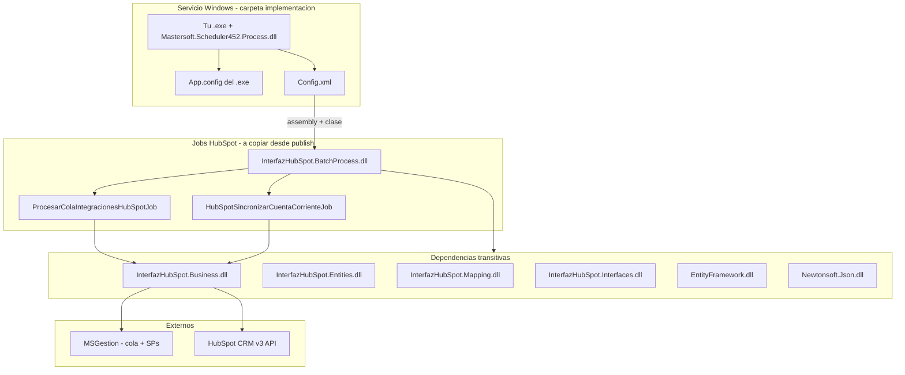

# Plan: interconexión servicio Windows ↔ batch HubSpot

## Cómo se conectan las piezas

El servicio que instalaste con `sc create` (tu `.exe` + `Mastersoft.Scheduler452.Process.dll`) es el **host**. No ejecuta lógica HubSpot directamente: lee [`implementacion/ServicioInterfazHubSpot_Implementacion/Config.xml`](implementacion/ServicioInterfazHubSpot_Implementacion/Config.xml), carga el assembly indicado en cada `<proceso>`, instancia la clase que implementa `IScheduler`, le inyecta `MSContext` desde `<mscfg>` + `App.config`, y llama `Execute()`.



Contrato que cumplen los jobs ([`ProcesarColaIntegracionesHubSpotJob.cs`](InterfazHubSpot.BatchProcess/ProcesarColaIntegracionesHubSpotJob.cs), [`HubSpotSincronizarCuentaCorrienteJob.cs`](InterfazHubSpot.BatchProcess/HubSpotSincronizarCuentaCorrienteJob.cs)):

```csharp
public interface IScheduler {
    MSContext Contexto { get; set; }
    bool Finished { get; set; }
    void Execute(XmlElement oParam, XmlElement oReturn);
}
```

La consola MVC ya usa el mismo patrón: instancia el job, asigna `Contexto`, llama `Execute(null, null)` — por eso si MVC funciona con tu `Web.config`, el servicio funcionará con un `App.config` equivalente.

---

## Estado actual: qué ya encaja y qué no

### Ya presente en [`implementacion/ServicioInterfazHubSpot_Implementacion/`](implementacion/ServicioInterfazHubSpot_Implementacion/)

| Pieza | Rol |
|-------|-----|
| `Mastersoft.Scheduler452.Process.dll` | Motor del scheduler |
| `Mastersoft.Scheduler452.Intefaces.dll` | Contrato `IScheduler` |
| `Mastersoft.Procesos.BatchProcess.dll` | Plantilla de otro producto Mastersoft (no HubSpot) |
| `EntityFramework*.dll`, `Mastersoft.Framework.*.dll` | Framework compartido |
| `Config.xml` | Programación de procesos |

### Presente en [`publish/bin/`](publish/bin/) (salida de publish MVC)

Incluye los DLLs HubSpot necesarios (`InterfazHubSpot.BatchProcess.dll`, `Business`, `Entities`, `Mapping`, `Interfaces`) **más** muchas DLLs solo-MVC (`System.Web.Mvc`, `Autofac`, `Owin`, `InterfazHubSpot.dll`, `ActiveReports`, etc.) que el servicio **no necesita** pero tampoco rompen si están en la carpeta.

### Bloqueos actuales (por eso no se interconectarían “solos”)

1. **`Config.xml` apunta al assembly equivocado** — hoy ambos procesos usan `Mastersoft.Procesos.BatchProcess` / `Procesos`, que no son los jobs HubSpot de este repo.
2. **Faltan los DLLs `InterfazHubSpot.*` en implementacion** — sin copiarlos, el host no puede cargar los jobs aunque corrijas el XML.
3. **Falta `App.config` junto al `.exe`** — connection string `MSGestion`, `HubSpot:PrivateAppToken`, `EmpresaId`, etc. El código lee `ConfigurationManager` del config del **proceso host**, no del DLL.
4. **Proceso 2B deshabilitado** — `habilitado="false"` en el proceso `id="02"`.
5. **Frecuencia 2A** — `minutosespera="1"` vs PRD/README que sugieren **5 minutos**.

---

## Qué copiar desde `publish/bin`

**Opción recomendada (más limpia):** copiar desde [`InterfazHubSpot.BatchProcess/bin/Release/net452/`](InterfazHubSpot.BatchProcess/bin/Release/net452/) — es el conjunto mínimo verificado del proyecto batch (ya compilado en tu workspace).

**Opción alternativa (tu caso):** copiar solo este subconjunto desde `publish/bin` a la carpeta del servicio (junto al `.exe`):

**Obligatorios:**
- `InterfazHubSpot.BatchProcess.dll`
- `InterfazHubSpot.Business.dll` + `InterfazHubSpot.Business.dll.config`
- `InterfazHubSpot.Entities.dll`
- `InterfazHubSpot.Interfaces.dll`
- `InterfazHubSpot.Mapping.dll` + `InterfazHubSpot.Mapping.dll.config`
- `Mastersoft.Framework.Cache.dll` (requerido por Business; **no** está hoy en implementacion)
- `Newtonsoft.Json.dll`
- `Google.Authenticator.dll`

**Ya en implementacion (verificar versión, no duplicar ciegamente):**
- `EntityFramework.dll`, `EntityFramework.SqlServer.dll`
- `Mastersoft.Framework.Standard.dll`, `.Interfaces.dll`, `.DataRepository.dll`
- `Mastersoft.Scheduler452.Intefaces.dll`

**No copiar (innecesarios para el servicio):**
- `InterfazHubSpot.dll`, `System.Web.Mvc.dll`, `Autofac*.dll`, `Microsoft.Owin*.dll`, `EPPlus.dll`, `ActiveReports*.dll`, carpeta `roslyn/`, etc.

**Regla de versiones:** si un DLL ya existe en implementacion y en `publish/bin`, preferir la versión que vino con el **paquete del servicio Mastersoft** para Framework/Scheduler, y la de **publish** solo para `InterfazHubSpot.*` y dependencias NuGet (`Newtonsoft.Json`, `Google.Authenticator`, `Mastersoft.Framework.Cache`).

---

## Cambios de configuración necesarios

### 1. Corregir `Config.xml`

Reemplazar la plantilla genérica por los jobs reales:

```xml
<msscheduler debug="true" debugstatus="false">
  <procesos>
    <proceso id="01"
             assembly="InterfazHubSpot.BatchProcess"
             clase="ProcesarColaIntegracionesHubSpotJob"
             horafija=""
             minutosespera="5"
             habilitado="true">
      <mscfg cnprefix="MSGestion" cn="" empresaid="1" />
      <parametros multitenant="N" enablelog="S" />
    </proceso>

    <proceso id="02"
             assembly="InterfazHubSpot.BatchProcess"
             clase="HubSpotSincronizarCuentaCorrienteJob"
             horafija="3:00"
             minutosespera=""
             habilitado="true">
      <mscfg cnprefix="MSGestion" cn="" empresaid="1" />
      <parametros multitenant="N" enablelog="S" />
    </proceso>
  </procesos>
</msscheduler>
```

Convención Mastersoft: `assembly` = nombre sin `.dll`; `clase` = nombre de clase completo en el namespace `InterfazHubSpot.BatchProcess`.

### 2. Crear `App.config` junto al `.exe`

Basarse en [`InterfazHubSpot.BatchProcess/App.config.example`](InterfazHubSpot.BatchProcess/App.config.example) y alinear con tu [`Web.config`](InterfazHubSpot/Web.config) de MVC (misma BD, mismo token):

| Clave | Obligatorio en prod |
|-------|---------------------|
| `connectionStrings/MSGestion` | Sí |
| `HubSpot:PrivateAppToken` | Sí si `UseDevelopmentMock=false` |
| `HubSpot:UseDevelopmentMock` | `false` en prod |
| `EmpresaId` | Sí — debe coincidir con `mscfg empresaid="1"` |
| `FrameworkCNPrefix` | Recomendado (`InterfazHubSpot`) |
| `EmailErrDE`, `EmailErrPara` | Recomendado — notificación de errores ([`EmailsManager.cs`](InterfazHubSpot.Business/Managers/EmailsManager.cs)) |
| `PathLog` | Opcional |

El `.exe` del servicio Windows lee su propio `NombreServicio.exe.config` (renombrar `App.config` al instalar si aplica).

### 3. Instalación del servicio (`sc create`)

Tu enfoque es válido. Verificar:

- `binPath` apunta al `.exe` en la **misma carpeta** donde quedan `Config.xml`, todos los DLL y el `.config`.
- La cuenta del servicio tiene permisos sobre SQL Server (`Integrated Security` o credenciales en connection string).
- Tras copiar DLLs nuevos: reiniciar el servicio (`sc stop` / `sc start`).

---

## Checklist de verificación post-despliegue

1. **Archivos:** en la carpeta del servicio existen `InterfazHubSpot.BatchProcess.dll` + dependencias listadas + `Config.xml` corregido + `.exe.config` con token y BD.
2. **Log del scheduler:** con `debug="true"` en `Config.xml`, revisar salida/log del host al arrancar (debe intentar cargar `InterfazHubSpot.BatchProcess`).
3. **Smoke 2A:** insertar fila pendiente en `dbo.ProcesosSpertaHubSpot` y esperar 5 min (o forzar intervalo menor temporalmente); verificar que pasa a `Ok`/`Error`.
4. **Smoke 2B:** habilitar proceso `02`, esperar hora fija o ajustar `horafija` para prueba; verificar actualización de `manejo_cuenta_corriente` en HubSpot.
5. **Paridad con MVC:** si `POST /Home/ProcesarColaHubSpot` funciona en el servidor con el mismo `Web.config`, el servicio debería comportarse igual con `App.config` equivalente.

---

## Respuesta directa a tu pregunta

**¿Basta con copiar `publish/bin` a implementacion?**

- **Parcialmente sí:** los DLLs de integración HubSpot en `publish/bin` son los correctos y el host Mastersoft que ya tienes sabe cargar assemblies vía `Config.xml`.
- **No se interconectarán solos** sin:
  1. Actualizar `Config.xml` a `InterfazHubSpot.BatchProcess` + nombres de job reales.
  2. Agregar `App.config` del `.exe` con BD y token HubSpot.
  3. Copiar al menos los DLLs `InterfazHubSpot.*` y `Mastersoft.Framework.Cache.dll` (falta en implementacion).
- **No hace falta copiar todo `publish/bin`** — es publish del sitio MVC; copiar el subconjunto batch evita ruido y conflictos de versión.

`Mastersoft.Procesos.BatchProcess.dll` que ya está en implementacion es de la plantilla original; **no es el puente a HubSpot** en este proyecto. Puedes dejarlo (no molesta) o quitarlo una vez confirmado que los dos procesos apuntan a `InterfazHubSpot.BatchProcess`.

---

## Diagrama de carpetas objetivo

```
C:\Ruta\ServicioInterfazHubSpot\          ← binPath de sc create
├── TuServicio.exe
├── TuServicio.exe.config                 ← App.config (MSGestion + HubSpot)
├── Config.xml                            ← jobs 2A y 2B corregidos
├── Mastersoft.Scheduler452.Process.dll   ← ya lo tienes
├── Mastersoft.Scheduler452.Intefaces.dll
├── InterfazHubSpot.BatchProcess.dll      ← desde publish/bin
├── InterfazHubSpot.Business.dll (+ .config)
├── InterfazHubSpot.Entities.dll
├── InterfazHubSpot.Interfaces.dll
├── InterfazHubSpot.Mapping.dll (+ .config)
├── Mastersoft.Framework.Cache.dll        ← agregar
├── Newtonsoft.Json.dll
├── Google.Authenticator.dll
├── EntityFramework.dll
└── EntityFramework.SqlServer.dll
```
