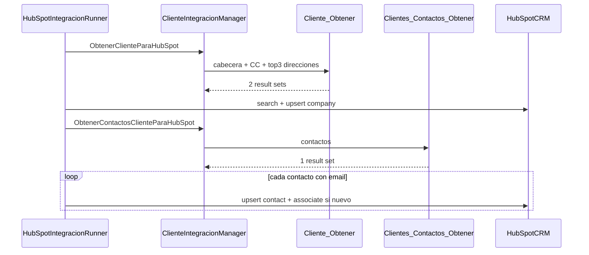

# Dividir obtención de datos en flujo 2A — con auditoría de equivalencias

## Objetivo

Separar la obtención ERP en dos SPs (empresa+direcciones / contactos) y garantizar que **SP → DTO → HubSpot** cumpla las tablas de equivalencia Sperta–HubSpot provistas.



---

## Auditoría de equivalencias — estado actual

### SP `InterfazHubSpot_Cliente_Obtener` → Company HubSpot

| Campo Sperta | HubSpot (`internal`) | SP 004 | DTO | Mapper | `BuildCompanyProperties` | Estado |
|---|---|---|---|---|---|---|
| Razon Social | `name` | `RazonSocial` | `RazonSocial` | OK | OK (Coalesce) | OK |
| Nombre Fantasia | `nombre_fantasia` | `ApellidoYNombre` | `ApellidoYNombre` | OK | OK | OK |
| CUIT/CUIL | `cuitcuil` | `NumeroDocumento` | `NumeroDocumento` | OK | OK | OK |
| NRO CLIENTE | `nro_cliente` | `CodigoCliente` | `CodigoCliente` (root) | OK | OK | OK |
| mastersoft id | `mastersoft_id` | `ClienteId` | `ClienteId` | OK | OK (pk) | OK |
| **Manejo Cuenta Corriente** | `manejo_cuenta_corriente` | **FALTA** | **FALTA** en `ClienteDatosDto` | **FALTA** | **FALTA** | **GAP** |
| Calle | `adress` | `Calle` | `Calle` | OK | OK | OK |
| Puerta | `puerta` | `Puerta` | `Puerta` | OK | OK | OK |
| Localidad | `city` | `Localidad` | `Localidad` | OK | OK | OK |
| C.P | `zip` | `CodigoPostal` | `CodigoPostal` | OK | OK | OK |
| Provincia (fiscal) | `state` | `CodigoProvinciaCliente` | `CodigoProvinciaCliente` | OK | OK | OK |
| Pais (fiscal) | `Country` | `CodigoPais` | `CodigoPais` | OK | OK | OK |
| Zona Vta | `zona_vta` | `Zona` | `ZonaId` | **lee `ZonaId`** | usa `ZonaId` | **GAP mapper** |
| Vendedor | `vendedor` | `Vendedor` | `VendedorId` | **lee `VendedorId`** | usa `VendedorId` | **GAP mapper** |
| Responsable de Cuenta | `responsable_de_cuenta` | `ResponsableCuenta` | `ResponsableCuentaId` | **lee `ResponsableCuentaId`** | usa `ResponsableCuentaId` | **GAP mapper** |
| Lista de Precios | `lista_de_precios` | `ListaPrecios` | `ListaPreciosId` | **lee `ListaPreciosId`** | usa `ListaPreciosId` | **GAP mapper** |
| Condicion de Venta | `condicion_de_venta` | `CondicionVenta` | `CondicionVentaId` | **lee `CondicionVentaId`** | usa `CondicionVentaId` | **GAP mapper** |
| Dias para Deuda | `dias_para_deuda` | `DiasParaDeuda` | `DiasParaDeuda` | OK | OK | OK |
| Limite de Credito | `limite_de_credito` | `LimiteCredito` | `LimiteCredito` | OK | OK | OK |
| CATEGORIA CLIENTE | `categoria_cliente` | `CategoriaCliente` | `CategoriaClienteId` | **lee `CategoriaClienteId`** | usa `CategoriaClienteId` | **GAP mapper** |

**Nota:** Los nombres internos del DTO (`ZonaId`, `VendedorId`, etc.) pueden conservarse; lo crítico es que el **mapper lea las columnas reales del SP** (`Zona`, `Vendedor`, …). El runner ya mapea correctamente a HubSpot.

### SP `InterfazHubSpot_Cliente_Obtener` → Direcciones de entrega (TOP 3)

| Campo Sperta | HubSpot | SP 004 | DTO | Mapper | `BuildCompanyProperties` | Estado |
|---|---|---|---|---|---|---|
| Direccion N Domicilio | `direccion_N_domicilio` | `Domicilio` | `Domicilio` | OK | OK | OK |
| Direccion N CP | `direccion_N_cp` | `CodigoPostal` | `CodigoPostal` | OK | OK | OK |
| Direccion N Localidad | `direccion_N_localidad` | `Localidad` | `Localidad` | OK | OK | OK |
| Direccion N Provincia | `direccion_N_provincia` | `Provincia` | `ProvinciaId` | **lee `ProvinciaId`** | usa `ProvinciaId` | **GAP mapper** |
| Direccion N Pais | `direccion_N_pais` | `Pais` (sin ISNULL) | **FALTA `Pais`** | **FALTA** | **FALTA** | **GAP** |

### SP `InterfazHubSpot_Clientes_Contactos_Obtener` → Contact HubSpot

| Campo Sperta | HubSpot | SP 005 | DTO | Mapper | `BuildContactProperties` | Estado |
|---|---|---|---|---|---|---|
| Nombre | `firstname` | `ApellidoYNombre` | `ApellidoYNombre` | pendiente split | OK | OK (tras split) |
| Sector | `sector` | `Sector` | `SectorId` | **lee `SectorId`** | usa `SectorId` | **GAP mapper** |
| Telefono | `phone` | `Telefono` | `Telefono` | pendiente split | OK | OK |
| Email | `email` | `CorreoElectronico` | `CorreoElectronico` | pendiente split | OK | OK |

### Bugs SQL detectados

- [`scriptsSQL/005_InterfazHubSpot_Clientes_Contactos_Obtener.sql`](scriptsSQL/005_InterfazHubSpot_Clientes_Contactos_Obtener.sql): `DROP PROCEDURE` apunta a `InterfazHubSpot_Cliente_Obtener` (incorrecto).
- [`scriptsSQL/004_InterfazHubSpot_Cliente_Obtener.sql`](scriptsSQL/004_InterfazHubSpot_Cliente_Obtener.sql): comentario dice "3 result sets"; son 2.
- [`scriptsSQL/000_Deploy_All.sql`](scriptsSQL/000_Deploy_All.sql): no incluye SP 005 contactos; cuenta corriente debe ser 006.

---

## Decisiones confirmadas

1. **Alias SP:** mantener nombres del SP (`Zona`, `Vendedor`, `Provincia`, `Sector`, `Pais`) — adaptar mapper C#.
2. **Manejo Cuenta Corriente en 2A:** incluir en SP 004 con **la misma lógica completa** del SP 006 (por `@ClienteId`), y enviarlo en `BuildCompanyProperties` vía `_hubCfg.PropertyManejoCuentaCorriente`.

---

## Plan de implementación

### 1. SQL — SP 004 con equivalencias completas

**Archivo:** [`scriptsSQL/004_InterfazHubSpot_Cliente_Obtener.sql`](scriptsSQL/004_InterfazHubSpot_Cliente_Obtener.sql)

- Result set 1 (cabecera): agregar columna `ManejoCuentaCorriente` calculada con la lógica de deuda del SP 006, filtrada por `@ClienteId` (extraer CTEs 2–6 de [`006_InterfazHubSpot_CuentaCorriente_Pagina.sql`](scriptsSQL/006_InterfazHubSpot_CuentaCorriente_Pagina.sql) reemplazando `PaginaClientes` por el cliente único).
- **Recomendación de mantenibilidad:** extraer la lógica compartida a función SQL `dbo.InterfazHubSpot_ManejoCuentaCorriente_Texto(@ClienteId INT)` usada por 004 y 006 (evita duplicar 80+ líneas).
- Result set 2 (direcciones): `ISNULL(paisDe.Descripcion, N'')` en `Pais`.
- Mantener alias: `Zona`, `Vendedor`, `ResponsableCuenta`, `ListaPrecios`, `CondicionVenta`, `CategoriaCliente`, `Provincia`, `Pais`.

### 2. SQL — SP 005 contactos

**Archivo:** [`scriptsSQL/005_InterfazHubSpot_Clientes_Contactos_Obtener.sql`](scriptsSQL/005_InterfazHubSpot_Clientes_Contactos_Obtener.sql)

- Corregir `DROP PROCEDURE dbo.InterfazHubSpot_Clientes_Contactos_Obtener`.
- Mantener columnas: `ApellidoYNombre`, `CorreoElectronico`, `Telefono`, `Sector`.

### 3. SQL — deploy y copias

- Actualizar [`scriptsSQL/000_Deploy_All.sql`](scriptsSQL/000_Deploy_All.sql): 004 → 005 contactos → 006 cuenta corriente.
- Sincronizar [`sql/003_USP_Integracion_HubSpot_Cliente_Obtener.sql`](sql/003_USP_Integracion_HubSpot_Cliente_Obtener.sql) y crear `sql/006_InterfazHubSpot_Clientes_Contactos_Obtener.sql`.
- Si se crea función compartida CC: nuevo script `scriptsSQL/007_InterfazHubSpot_ManejoCuentaCorriente_Texto.sql` (o inline en 004/006 según preferencia de deploy).

### 4. DTOs — contrato alineado a equivalencias

**Archivo:** [`InterfazHubSpot.Business/Integration/Dtos/ClienteIntegracionDto.cs`](InterfazHubSpot.Business/Integration/Dtos/ClienteIntegracionDto.cs)

| DTO (mantener nombre interno) | Columna SP | HubSpot |
|---|---|---|
| `ManejoCuentaCorriente` **(nuevo)** | `ManejoCuentaCorriente` | `manejo_cuenta_corriente` |
| `ZonaId` | `Zona` | `zona_vta` |
| `VendedorId` | `Vendedor` | `vendedor` |
| `ResponsableCuentaId` | `ResponsableCuenta` | `responsable_de_cuenta` |
| `ListaPreciosId` | `ListaPrecios` | `lista_de_precios` |
| `CondicionVentaId` | `CondicionVenta` | `condicion_de_venta` |
| `CategoriaClienteId` | `CategoriaCliente` | `categoria_cliente` |
| `DireccionEntregaDto.Pais` **(nuevo)** | `Pais` | `direccion_N_pais` |
| `DireccionEntregaDto.ProvinciaId` | `Provincia` | `direccion_N_provincia` |
| `ContactoDto.SectorId` | `Sector` | `sector` |

- Quitar `ListaClientesContactos` de `ClienteDatosDto` (contactos van por SP/método dedicado).

### 5. Mapper — puente SP → DTO

**Archivo:** [`InterfazHubSpot.Business/Integration/ClienteIntegracionMapper.cs`](InterfazHubSpot.Business/Integration/ClienteIntegracionMapper.cs)

```csharp
// Cabecera — leer columnas SP reales
ManejoCuentaCorriente = GetStr(row, "ManejoCuentaCorriente"),
ZonaId = GetStr(row, "Zona"),
VendedorId = GetStr(row, "Vendedor"),
// ... ResponsableCuenta, ListaPrecios, CondicionVenta, CategoriaCliente

// Direcciones
ProvinciaId = GetStr(d, "Provincia"),
Pais = GetStr(d, "Pais"),

// Contactos (nuevo MapearContactos)
SectorId = GetStr(c, "Sector"),
```

- `MapearCliente(cabecera, direcciones)` — 2 result sets.
- `MapearContactos(contactos) → List<ContactoDto>`.

### 6. Manager — dos SPs

**Archivo:** [`InterfazHubSpot.Business/Managers/ClienteIntegracionManager.cs`](InterfazHubSpot.Business/Managers/ClienteIntegracionManager.cs)

- `ObtenerClienteParaHubSpot`: 2 result sets del SP 004.
- `ObtenerContactosClienteParaHubSpot`: 1 result set del SP 005.

### 7. Runner — payload HubSpot completo

**Archivo:** [`InterfazHubSpot.Business/HubSpot/HubSpotIntegracionRunner.cs`](InterfazHubSpot.Business/HubSpot/HubSpotIntegracionRunner.cs)

En `BuildCompanyProperties`, agregar:

```csharp
[_hubCfg.PropertyManejoCuentaCorriente] = ms.ManejoCuentaCorriente ?? string.Empty,
// ...
props["direccion_" + n + "_pais"] = d.Pais ?? string.Empty;
```

En `SincronizarClienteColaAsync`:

1. SP 004 → upsert company.
2. SP 005 → upsert/associate contactos.

`DiagnosticarSincronizarContactosCliente` usa `ObtenerContactosClienteParaHubSpot`.

### 8. Tests

| Archivo | Cobertura nueva |
|---|---|
| `ClienteIntegracionMapperTests` | Alias SP (`Zona`, `Provincia`, `Sector`, `Pais`, `ManejoCuentaCorriente`); `MapearContactos` |
| `HubSpotIntegracionRunnerPayloadTests` | `manejo_cuenta_corriente`, `direccion_1_pais` |
| `ClienteIntegracionManagerLiveTests` | Stub Live para contactos SP |

Verificación: `pwsh -NoProfile -File InterfazHubSpot/Scripts/agent/Verify-InterfazHubSpot.ps1`

### 9. Documentación

Actualizar [`README.md`](README.md), [`AGENTS.md`](AGENTS.md) con tabla de equivalencias resumida y numeración SP 004/005/006.

---

## Matriz de verificación post-implementación

Checklist para cerrar la fase (todos deben quedar en OK):

- [ ] SP 004 devuelve los 22 campos de equivalencia (incl. `ManejoCuentaCorriente` + 5 campos × 3 direcciones)
- [ ] SP 005 devuelve 4 campos de contacto
- [ ] Mapper lee columnas SP sin fallback vacío por nombre incorrecto
- [ ] `BuildCompanyProperties` envía las 22 propiedades HubSpot de company
- [ ] `BuildContactProperties` envía `firstname`, `sector`, `phone`, `email`
- [ ] Flujo 2A llama SP 005 **después** del upsert de company
- [ ] Deploy `000_Deploy_All.sql` incluye todos los scripts

---

## Todos

- [ ] **fix-sql**: Corregir 004 (CC + Pais ISNULL), 005 (DROP), función CC compartida, deploy 000
- [ ] **fix-mapper-dtos**: DTOs + mapper con equivalencias completas
- [ ] **split-manager**: Dos métodos / dos SPs en ClienteIntegracionManager
- [ ] **refactor-runner**: Orden 2A + manejo_cuenta_corriente + direccion_N_pais en payload
- [ ] **tests-docs**: Tests unitarios + Verify + docs
