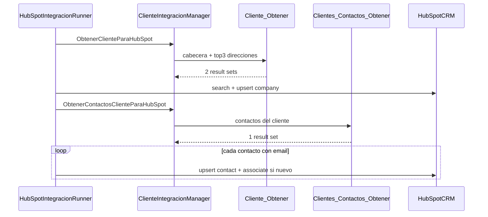

# Dividir obtención de datos en flujo 2A

## Estado actual vs objetivo

Hoy [`ClienteIntegracionManager.ObtenerClienteParaHubSpot`](InterfazHubSpot.Business/Managers/ClienteIntegracionManager.cs) ejecuta un solo SP y consume **3 result sets** (cabecera, contactos, direcciones). El runner [`SincronizarClienteColaAsync`](InterfazHubSpot.Business/HubSpot/HubSpotIntegracionRunner.cs) ya hace company primero y contactos después en HubSpot, pero **lee todos los datos del ERP en un solo paso inicial**.

Objetivo: reflejar en la capa de datos el mismo orden lógico.



## 1. SQL — corregir y cerrar contrato

### [`scriptsSQL/004_InterfazHubSpot_Cliente_Obtener.sql`](scriptsSQL/004_InterfazHubSpot_Cliente_Obtener.sql)

Ya tiene 2 result sets (cabecera + direcciones TOP 3) y `Pais` en direcciones. Ajustes menores:

- Actualizar comentario de cabecera: **2 result sets**, no 3.
- Envolver `Pais` con `ISNULL(paisDe.Descripcion, N'')` (hoy puede devolver NULL).
- Mantener alias elegidos: `Zona`, `Vendedor`, `ResponsableCuenta`, `ListaPrecios`, `CondicionVenta`, `CategoriaCliente`, `Provincia`, `Pais`.

### [`scriptsSQL/005_InterfazHubSpot_Clientes_Contactos_Obtener.sql`](scriptsSQL/005_InterfazHubSpot_Clientes_Contactos_Obtener.sql)

**Bug crítico a corregir:** el `DROP PROCEDURE` apunta a `InterfazHubSpot_Cliente_Obtener` en lugar de `InterfazHubSpot_Clientes_Contactos_Obtener`.

Mantener alias `Sector` (no `SectorId`) — el mapper C# se adaptará.

### [`scriptsSQL/000_Deploy_All.sql`](scriptsSQL/000_Deploy_All.sql)

Actualizar orquestador (hoy desactualizado):

```
:r 004_InterfazHubSpot_Cliente_Obtener.sql
:r 005_InterfazHubSpot_Clientes_Contactos_Obtener.sql
:r 006_InterfazHubSpot_CuentaCorriente_Pagina.sql
```

### Copias en [`sql/`](sql/)

- Actualizar [`sql/003_USP_Integracion_HubSpot_Cliente_Obtener.sql`](sql/003_USP_Integracion_HubSpot_Cliente_Obtener.sql): quitar result set de contactos, agregar `Pais`, alinear alias con 004.
- Crear `sql/006_InterfazHubSpot_Clientes_Contactos_Obtener.sql` (copia versionada del 005).

## 2. DTOs y mapper — adaptar C# a alias del SP

Decisión confirmada: **no renombrar columnas en SQL**; adaptar el mapper.

### [`InterfazHubSpot.Business/Integration/Dtos/ClienteIntegracionDto.cs`](InterfazHubSpot.Business/Integration/Dtos/ClienteIntegracionDto.cs)

- Agregar `Pais` en `DireccionEntregaDto`.
- **Quitar** `ListaClientesContactos` de `ClienteDatosDto` (contactos salen del método/SP dedicado).

### [`InterfazHubSpot.Business/Integration/ClienteIntegracionMapper.cs`](InterfazHubSpot.Business/Integration/ClienteIntegracionMapper.cs)

| Columna SP (004) | Propiedad DTO |
|---|---|
| `Zona` | `ZonaId` |
| `Vendedor` | `VendedorId` |
| `ResponsableCuenta` | `ResponsableCuentaId` |
| `ListaPrecios` | `ListaPreciosId` |
| `CondicionVenta` | `CondicionVentaId` |
| `CategoriaCliente` | `CategoriaClienteId` |
| `Provincia` | `ProvinciaId` |
| `Pais` | `Pais` |

Cambios de firma:

- `MapearCliente(DataTable cabecera, DataTable direcciones)` — sin parámetro contactos.
- Nuevo `MapearContactos(DataTable contactos) → List<ContactoDto>` leyendo columna `Sector` → `SectorId`.

## 3. Manager — dos métodos, dos SPs

### [`InterfazHubSpot.Business/Managers/ClienteIntegracionManager.cs`](InterfazHubSpot.Business/Managers/ClienteIntegracionManager.cs)

**`ObtenerClienteParaHubSpot`**
- `EXEC dbo.InterfazHubSpot_Cliente_Obtener @ClienteId`
- Leer 2 result sets (cabecera, direcciones).
- Llamar `MapearCliente(cabecera, direcciones)`.

**Nuevo `ObtenerContactosClienteParaHubSpot(int clienteId)`**
- `EXEC dbo.InterfazHubSpot_Clientes_Contactos_Obtener @ClienteId`
- 1 result set → `MapearContactos`.

## 4. Runner 2A — reordenar llamadas ERP

### [`InterfazHubSpot.Business/HubSpot/HubSpotIntegracionRunner.cs`](InterfazHubSpot.Business/HubSpot/HubSpotIntegracionRunner.cs)

En `SincronizarClienteColaAsync`:

1. Paso `bd.sp.cliente_obtener` → `_cli.ObtenerClienteParaHubSpot` (solo empresa + direcciones).
2. Search + upsert company (sin cambios).
3. **Nuevo paso** `bd.sp.contactos_obtener` → `_cli.ObtenerContactosClienteParaHubSpot(clientePk)`.
4. Loop contactos (search/upsert/associate) usando la lista devuelta, no `dto.Cliente.ListaClientesContactos`.

En `BuildCompanyProperties`, agregar mapeo HubSpot:

```csharp
props["direccion_" + n + "_pais"] = d.Pais ?? string.Empty;
```

En `DiagnosticarSincronizarContactosCliente`: reemplazar `ObtenerClienteParaHubSpot` por `ObtenerContactosClienteParaHubSpot`.

`DiagnosticarUpsertEmpresaHubSpot` sigue usando solo el SP 004 (sin contactos) — coherente con su propósito.

## 5. Tests y verificación

| Archivo | Cambio |
|---|---|
| [`ClienteIntegracionMapperTests.cs`](InterfazHubSpot.Tests.Unit/Managers/ClienteIntegracionMapperTests.cs) | Tests separados: `MapearCliente` (2 tablas, alias nuevos, `Pais`); `MapearContactos` con columna `Sector` |
| [`HubSpotIntegracionRunnerPayloadTests.cs`](InterfazHubSpot.Tests.Unit/HubSpot/HubSpotIntegracionRunnerPayloadTests.cs) | Test `direccion_1_pais` (y 2/3 si aplica) |
| [`ClienteIntegracionManagerLiveTests.cs`](InterfazHubSpot.IntegrationTests/Managers/ClienteIntegracionManagerLiveTests.cs) | Stub Live para `ObtenerContactosClienteParaHubSpot` |

Verificación final:

```powershell
pwsh -NoProfile -File InterfazHubSpot/Scripts/agent/Verify-InterfazHubSpot.ps1
```

Deploy manual en MSGestion dev (fuera del build):

```powershell
sqlcmd -S <server> -d <MSGestion> -i scriptsSQL/000_Deploy_All.sql
```

## 6. Documentación mínima

Actualizar referencias en [`README.md`](README.md), [`AGENTS.md`](AGENTS.md) y comentario en [`ClienteIntegracionManagerLiveTests.cs`](InterfazHubSpot.IntegrationTests/Managers/ClienteIntegracionManagerLiveTests.cs): SP 004 = empresa + direcciones; SP 005 = contactos; SP 006 = cuenta corriente 2B.

## Fuera de alcance

- `manejo_cuenta_corriente` en upsert 2A (permanece en flujo 2B vía [`006_InterfazHubSpot_CuentaCorriente_Pagina.sql`](scriptsSQL/006_InterfazHubSpot_CuentaCorriente_Pagina.sql)).
- Renombrar typos HubSpot (`adress`, `Country`) — ya están en producción/config.

## Riesgos a vigilar

- Si 004 se despliega sin 005, el flujo 2A fallará al buscar contactos → mitigado actualizando `000_Deploy_All.sql`.
- Contactos sin email siguen omitidos (comportamiento actual).
- El SP 005 con `DROP` incorrecto podría borrar el SP 004 si se ejecuta aislado — corregir antes de deploy.
