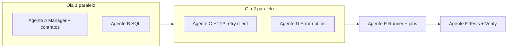
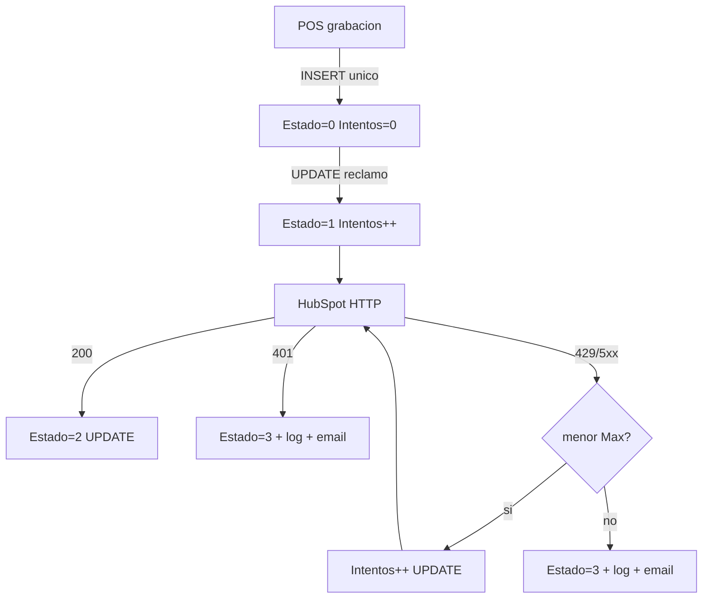

# Plan: cola sin duplicados + reintentos HTTP HubSpot

## Diagnóstico (causa raíz de los 3 registros)

| ProcesoId | Estado | Qué pasó |
|-----------|--------|----------|
| 4 | 0 Pendiente | INSERT original de `USER_POS_Clientes_Agregar` — **nunca se actualizó** |
| 5 | 1 EnProceso | **INSERT accidental** al reclamar (debería haber sido UPDATE de la fila 4) |
| 6 | 3 Error | **INSERT accidental** al marcar error (debería haber sido UPDATE de la fila 5) |

Causa: [`ProcesosSpertaHubSpotManager.cs`](InterfazHubSpot.Business/Managers/ProcesosSpertaHubSpotManager.cs) llama `SaveEntity` sin `ObjectState = Constants.Object_Modified`. Patrón correcto en [`UsuariosWebManager.cs`](InterfazHubSpot.Business/Managers/UsuariosWebManager.cs) líneas 377-379.

**Solo el POS debe INSERT.** El batch solo UPDATE del `ProcesoId` reclamado.

---

## Olas multiagente



| Ola | Agentes | Paralelo | Gate de salida |
|-----|---------|----------|----------------|
| **1** | A + B | Sí | Build librerías OK; contratos C# publicados; scripts SQL listos |
| **2** | C + D | Sí | Tests aislados de C y D pasan; config documentada |
| **3** | E | No (1 agente) | Runner compila; flujo 2A/2B cableado |
| **4** | F | No (1 agente) | `Verify-InterfazHubSpot.ps1` verde |

---

## Ola 1 — Fundamentos cola (2 agentes en paralelo)

### Agente A — Manager C# + contratos

**Archivos (exclusivos):**

- [`ProcesosSpertaHubSpotManager.cs`](InterfazHubSpot.Business/Managers/ProcesosSpertaHubSpotManager.cs)
- Nuevo: `InterfazHubSpot.Business/HubSpot/IHubSpotColaIntentosReporter.cs`
- Nuevo: `InterfazHubSpot.Business/HubSpot/HubSpotColaIntentosReporter.cs` (implementación que llama `IncrementarIntentos`)

**Entregables:**

1. `MarcarModificado(p)` privado → `p.ObjectState = Constants.Object_Modified` en `ReclamarPendientes`, `MarcarOk`, `MarcarError`, `ReponerEnCola`.
2. `IncrementarIntentos(long procesoId)` público.
3. Interfaz `IHubSpotColaIntentosReporter` con `void OnHttpRetryFailed(long? procesoId)` — contrato para Ola 2 Agente C.
4. Commit atómico: `fix(cola): ObjectState Modified evita INSERT duplicado`.

**No tocar:** `HubSpotCrmClient`, `HubSpotIntegracionRunner`, SQL.

**Verificación Agente A:**

```powershell
pwsh -NoProfile -File InterfazHubSpot/Scripts/agent/Build-InterfazHubSpot.ps1 -LibrariesOnly
```

---

### Agente B — SQL defensa

**Fuera de alcance:** script de cleanup de duplicados — datos ya corregidos manualmente en BD.

**Archivos (exclusivos):**

- [`scriptsSQL/003_USER_CALZETTA_POS_Clientes_Agregar.sql`](scriptsSQL/003_USER_CALZETTA_POS_Clientes_Agregar.sql)
- [`sql/002_USER_POS_Clientes_Agregar.sql`](sql/002_USER_POS_Clientes_Agregar.sql)
- [`scriptsSQL/001_ProcesosSpertaHubSpot.sql`](scriptsSQL/001_ProcesosSpertaHubSpot.sql) — índice filtrado único (bloque idempotente)
- [`sql/001_ProcesosSpertaHubSpot.sql`](sql/001_ProcesosSpertaHubSpot.sql) — copia alineada

**Entregables:**

1. Guard POS: `Estado IN (0, 1)` en lugar de solo `Estado = 0`.
2. Índice único filtrado `UX_ProcesosSpertaHubSpot_ActivoCliente` WHERE `Estado IN (0, 1)`.
3. Commit: `fix(sql): guard POS anti-duplicado + indice activo cliente`.

**No tocar:** código C#.

**Verificación Agente B:** revisión manual del SQL; opcional deploy en dev MSGestion.

---

### Gate Ola 1 → Ola 2

- [ ] Agente A: build librerías OK
- [ ] Agente A: `IHubSpotColaIntentosReporter` mergeado (Agente C lo consume)
- [ ] Agente B: scripts SQL mergeados

---

## Ola 2 — Infraestructura HTTP + notificaciones (2 agentes en paralelo)

### Agente C — Cliente HTTP con reintentos

**Archivos (exclusivos):**

- [`HubSpotCrmClient.cs`](InterfazHubSpot.Business/HubSpot/HubSpotCrmClient.cs)
- Nuevo: `InterfazHubSpot.Business/HubSpot/HubSpotHttpExceptions.cs` (`HubSpotAuthException`, `HubSpotHttpRetriesExhaustedException`)
- [`Web.config.example`](Web.config.example) — claves retry

**Entregables:**

1. Config en `HubSpotConfiguration`:
   - `HubSpot:MaxHttpRetries` (default 3)
   - `HubSpot:HttpRetryBackoffMilliseconds` (default 1000)
2. `SendWithRetryAsync` centralizado para POST/PATCH/PUT asociación.
3. **401** → `HubSpotAuthException` sin retry.
4. **429, 502, 503, 504** (+ opcional 500) → retry hasta max; en cada fallo reintentable invocar `IHubSpotColaIntentosReporter.OnHttpRetryFailed(procesoId)` si reporter no null.
5. Agotados → `HubSpotHttpRetriesExhaustedException`.
6. Sobrecargas internas que acepten `long? procesoId` + reporter (runner los cableará en Ola 3).
7. Tests en [`HubSpotCrmClientEndpointsTests.cs`](InterfazHubSpot.Tests.Unit/HubSpot/HubSpotCrmClientEndpointsTests.cs) o nuevo `HubSpotHttpRetryTests.cs`: mock 429×N, mock 401 sin retry.

**Depende de Ola 1:** interfaz `IHubSpotColaIntentosReporter` (solo la firma, no el runner).

**No tocar:** `HubSpotIntegracionRunner`, `EmailsManager`, jobs batch.

**Verificación Agente C:**

```powershell
pwsh -NoProfile -File InterfazHubSpot/Scripts/agent/Test-InterfazHubSpot.ps1 -Filter "FullyQualifiedName~HubSpotHttp"
```

---

### Agente D — Notificador de errores

**Archivos (exclusivos):**

- Nuevo: `InterfazHubSpot.Business/Integration/IntegracionErrorNotifier.cs`
- [`EmailsManager.cs`](InterfazHubSpot.Business/Managers/EmailsManager.cs) — guard `EmailErrPara`
- [`IEmailsManager.cs`](InterfazHubSpot.Interfaces/Managers/IEmailsManager.cs) — si hace falta overload asunto custom

**Entregables:**

1. `IntegracionErrorNotifier` con:
   - `NotificarErrorFila2A(procesoId, clienteId, fase, ex)`
   - `NotificarErrorBatch2B(lote, ex)`
   - `NotificarErrorFatalJob(jobName, ex)`
   - `NotificarErrorAuth(ex)` — asunto `[HubSpot] Error autenticación`
2. Asuntos contextualizados (2A, 2B, 401, fatal).
3. Guard: no llamar `Emails_Agregar` si `EmailErrPara` vacío/null.
4. Tests unitarios mínimos: guard EmailErrPara, asunto formateado (mock config).

**No tocar:** `HubSpotIntegracionRunner`, `HubSpotCrmClient`.

**Verificación Agente D:** tests filtro `IntegracionErrorNotifier` o `EmailsManager`.

---

### Gate Ola 2 → Ola 3

- [ ] Tests HTTP retry + 401 verdes (Agente C)
- [ ] `IntegracionErrorNotifier` mergeado (Agente D)
- [ ] `Web.config.example` actualizado

---

## Ola 3 — Integración runner + jobs (1 agente)

### Agente E — Orquestación 2A / 2B

**Archivos:**

- [`HubSpotIntegracionRunner.cs`](InterfazHubSpot.Business/HubSpot/HubSpotIntegracionRunner.cs)
- [`ProcesarColaIntegracionesHubSpotJob.cs`](InterfazHubSpot.BatchProcess/ProcesarColaIntegracionesHubSpotJob.cs)
- [`HubSpotSincronizarCuentaCorrienteJob.cs`](InterfazHubSpot.BatchProcess/HubSpotSincronizarCuentaCorrienteJob.cs)

**Entregables:**

1. Instanciar `HubSpotColaIntentosReporter` + `IntegracionErrorNotifier` en runner.
2. Pasar `procesoId` + reporter a todas las llamadas HubSpot en `SincronizarClienteColaAsync` (2A).
3. `catch` por ítem 2A:
   - `HubSpotAuthException` / `HubSpotHttpRetriesExhaustedException` / genérico → `MarcarError` (UPDATE misma fila) + log + `NotificarErrorFila2A`.
   - Continuar siguiente ítem (no abortar job).
4. Flujo 2B `EjecutarSincronizacionCuentaCorriente`:
   - try/catch **por batch** (100 companies).
   - 401 → log + email auth + **detener job** (throw o flag).
   - 429 agotado → log batch + `NotificarErrorBatch2B` + **continuar** siguiente batch/página.
5. Jobs batch: delegar errores fatales a `NotificarErrorFatalJob` (reemplazar duplicación inline en catch).

**Depende de:** Ola 1 (manager fix) + Ola 2 (client + notifier).

**Verificación Agente E:**

```powershell
pwsh -NoProfile -File InterfazHubSpot/Scripts/agent/Build-InterfazHubSpot.ps1 -LibrariesOnly
pwsh -NoProfile -File InterfazHubSpot/Scripts/agent/Test-InterfazHubSpot.ps1
```

---

### Gate Ola 3 → Ola 4

- [ ] Build + tests existentes verdes
- [ ] Sin regresión en tests HubSpot payload/diagnostics

---

## Ola 4 — Tests integración + verificación final (1 agente)

### Agente F — QA automatizado + UAT

**Archivos:**

- [`InterfazHubSpot.Tests.Unit/`](InterfazHubSpot.Tests.Unit/) — tests runner mock HTTP (Intentos++, notifier invocado)
- [`InterfazHubSpot.IntegrationTests/Managers/ProcesosSpertaHubSpotManagerLiveTests.cs`](InterfazHubSpot.IntegrationTests/Managers/ProcesosSpertaHubSpotManagerLiveTests.cs) — descomentar/documentar test anti-duplicado Live
- [`docs/PRD_Integracion_HubSpot_2A_2B.md`](docs/PRD_Integracion_HubSpot_2A_2B.md) + [`README.md`](README.md) — alinear 401 fail-fast, Intentos, claves config

**Entregables:**

1. Test runner: mock HTTP 429 incrementa Intentos vía manager (mock reporter).
2. Test Live (Category=Live): `ReclamarPendientes` + `MarcarError` → `COUNT(*)` no aumenta para mismo Identificador.
3. Checklist UAT en plan o README:

   | Paso | Esperado |
   |------|----------|
   | `EXEC USER_POS_Clientes_Agregar @ClienteID=77` | 1 fila Estado=0 Intentos=0 |
   | Ejecutar cola | Mismo ProcesoId, sin huérfanos Intentos=0 |
   | Mock 429 | Intentos sube en cada fallo HTTP |
   | Token inválido | Error inmediato, email, Intentos = solo reclamo |

4. `Verify-InterfazHubSpot.ps1` verde.

---

## Decisiones de diseño (bloqueadas)

| Tema | Decisión |
|------|----------|
| 401 | Fail-fast, sin reintentos HTTP |
| Intentos | Incrementa al **reclamar** y en cada **HTTP reintentable fallido** |
| Email 2A | Por fila al fallar (no solo crash job) |
| Email 2B | Por batch fallido; 401 detiene job |
| Duplicados | Fix ObjectState + guard SQL + índice único |

---

## Semántica Intentos (referencia)

| Evento | Incremento |
|--------|------------|
| Reclamar (Pendiente→EnProceso) | Intentos++ |
| HTTP reintentable fallido | Intentos++ vía `IncrementarIntentos` |
| 401 | Solo incremento del reclamo |

Ejemplo MaxHttpRetries=3 con 429 persistente: reclamo 0→1, fallos HTTP 1→2→3→4, luego `MarcarError` + log + email.

---

## Flujo objetivo



---

## Mapa de conflictos (evitar solapamiento)

| Archivo | Ola | Agente |
|---------|-----|--------|
| ProcesosSpertaHubSpotManager.cs | 1 | A |
| IHubSpotColaIntentosReporter*.cs | 1 | A |
| scriptsSQL/* POS, 001 | 1 | B |
| HubSpotCrmClient.cs, HubSpotHttpExceptions.cs | 2 | C |
| Web.config.example (solo claves HubSpot retry) | 2 | C |
| IntegracionErrorNotifier.cs, EmailsManager.cs | 2 | D |
| HubSpotIntegracionRunner.cs, *Job.cs | 3 | E |
| Tests + docs | 4 | F |

---

## Prompts sugeridos por agente

Copiar al lanzar subagentes en Cursor:

**Agente A:** "Ejecuta Ola 1 Agente A del plan fix_cola_y_http_retries: fix ObjectState en ProcesosSpertaHubSpotManager, IncrementarIntentos, IHubSpotColaIntentosReporter. No tocar HubSpotCrmClient ni SQL."

**Agente B:** "Ejecuta Ola 1 Agente B: guard POS Estado IN (0,1), índice único filtrado. Solo SQL scriptsSQL/ y sql/. No crear script cleanup (datos ya limpiados en BD)."

**Agente C:** "Ejecuta Ola 2 Agente C: SendWithRetryAsync en HubSpotCrmClient, excepciones 401/429, config MaxHttpRetries, tests HTTP mock. Consumir IHubSpotColaIntentosReporter de Ola 1."

**Agente D:** "Ejecuta Ola 2 Agente D: IntegracionErrorNotifier + guard EmailErrPara en EmailsManager + tests."

**Agente E:** "Ejecuta Ola 3: cablear HubSpotIntegracionRunner 2A/2B con retry client, notifier, MarcarError UPDATE, jobs batch. Requiere Ola 1+2 mergeadas."

**Agente F:** "Ejecuta Ola 4: tests integración Intentos/notifier, Live anti-duplicado, docs PRD/README, Verify-InterfazHubSpot.ps1."
