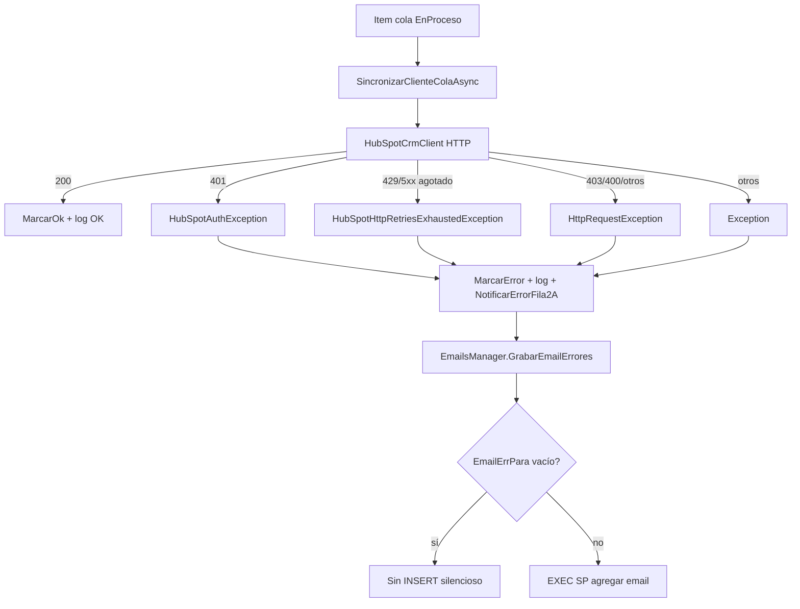

# Fix grabación en Emails ante errores HubSpot

## Diagnóstico (verificado MCP + código)

### Tu error actual (ProcesoId=9, ClienteId=77)

| Capa | Estado | Evidencia |
|------|--------|-----------|
| Cola `ProcesosSpertaHubSpot` | OK | `Estado=3`, `MensajeUltimoError` con HTTP 403 MISSING_SCOPES en contact POST |
| Log `ProcesosSpertaHubSpotLog` | OK | Fase `SyncClienteCola`, stack completo `HttpRequestException` |
| Tabla `dbo.Emails` | **FALLA** | `SELECT ... WHERE Asunto LIKE '%HubSpot%'` → 0 filas |

El error de permisos HubSpot es real (faltan scopes `crm.objects.contacts.write`, etc.), pero **el sistema sí lo trató como error de fila 2A** — no es un bug del catch.

### Flujo de errores implementado (correcto en orquestación)



Referencias clave:

- Catch por ítem en [`HubSpotIntegracionRunner.cs`](InterfazHubSpot.Business/HubSpot/HubSpotIntegracionRunner.cs) (líneas 193–237): **403 cae en `catch (Exception)` genérico** → llama `_errorNotifier.NotificarErrorFila2A`.
- 403 no es reintentable en [`HubSpotCrmClient.cs`](InterfazHubSpot.Business/HubSpot/HubSpotCrmClient.cs) (línea 422–423): lanza `HttpRequestException` inmediato (correcto).
- Guard silencioso en [`EmailsManager.cs`](InterfazHubSpot.Business/Managers/EmailsManager.cs) (líneas 44–46): si `EmailErrPara` vacío → `return` sin grabar.

### Dos causas raíz de que no haya fila en Emails

**1. Configuración vacía (bloqueo actual en dev)**

En [`InterfazHubSpot/Web.config`](InterfazHubSpot/Web.config):

```xml
<add key="EmailErrDE" value="" />
<add key="EmailErrPara" value="" />
```

Comportamiento documentado en PRD §10: sin destinatario, no encola. Es intencional pero **invisible** (no loguea el skip).

**2. SP incorrecto (fallará al configurar destinatario)**

`EmailsManager` ejecuta `dbo.Emails_Agregar`, que **no existe** en MSGestion Calzetta (MCP: solo existe la tabla `Emails`).

El SP canónico del ERP es **`dbo.MSEMails_Agregar`** (parámetros compatibles, inserta `Enviado='N'`):

| Parámetro MSEMails_Agregar | EmailsManager actual |
|---------------------------|----------------------|
| @De, @Para, @Cc, @Cco, @Adjuntos, @Asunto, @EsHtml, @Mensaje | Igual (+ @Enviado que sobra) |
| @Id INT OUTPUT | No capturado |

Otros procesos del ERP (avisos stock) sí insertan en `Emails` vía sus propios SPs; la infraestructura de tabla funciona.

---

## Cambios propuestos

### 1. Corregir `EmailsManager` — SP real del ERP

Archivo: [`InterfazHubSpot.Business/Managers/EmailsManager.cs`](InterfazHubSpot.Business/Managers/EmailsManager.cs)

- Reemplazar `EXEC dbo.Emails_Agregar` por `EXEC dbo.MSEMails_Agregar`.
- Quitar parámetro `@Enviado` (el SP ya fuerza `'N'`).
- Agregar `@Id INT OUTPUT` y leer el Id insertado (opcional para trazabilidad/tests).
- Fallback de remitente: si `EmailErrDE` vacío, usar `EmailDe` de AppSettings (ya configurado en tu Web.config).
- Truncar `@Asunto` a 100 chars (límite del SP) para evitar fallos SQL.

### 2. Configuración dev (manual, no versionada)

En [`InterfazHubSpot/Web.config`](InterfazHubSpot/Web.config) (local):

```xml
<add key="EmailErrDE" value="Notificaciones_Mastersoft@mastersoft.com.ar" />
<add key="EmailErrPara" value="alan.lipshitz@mastersoft.com.ar" />
<add key="EmailErrCc" value="" />
```

Documentar en [`Web.config.example`](Web.config.example) las claves `EmailErr*` con comentario “obligatorio para alertas HubSpot”.

Si corrés batch Windows: replicar en `InterfazHubSpot.BatchProcess/App.config` (gitignored).

### 3. Resiliencia — email no debe tumbar el job

Hoy `NotificarErrorFila2A` en el runner **no** está envuelto en try/catch por ítem. Si el SP fallara, abortaría el foreach.

Alinear con el patrón del job en [`ProcesarColaIntegracionesHubSpotJob.cs`](InterfazHubSpot.BatchProcess/ProcesarColaIntegracionesHubSpotJob.cs) (líneas 59–67):

- Envolver cada llamada a `_errorNotifier` en try/catch + `Logger.Log` en runner (2A y 2B).

### 4. Tests

Archivo: [`InterfazHubSpot.Tests.Unit/Managers/EmailsManagerTests.cs`](InterfazHubSpot.Tests.Unit/Managers/EmailsManagerTests.cs)

- Mantener tests de guard `EmailErrPara` vacío.
- Assert de que el SQL generado referencia `MSEMails_Agregar` (vía refactor mínimo testeable o test de integración Live opcional).

Tests existentes de [`IntegracionErrorNotifierTests.cs`](InterfazHubSpot.Tests.Unit/Integration/IntegracionErrorNotifierTests.cs) ya cubren asuntos contextualizados — no requieren cambio.

### 5. Template HTML

[`InterfazHubSpot/Templates/error_template.html`](InterfazHubSpot/Templates/error_template.html) ya está en el csproj como Content. Solo aplica a MVC (BaseDirectory del sitio). Para batch Windows, copiar template al output del servicio si se usa fuera de IIS (verificar en deploy batch).

---

## Verificación end-to-end (post-fix)

### A. Smoke rápido de encolado (sin reprocesar HubSpot)

1. Configurar `EmailErrPara` como arriba.
2. Desde MVC Home: `POST /Home/GrabarEmailError` (usa [`GrabarEmailError.cs`](InterfazHubSpot.BatchProcess/GrabarEmailError.cs)).
3. MCP:

```sql
SELECT TOP 3 Id, Asunto, Para, Enviado, FechaEmail
FROM dbo.Emails
WHERE Para LIKE '%alan.lipshitz%'
ORDER BY Id DESC
```

Esperado: fila nueva con `Enviado='N'`, asunto contiene `GrabarEmailError`.

### B. Reproducir error HubSpot (tu caso 403)

1. Resetear fila de prueba: `UPDATE dbo.ProcesosSpertaHubSpot SET Estado=0, Intentos=0, MensajeUltimoError=NULL WHERE ProcesoId=9` (o insertar nuevo cliente vía POS).
2. Ejecutar cola: `POST /Home/ProcesarColaHubSpot` o traza MVC.
3. MCP:

```sql
-- Cola en Error
SELECT ProcesoId, Estado, MensajeUltimoError FROM dbo.ProcesosSpertaHubSpot WHERE ProcesoId=9;

-- Email encolado
SELECT TOP 1 Id, Asunto, Para, LEFT(CAST(Mensaje AS varchar(500)), 200) AS MensajePreview
FROM dbo.Emails WHERE Asunto LIKE '%HubSpot 2A%' ORDER BY Id DESC;
```

Esperado: asunto tipo `[HubSpot 2A] Error ProcesoId=9 ClienteId=77 Fase=SyncClienteCola`, cuerpo HTML con mensaje 403.

### C. Build/tests

```powershell
pwsh -NoProfile -File InterfazHubSpot/Scripts/agent/Verify-InterfazHubSpot.ps1
```

---

## Nota paralela: error HubSpot 403 (permisos)

Independiente del pipeline de emails: la Private App necesita scopes de escritura de contactos (`crm.objects.contacts.write` como mínimo). Eso se corrige en el portal HubSpot → Private Apps → Scopes. El flujo de error ya captura bien ese escenario una vez arreglado el encolado.

## Resumen de archivos a tocar

| Archivo | Cambio |
|---------|--------|
| [`EmailsManager.cs`](InterfazHubSpot.Business/Managers/EmailsManager.cs) | SP `MSEMails_Agregar`, fallback `EmailDe`, truncar asunto |
| [`HubSpotIntegracionRunner.cs`](InterfazHubSpot.Business/HubSpot/HubSpotIntegracionRunner.cs) | try/catch en notifier por ítem/batch |
| [`Web.config.example`](Web.config.example) | Documentar `EmailErr*` |
| [`EmailsManagerTests.cs`](InterfazHubSpot.Tests.Unit/Managers/EmailsManagerTests.cs) | Test SP name / guard |
| [`InterfazHubSpot/Web.config`](InterfazHubSpot/Web.config) | Config local dev (manual) |
