# Corregir NullReferenceException Paso 1 y alinear conexión SQL

## Diagnóstico

```mermaid
flowchart TD
    subgraph paso1 [Paso 1 - TrazaCola]
        A[HomeController.GetContext] --> B[ProcesosSpertaHubSpotManager]
        B --> C["UnitOfWork(_ctx, MSGestionContext)"]
        C --> D["NullReferenceException"]
    end
    subgraph paso2 [Paso 2 - TrazaCliente]
        E[ClienteIntegracionManager] --> F[MSGestionContext + EXEC SP]
        F --> G["SqlException: SP no encontrado"]
    end
    subgraph ssms [SSMS - funciona]
        H[Misma instancia/catalogo correcto]
        H --> I[ProcesosSpertaHubSpot + SPs 004/005]
    end
```



### Problema A — NRE en Paso 1 (código)

El botón **Paso 1** llama a `POST /Home/ProcesarColaHubSpotTrazaCola`, que usa [`ProcesosSpertaHubSpotManager`](InterfazHubSpot.Business/Managers/ProcesosSpertaHubSpotManager.cs):

```24:27:InterfazHubSpot.Business/Managers/ProcesosSpertaHubSpotManager.cs
private IUnitOfWorkAsync CreateUow()
{
    return new UnitOfWork(_ctx, new MSGestionContext(_ctx));
}
```

`UnitOfWork` del framework Mastersoft (`Mastersoft.Framework.DataRepository`) **requiere un `MSContext` completo**. En cambio, [`HomeController.GetContext()`](InterfazHubSpot/Controllers/HomeController.cs) solo setea `CNPrefix` y opcionalmente `EmpresaId` / `TenantId`:

```426:438:InterfazHubSpot/Controllers/HomeController.cs
private static MSContext GetContext()
{
    var context = new MSContext();
    var prefix = ConfigurationManager.AppSettings["FrameworkCNPrefix"];
    context.CNPrefix = string.IsNullOrEmpty(prefix) ? "InterfazHubSpot" : prefix;
    // ... EmpresaId, TenantId (opcional)
    return context;
}
```

**No inicializa `DBProvider` ni `CN`**, que sí setea [`Util.GetMSContext()`](InterfazHubSpot/Core/Util.cs) (líneas 46–48). Eso explica el NRE al instanciar `UnitOfWork`.

Los SPs **no pasan por UnitOfWork**: [`ClienteIntegracionManager`](InterfazHubSpot.Business/Managers/ClienteIntegracionManager.cs) usa solo `MSGestionContext` + ADO.NET. Por eso SSMS y el Paso 2 llegan más lejos (hasta el EXEC) aunque el contexto esté incompleto.

### Problema B — Base de datos distinta (configuración)

Tu traza del Paso 2 muestra:

- `"TenantId": null` — **esperado y correcto** en Calzetta: base **sin multitenancy**; no requiere `TenantId` en `Web.config` ni en `MSContext`
- `"cnPrefix": "InterfazHubSpot"` — solo afecta resolución de nombre de connection string; con `name="MSGestion"` directo alcanza
- Error: **`No se encontró el procedimiento almacenado 'dbo.InterfazHubSpot_Cliente_Obtener'`**

En SSMS el SP existe en **MS0025 / MsGestion_CALZETTA** y devuelve datos para `ClienteId=1007`. Conclusión: **la app MVC se conecta a otro servidor/catálogo** (no MS0025/MsGestion_CALZETTA).

La resolución de conexión en [`MSGestionContext.ResolveGestionConnectionString`](InterfazHubSpot.Mapping/Context/MSGestionContext.cs) termina en fallback `MSGestion`. Basta **una sola entrada** apuntando directo al catálogo:

```xml
<add name="MSGestion" connectionString="Data Source=MS0025;Initial Catalog=MsGestion_CALZETTA;..." />
```

No hace falta MSFwk, tabla de tenants ni cadena por prefijo `InterfazHubSpot_MSGestion`.

---

## Plan de corrección

### 1. Arreglar `GetContext()` en HomeController

Reemplazar la factory mínima por una que reutilice `Util.GetMSContext()` (setea `DBProvider`, `CN`, defaults) y solo sobrescriba lo necesario para consola interna **sin multitenancy**:

```csharp
private static MSContext GetContext()
{
    var context = Util.GetMSContext(); // DBProvider="SQLServer", CN="", etc.

    var prefix = ConfigurationManager.AppSettings["FrameworkCNPrefix"];
    if (!string.IsNullOrWhiteSpace(prefix))
        context.CNPrefix = prefix;

    int empresaId;
    if (int.TryParse(ConfigurationManager.AppSettings["EmpresaId"], out empresaId))
        context.EmpresaId = empresaId;

    // Calzetta: sin multitenancy — no setear TenantId ni UsaContextTenants
    return context;
}
```

Opcional: eliminar la lectura de `TenantId` del `GetContext()` actual (línea 436) para no confundir en trazas.

**Nota:** `ProcesosSpertaHubSpotManager` consulta la cola solo por `Destino` + `Estado`; **no filtra por TenantId**. La columna `TenantId` en la tabla puede tener valor legacy (`MS` en tu fila de prueba) pero no afecta el flujo HubSpot en esta base.

Archivo: [`InterfazHubSpot/Controllers/HomeController.cs`](InterfazHubSpot/Controllers/HomeController.cs)

Agregar `using InterfazHubSpot.Core;`.

**Efecto esperado:** Paso 1 deja de lanzar NRE en `CreateUow()`.

### 2. Configurar `Web.config` → conexión directa MS0025 / MsGestion_CALZETTA

**Target confirmado:** servidor `MS0025`, catálogo `MsGestion_CALZETTA`. **Sin multitenancy** — el connection string apunta **directo** a esa base; no hay routing por tenant.

Editar [`InterfazHubSpot/Web.config`](InterfazHubSpot/Web.config) (no versionado):

```xml
<connectionStrings>
  <add name="MSGestion"
       connectionString="Data Source=MS0025;Initial Catalog=MsGestion_CALZETTA;Integrated Security=True;MultipleActiveResultSets=True"
       providerName="System.Data.SqlClient" />
</connectionStrings>
<appSettings>
  <add key="FrameworkCNPrefix" value="InterfazHubSpot" />
  <add key="EmpresaId" value="1" />
  <add key="HubSpot:UseDevelopmentMock" value="true" />
</appSettings>
```

**No incluir `TenantId`** — no aplica en esta instalación.

> Si usás SQL auth, reemplazar `Integrated Security=True` por `User ID=...;Password=...` (nunca versionar credenciales).

**Batch:** misma cadena `MSGestion` en `InterfazHubSpot.BatchProcess/App.config`.

**Verificación rápida:** en el JSON del Paso 1, el paso `infra.bd.msgestion` debe mostrar:
- `DataSource`: `MS0025`
- `Catalogo`: `MsGestion_CALZETTA`
- `Select1Ok`: `true`

### 3. Desplegar SPs en MsGestion_CALZETTA (si falta)

Conectar SSMS a `MS0025` → `MsGestion_CALZETTA`. Si tras el cambio de `Web.config` el Paso 2 sigue con "SP no encontrado", ejecutar ahí:

[`scriptsSQL/000_Deploy_All.sql`](scriptsSQL/000_Deploy_All.sql) (001 cola, 004 cliente, 005 contactos, 006 cuenta corriente, 007 función CC)

> En SSMS ya tenés datos de prueba (cola ProcesoId=2, ClienteId=1007); eso confirma que el deploy en esa base ya puede estar hecho — el error del Paso 2 era casi seguro que la app apuntaba a **otra** instancia/catálogo.

### 4. Verificar end-to-end

Tras rebuild con el script canónico:

```powershell
pwsh -NoProfile -File InterfazHubSpot/Scripts/agent/Verify-InterfazHubSpot.ps1
```

Smoke manual en Home:

| Paso | Acción | Resultado esperado |
|------|--------|-------------------|
| 1 | Ver estado de cola | JSON con `pendientes >= 1`, muestra fila `Identificador=1007` |
| 2 | SP datos cliente, ClienteId=1007 | `encontrado: true`, sin SqlException |

### 5. Documentar en plantillas

Actualizar [`Web.config.example`](Web.config.example) y [`InterfazHubSpot.BatchProcess/App.config.example`](InterfazHubSpot.BatchProcess/App.config.example):

- Connection string ejemplo directo: `Data Source=MS0025;Initial Catalog=MsGestion_CALZETTA;...`
- `EmpresaId=1` (opcional, trazas)
- **Sin `TenantId`** — documentar que Calzetta no usa multitenancy

---

## Qué NO es el problema

- **`TenantId: null` en la traza JSON** — normal en Calzetta (sin multitenancy); no es causa del fallo
- Los NULL en columnas `MensajeUltimoError`, `FechaInicioProceso`, `FechaFinProceso` de la cola son **normales** para filas Pendiente (`Estado=0`)
- Los dos result sets del SP 004 están soportados en [`ClienteIntegracionManager`](InterfazHubSpot.Business/Managers/ClienteIntegracionManager.cs) vía `reader.NextResult()`

---

## Resumen para el usuario

| Síntoma | Causa | Fix |
|---------|-------|-----|
| NRE en `CreateUow()` Paso 1 | `MSContext` sin `DBProvider` | Cambiar `GetContext()` → `Util.GetMSContext()` |
| SP no encontrado Paso 2 | `Web.config` apunta a otra BD | `MSGestion` directo → MS0025 / MsGestion_CALZETTA |
| `TenantId: null` en traza | Sin multitenancy (esperado) | **Nada que hacer** |
