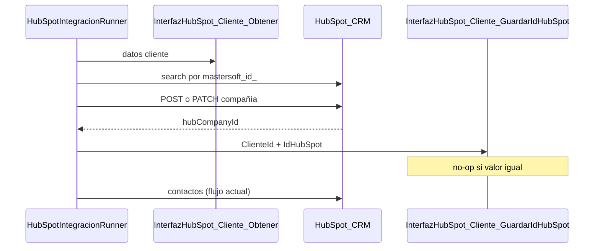

# Persistir id HubSpot en atributo variable CLIENTES (Flujo 2A)

## Hallazgos MCP (MSGestion)

El modelo de **atributos variables** en Mastersoft usa dos tablas principales:

| Tabla | Rol |
|-------|-----|
| [`MSAtributos`](scriptsSQL) | Definición del atributo: `Entidad`, `CodAtrib`, `Tipo`, etc. |
| [`MSAtributosValores`](scriptsSQL) | Valor por registro: `AtributoID` + `RegistroID` (= `ClienteID`) + `Valor` |

**Patrón existente en CLIENTES** (ej. `NickNameML`, AtributoID 113):
- Solo fila en `MSAtributos` con `Entidad = 'CLIENTES'`, `Tipo = 'TEXTO'`
- No requiere fila en `Atributos` / `AtributosXTabla` (VB6) para funcionar en .NET
- `RegistroID` en `MSAtributosValores` = `Clientes.ClienteID` (verificado con NickNameML)

**SPs reutilizables:**
- `MSAtributos_Agregar` — crea definición (asigna `MAX(AtributoID)+1`)
- `MSValorAtributo_Agregar` — upsert simple en `MSAtributosValores` (sin lógica VB6 extra; preferible a `MSAtributosValores_Agregar` para CLIENTES)

**Estado actual:** no existe `id_hubspot` en `MSAtributos`. El PRD mencionaba `USER_HS_Cliente_GuardarHubSpotId` en columna dedicada, pero **nunca se implementó** en código ni en [`scriptsSQL/`](scriptsSQL/). El flujo 2A hoy termina el paso compañía sin escribir nada en ERP:

```411:414:InterfazHubSpot.Business/HubSpot/HubSpotIntegracionRunner.cs
            var joCompany = JObject.Parse(respCompany);
            var hubCompanyId = joCompany["id"]?.ToString() ?? hubCompanyExistingId;
            if (string.IsNullOrEmpty(hubCompanyId))
                throw new InvalidOperationException("HubSpot no devolvió id de compañía.");
```

## Flujo objetivo (solo 2A)



**Momento de grabación (confirmado):** solo tras **upsert de compañía exitoso**. Si falla el PATCH/POST, no se toca ERP.

## Cambios SQL

### 1. Nuevo script [`scriptsSQL/010_InterfazHubSpot_Atributo_IdHubSpot.sql`](scriptsSQL/010_InterfazHubSpot_Atributo_IdHubSpot.sql)

Dos bloques idempotentes:

**A) Crear atributo** (si no existe):

```sql
IF NOT EXISTS (
    SELECT 1 FROM dbo.MSAtributos
    WHERE Entidad = 'CLIENTES' AND CodAtrib = 'id_hubspot'
)
BEGIN
    EXEC dbo.MSAtributos_Agregar
         @Entidad     = 'CLIENTES',
         @CodAtrib    = 'id_hubspot',
         @Descripcion = 'ID HubSpot CRM',
         @Tipo        = 'TEXTO',
         @Decimales   = NULL,
         @MaxLength   = 50;
END
```

**B) SP `dbo.InterfazHubSpot_Cliente_GuardarIdHubSpot`**

Parámetros: `@ClienteId INT`, `@IdHubSpot VARCHAR(50)`

Lógica:
1. Validar `@ClienteId > 0` y `@IdHubSpot` no vacío (trim)
2. Resolver `@AtributoID` desde `MSAtributos` WHERE `Entidad='CLIENTES' AND CodAtrib='id_hubspot'`
   - Si no existe → `RAISERROR` claro (deploy incompleto)
3. Leer `@ValorActual` de `MSAtributosValores` para ese par `(AtributoID, RegistroID=@ClienteId)`
4. Si `LTRIM(RTRIM(ISNULL(@ValorActual,''))) = LTRIM(RTRIM(@IdHubSpot))` → `RETURN` (no-op)
5. Si no → `EXEC dbo.MSValorAtributo_Agregar @AtributoID, @ClienteId, @IdHubSpot`

Copia espejo en [`sql/010_InterfazHubSpot_Atributo_IdHubSpot.sql`](sql/010_InterfazHubSpot_Atributo_IdHubSpot.sql).

### 2. Actualizar [`scriptsSQL/000_Deploy_All.sql`](scriptsSQL/000_Deploy_All.sql)

Añadir `:r 010_InterfazHubSpot_Atributo_IdHubSpot.sql` al final (antes del `PRINT`).

**Deploy en Calzetta:** ejecutar script 010 en MSGestion antes de desplegar el binario C#.

## Cambios C# (.NET 4.5.2)

### 3. [`ClienteIntegracionManager.cs`](InterfazHubSpot.Business/Managers/ClienteIntegracionManager.cs)

Nuevo método público:

```csharp
public void GuardarIdHubSpotCliente(int clienteId, string idHubSpot)
```

- `EXEC dbo.InterfazHubSpot_Cliente_GuardarIdHubSpot @ClienteId, @IdHubSpot`
- Mismo patrón ADO que `ObtenerClienteParaHubSpot` (SqlParameter, conexión EF)
- No lanzar si `idHubSpot` es null/whitespace (guard defensivo en C#)

### 4. [`HubSpotIntegracionRunner.cs`](InterfazHubSpot.Business/HubSpot/HubSpotIntegracionRunner.cs)

En `SincronizarClienteColaAsync`, **después** de validar `hubCompanyId` y **antes** del loop de contactos:

```csharp
_cli.GuardarIdHubSpotCliente(clientePk, hubCompanyId);
_pasos.RegistrarPaso(..., "bd.sp.cliente_guardar_id_hubspot", ...);
```

Extraer método privado `PersistirIdHubSpotEnErp(int clientePk, string hubCompanyId, long? procesoId)` para reutilizar en:
- `SincronizarClienteColaAsync` (producción 2A)
- `DiagnosticarUpsertEmpresaHubSpot` (traza MVC — mismo comportamiento, sin cola)

**No modificar:** `SincronizarCuentaCorrienteAsync` / flujo 2B.

## Verificación

| Paso | Comando / acción |
|------|------------------|
| Build + tests | `pwsh -NoProfile -File InterfazHubSpot/Scripts/agent/Verify-InterfazHubSpot.ps1` |
| SQL manual | Tras deploy 010: `EXEC InterfazHubSpot_Cliente_GuardarIdHubSpot @ClienteId=77, @IdHubSpot='12345'` dos veces → segunda sin cambio en `MSAtributosValores` |
| UAT 2A | Procesar fila cola: compañía en HubSpot con `mastersoft_id_` + fila en `MSAtributosValores` con `CodAtrib='id_hubspot'` |
| Traza MVC | `POST TrazaHubSpotUpsertEmpresa?clienteId=N` debe mostrar paso `bd.sp.cliente_guardar_id_hubspot` |

## Riesgos y mitigaciones

| Riesgo | Mitigación |
|--------|------------|
| Script 010 no desplegado en prod | SP hace `RAISERROR` explícito; documentar en deploy |
| ID HubSpot cambia manualmente en HubSpot | SP actualiza solo si valor distinto (comportamiento deseado) |
| Divergencia con PRD (`USER_HS_*` + columna) | Usuario eligió atributo variable; no implementar columna dedicada |

## Archivos tocados (resumen)

- **Nuevo:** `scriptsSQL/010_...sql`, `sql/010_...sql`
- **Editar:** `000_Deploy_All.sql`, `ClienteIntegracionManager.cs`, `HubSpotIntegracionRunner.cs`
- **Opcional:** test Live en `ClienteIntegracionManagerLiveTests.cs` (Category=Live) para el nuevo SP
