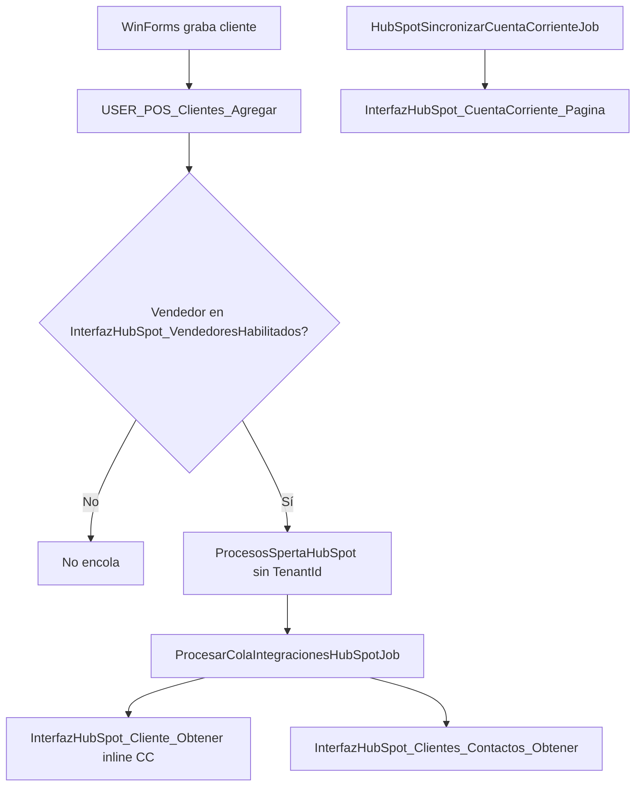

# Análisis: eliminación de TenantId y coherencia SQL HubSpot

## Veredicto MCP (MSGestion — greenfield desplegado)

Validación en vivo contra `project-0-INTERFAZHUBSPOT-mssql-mcp-msgestion-CALZETTA`:

| Objeto | Estado en BD | Alineado con scripts |
|--------|-------------|----------------------|
| `dbo.ProcesosSpertaHubSpot` | 12 columnas, **sin `TenantId`** | Sí — coincide con [`scriptsSQL/001_ProcesosSpertaHubSpot.sql`](scriptsSQL/001_ProcesosSpertaHubSpot.sql) |
| `dbo.USER_POS_Clientes_Agregar` | INSERT sin TenantId, filtro vendedor | Sí — coincide con [`scriptsSQL/003_USER_CALZETTA_POS_Clientes_Agregar.sql`](scriptsSQL/003_USER_CALZETTA_POS_Clientes_Agregar.sql) |
| `dbo.InterfazHubSpot_Cliente_Obtener` | v2 inline (no usa función) | Sí — [`scriptsSQL/004_...`](scriptsSQL/004_InterfazHubSpot_Cliente_Obtener.sql) |
| `dbo.InterfazHubSpot_CuentaCorriente_Pagina` | v3 con filtro vendedor | Sí — [`scriptsSQL/006_...`](scriptsSQL/006_InterfazHubSpot_CuentaCorriente_Pagina.sql) |
| `dbo.InterfazHubSpot_VendedoresHabilitados` | VendedorID 37, 91, 107 | Sí — [`scriptsSQL/008_...`](scriptsSQL/008_InterfazHubSpot_VendedoresHabilitados.sql) |
| Índices HubSpot | `IX_Clientes_HubSpot_Pagina`, `IX_VeCtasCtes_HubSpot`, índices cola/log | Parcial — faltan 2 de [`scriptsSQL/009_Indices.sql`](scriptsSQL/009_Indices.sql) |
| `dbo.InterfazHubSpot_ManejoCuentaCorriente_Texto` | **Sigue existiendo (huérfana)** | No — ya no la usan 004/006 |



---

## Lo que está bien (coherente)

### 1. Eliminación de TenantId en SQL
- [`001`](scriptsSQL/001_ProcesosSpertaHubSpot.sql): tabla sin `TenantId`.
- [`003`](scriptsSQL/003_USER_CALZETTA_POS_Clientes_Agregar.sql): INSERT solo con `EmpresaId=1` y campos operativos.
- BD confirmada: columna `TenantId` ausente.

### 2. Filtro de vendedores unificado
Los cuatro puntos de entrada aplican el mismo criterio `EXISTS` sobre `InterfazHubSpot_VendedoresHabilitados`:
- Encolado WinForms (003)
- Lectura cliente 2A (004 cabecera + direcciones)
- Contactos 2A (005)
- Paginación 2B (006)

Comportamiento coherente: un cliente con vendedor no habilitado **no se encola**, **no se lee** en 2A y **no entra** en 2B.

### 3. Función 007 reemplazada correctamente en SPs
- 004 inlinéa la lógica CC (CTE `DeudaDetalle` → `DeudaAgregada`) — ya desplegado sin referencia a función.
- 006 mantiene la misma estructura CTE pero paginada por `PaginaClientes`.
- Decisión válida: evita duplicar deploy de función y permite optimizar cada SP por separado.

### 4. Índices de cola/log en 001/002
- `IX_ProcesosSpertaHubSpot_DestinoEstadoFecha` — cubre el patrón del job (`Destino + Estado + FechaCreacion`).
- `IX_ProcesosSpertaHubSpotLog_DestinoFecha` — auditoría 2A/2B.
- Idempotentes con `IF NOT EXISTS` (buen patrón).

### 5. Paginación keyset 006
- Defaults `@PageSize=101`, `@Cursor=0` alineados con el runner C# (`pageSize+1` para detectar más páginas).
- Comentarios y contrato claros.

---

## Inconsistencias detectadas (acción requerida)

### A. Código C# aún mapea TenantId en la cola (bloqueante post-deploy)

EF6 seguirá generando SQL con columna inexistente → **fallará en runtime** al leer/escribir la cola.

Archivos a actualizar:

| Archivo | Cambio |
|---------|--------|
| [`InterfazHubSpot.Entities/Entities/ProcesosSpertaHubSpot.cs`](InterfazHubSpot.Entities/Entities/ProcesosSpertaHubSpot.cs) | Quitar propiedad `TenantId` |
| [`InterfazHubSpot.Mapping/Mapping/ProcesosSpertaHubSpotMap.cs`](InterfazHubSpot.Mapping/Mapping/ProcesosSpertaHubSpotMap.cs) | Quitar mapeo `TenantId` |
| [`InterfazHubSpot.Business/Managers/ProcesosSpertaHubSpotManager.cs`](InterfazHubSpot.Business/Managers/ProcesosSpertaHubSpotManager.cs) | Quitar `TenantId` de `ColaIntegracionPendienteMuestra` y proyección |

**No tocar** (son MSFwk/auditoría general, no cola):
- `Errores.TenantId` en jobs
- `ctx.TenantId` en trazas MVC [`HomeController.cs`](InterfazHubSpot/Controllers/HomeController.cs)

### B. Orquestador de deploy desactualizado

[`scriptsSQL/000_Deploy_All.sql`](scriptsSQL/000_Deploy_All.sql) hoy:

```
003 → 007 (función) → 004 → 005 → 006
```

Problemas:
1. **007 ya no debe incluirse** (lógica inline); la función huérfana sigue en BD.
2. **008 debe ir antes de 003/004/005/006** (todos referencian `InterfazHubSpot_VendedoresHabilitados`).
3. **009 no está incluido** (2 índices no desplegados en BD).

Orden propuesto:

```
000_Cleanup_Legacy
001, 002
008 (vendedores)
009 (índices — ver item D)
DROP FUNCTION IF EXISTS dbo.InterfazHubSpot_ManejoCuentaCorriente_Texto  ← nuevo paso cleanup
003, 004, 005, 006
```

### C. Texto cuenta corriente: divergencia 2A vs 2B

Misma propiedad HubSpot `manejo_cuenta_corriente`, formatos distintos en SPs desplegados:

| Detalle | 004 (2A) | 006 (2B) |
|---------|----------|----------|
| Pie con deuda | `Total: $` | `Deuda total: $` |
| Etiqueta vencimiento | `VTO:` | `Vto:` |
| Filtro saldo mínimo | `(sv.LSaldo > 0.01 OR sv.ESaldo > 0.01)` | Solo `<> 0` |

Los tests C# esperan `"Cuenta Corriente al ... Deuda: $0"` ([`ClienteIntegracionMapperTests.cs`](InterfazHubSpot.Tests.Unit/Managers/ClienteIntegracionMapperTests.cs)) — coherente con ambos SPs para el caso sin deuda.

**Recomendación:** unificar 004 y 006 en:
- Mismo pie: `Deuda total: $` (006) o `Total: $` (004) — elegir uno.
- Misma etiqueta: `VTO:` (mayúsculas, como comentarios de 006).
- Mismo umbral de saldo `> 0.01` en ambos (evita líneas por redondeo).

### D. [`scriptsSQL/009_Indices.sql`](scriptsSQL/009_Indices.sql) no idempotente

- Usa `CREATE INDEX` directo → falla en re-ejecución.
- En BD faltan: `IX_VeComprobantes_HubSpot`, `IX_VeComprobantesVto_HubSpot`.

Envolver cada índice en `IF NOT EXISTS (SELECT 1 FROM sys.indexes WHERE name = ...)` como en 001/002.

### E. [`scriptsSQL/008_...`](scriptsSQL/008_InterfazHubSpot_VendedoresHabilitados.sql) destructivo en re-deploy

`DROP TABLE` + `INSERT` fijos borra configuración manual de vendedores. Para greenfield está bien; para re-deploy conviene:
- `CREATE TABLE IF NOT EXISTS`
- Seed con `INSERT ... WHERE NOT EXISTS`

### F. Carpeta [`sql/`](sql/) desalineada (copias versionadas)

Sigue con TenantId y nombres legacy:

- [`sql/001_ProcesosSpertaHubSpot.sql`](sql/001_ProcesosSpertaHubSpot.sql) — incluye `TenantId`
- [`sql/002_USER_POS_Clientes_Agregar.sql`](sql/002_USER_POS_Clientes_Agregar.sql) — INSERT con `TenantId = N'MS'`
- SPs con prefijo `USP_Integracion_*` vs nombres canónicos `InterfazHubSpot_*`

Riesgo: alguien despliega desde `sql/` y revierte el cambio.

### G. Documentación desactualizada

- [`docs/PRD_Integracion_HubSpot_2A_2B.md`](docs/PRD_Integracion_HubSpot_2A_2B.md) §5.1 aún documenta `TenantId` y formato CC antiguo (`Cuenta actualizada al`).
- [`README.md`](README.md), [`CLAUDE.md`](CLAUDE.md), [`AGENTS.md`](AGENTS.md) referencian script 007 como función activa.

---

## Checklist de verificación post-fix

1. **MCP / SSMS**
   - `SELECT * FROM sys.columns WHERE object_id = OBJECT_ID('dbo.ProcesosSpertaHubSpot')` → sin TenantId
   - `OBJECT_ID('dbo.InterfazHubSpot_ManejoCuentaCorriente_Texto')` → NULL
   - Los 4 índices de 009 presentes
   - `EXEC USER_POS_Clientes_Agregar @ClienteID=77` encola solo si vendedor habilitado

2. **Build + tests**
   ```powershell
   pwsh -NoProfile -File InterfazHubSpot/Scripts/agent/Verify-InterfazHubSpot.ps1
   ```

3. **Smoke MVC**
   - `POST /Home/ProcesarColaHubSpotTrazaCola` — muestra pendientes sin error EF
   - `POST /Home/ProcesarColaHubSpotTrazaCliente?clienteId=77` — SP 004/005 OK

---

## Resumen ejecutivo

| Área | Coherente | Pendiente |
|------|-----------|-----------|
| Scripts 001–006, 008 (lógica) | Sí | Unificar formato CC 004↔006 |
| BD Calzetta (MCP) | TenantId fuera, SPs nuevos OK | Drop función 007; 2 índices 009 |
| C# EF6 cola | No | Quitar TenantId entity/map/DTO |
| Deploy (`000_Deploy_All`) | No | Orden 008→009→003–006; quitar 007 |
| `sql/` + docs | No | Sincronizar con `scriptsSQL/` |

La base del cambio (sin multitenancy en cola, filtro vendedores, CC inline) es sólida y ya está operativa en BD. El trabajo restante es **cerrar el círculo en C#**, **limpiar objetos legacy**, **fijar el orquestador** y **unificar detalles de formato** para que 2A y 2B escriban el mismo texto en HubSpot.
