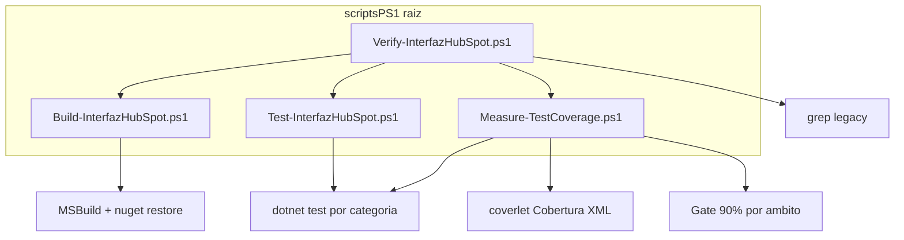

# Scripts PS1, cobertura 90% y documentación

## Estado actual

| Área | Situación |
|------|-----------|
| Scripts | 3 scripts en [`SolucionInterfazHubSpot/InterfazHubSpot/Scripts/agent/`](SolucionInterfazHubSpot/InterfazHubSpot/Scripts/agent/) — sin coverlet, sin categoría Security, sin parámetro `-Filter` |
| Tests unitarios | ~90 `[Fact]` en [`InterfazHubSpot.Tests.Unit`](SolucionInterfazHubSpot/InterfazHubSpot.Tests.Unit/) — buena cobertura manual de `HubSpot/`, `Integration/`, `Diagnostics/` (quick task 260606-p2k) |
| Tests seguridad | No hay `Category=Security`; lógica repartida en `HubSpotHttpRetryTests`, `HubSpotInternalsTests`, `ErpConnectivityProbeTests`, `IntegracionErrorNotifierTests`, `EmailsManagerTests` |
| Tests integración | 1 smoke + 9 Live **skipped** en [`InterfazHubSpot.IntegrationTests`](SolucionInterfazHubSpot/InterfazHubSpot.IntegrationTests/) — cobertura efectiva de `Managers/` casi nula sin BD |
| Documentación | [`README.md`](README.md) ya tiene quickstart pero rutas inconsistentes (p.ej. líneas 199–200 omiten `SolucionInterfazHubSpot/`) y repite comandos en 4+ archivos |

## Arquitectura objetivo



---

## 1. Mover y ampliar scripts → `scriptsPS1/`

Crear carpeta [`scriptsPS1/`](scriptsPS1/) en la **raíz del repo** y **eliminar** (o dejar stubs de 1 línea con deprecation) los scripts actuales en `Scripts/agent/`.

### [`scriptsPS1/Build-InterfazHubSpot.ps1`](scriptsPS1/Build-InterfazHubSpot.ps1)
- Misma lógica que el script actual; ajustar `$repoRoot` a `Join-Path $PSScriptRoot '..\SolucionInterfazHubSpot'`.
- Parámetros: `-LibrariesOnly` (sin cambios).

### [`scriptsPS1/Test-InterfazHubSpot.ps1`](scriptsPS1/Test-InterfazHubSpot.ps1)
- Parámetros nuevos:
  - `-Filter` → pasa a `dotnet test`
  - `-Category` → `Unit` (default), `Security`, `Integration`, `All`
  - `-IncludeLive` → incluye `Category=Live`
- Filtros xUnit por categoría:

| Categoría | Proyecto | Filtro default |
|-----------|----------|----------------|
| Unit | Tests.Unit | `Category!=Live&Category!=Security` |
| Security | Tests.Unit | `Category=Security` |
| Integration | IntegrationTests | `Category!=Live` (o sin filtro si `-IncludeLive`) |

- Ejecutar **build previo** opcional con `-SkipBuild` (para iteración rápida).

### [`scriptsPS1/Measure-TestCoverage.ps1`](scriptsPS1/Measure-TestCoverage.ps1) (nuevo)
- Ejecuta las 3 categorías con `--collect:"XPlat Code Coverage"` y `--results-directory scriptsPS1/coverage/<categoria>`.
- Parsea el XML Cobertura generado por coverlet (buscar `coverage.cobertura.xml` bajo el results dir).
- Compara **line-rate** agregado por ámbito contra umbral **90%** (param `-Threshold`, default 90).
- Ámbitos definidos en [`scriptsPS1/coverage-scopes.json`](scriptsPS1/coverage-scopes.json):

```json
{
  "unit": {
    "assemblies": ["InterfazHubSpot.Business"],
    "includePaths": ["HubSpot/", "Integration/", "Diagnostics/"],
    "threshold": 90
  },
  "security": {
    "assemblies": ["InterfazHubSpot.Business"],
    "includeClasses": [
      "HubSpotConfiguration",
      "HubSpotCrmClient",
      "ErpConnectivityProbe",
      "IntegracionErrorNotifier",
      "EmailsManager",
      "MSSecurity"
    ],
    "threshold": 90
  },
  "integration": {
    "assemblies": ["InterfazHubSpot.Business"],
    "includePaths": ["Managers/", "Integration/ClienteIntegracionMapper"],
    "threshold": 90
  }
}
```

- Salida legible: tabla por categoría (líneas cubiertas, %, PASS/FAIL).
- Exit code ≠ 0 si alguna categoría cae bajo umbral.

### [`scriptsPS1/Verify-InterfazHubSpot.ps1`](scriptsPS1/Verify-InterfazHubSpot.ps1)
- Build → Test (Unit+Security+Integration, sin Live) → **Measure-TestCoverage** → grep legacy (misma lógica actual).
- Parámetros: `-LibrariesOnly`, `-SkipBuild`, `-SkipTests`, `-SkipCoverage`, `-IncludeLive`.

### [`scriptsPS1/README.md`](scriptsPS1/README.md)
- Referencia única de parámetros y ejemplos (sin repetir arquitectura del producto).

### Actualizar referencias (obligatorio)
Reemplazar rutas antiguas en:
- [`AGENTS.md`](AGENTS.md), [`CLAUDE.md`](CLAUDE.md), [`README.md`](README.md)
- [`SolucionInterfazHubSpot/README.md`](SolucionInterfazHubSpot/README.md)
- [`.cursor/rules/interfaz-hubspot.mdc`](.cursor/rules/interfaz-hubspot.mdc), [`.cursor/rules/powershell-windows.mdc`](.cursor/rules/powershell-windows.mdc)
- [`.cursor/skills/interfaz-hubspot-dev/SKILL.md`](.cursor/skills/interfaz-hubspot-dev/SKILL.md), [`.cursor/skills/dotnet-best-practices/SKILL.md`](.cursor/skills/dotnet-best-practices/SKILL.md)
- [`docs/PRD_Integracion_HubSpot_2A_2B.md`](docs/PRD_Integracion_HubSpot_2A_2B.md) §15, [`docs/BatchProcess_Desarrollo_e_Implementacion.md`](docs/BatchProcess_Desarrollo_e_Implementacion.md)

Nuevo comando canónico:

```powershell
pwsh -NoProfile -File scriptsPS1/Build-InterfazHubSpot.ps1
pwsh -NoProfile -File scriptsPS1/Test-InterfazHubSpot.ps1
pwsh -NoProfile -File scriptsPS1/Measure-TestCoverage.ps1
pwsh -NoProfile -File scriptsPS1/Verify-InterfazHubSpot.ps1
```

---

## 2. Infraestructura coverlet

Añadir en ambos `.csproj` de test:

```xml
<PackageReference Include="coverlet.collector" Version="6.0.2" />
```

Archivos:
- [`InterfazHubSpot.Tests.Unit.csproj`](SolucionInterfazHubSpot/InterfazHubSpot.Tests.Unit/InterfazHubSpot.Tests.Unit.csproj)
- [`InterfazHubSpot.IntegrationTests.csproj`](SolucionInterfazHubSpot/InterfazHubSpot.IntegrationTests/InterfazHubSpot.IntegrationTests.csproj)

Añadir `scriptsPS1/coverage/` al `.gitignore`.

---

## 3. Categoría Security y tests faltantes

### Re-etiquetar tests existentes con `[Trait("Category", "Security")]`
Sin mover archivos; solo trait en tests que ya cubren superficie de seguridad:
- `HubSpotHttpRetryTests` (401 fail-fast)
- `HubSpotInternalsTests.ValidarToken_*`
- `ErpConnectivityProbeTests.SanitizeSqlError_*` y parseo connection string
- `IntegracionErrorNotifierTests.NotificarErrorAuth_*`
- `EmailsManagerTests.TruncarAsunto_*` (límite asunto / evitar payloads largos)

### Nuevos tests en [`InterfazHubSpot.Tests.Unit/Security/`](SolucionInterfazHubSpot/InterfazHubSpot.Tests.Unit/Security/)
| Archivo | Qué cubre |
|---------|-----------|
| `HubSpotConfigurationSecurityTests.cs` | `ValidarToken` sin token / mock activo; `TienePrivateAppToken`; headers Authorization no logueados |
| `MSSecurityTests.cs` | `GenerateSaltValue` longitud; `GenerateHashWithSalt` determinismo con salt fijo |
| `DevelopmentHubSpotStubSecurityTests.cs` | Stub dev no exige token real (trait Security) |

Objetivo: llevar el ámbito **security** del JSON a ≥90% line-rate medido solo con filtro `Category=Security`.

---

## 4. Cerrar gap integración (Managers ≥90%)

Hoy el ámbito `Managers/` apenas se ejecuta. Acciones:

1. **Corregir scaffolding Live** — añadir referencia `Mastersoft.Framework.Standard` en [`IntegrationTests.csproj`](SolucionInterfazHubSpot/InterfazHubSpot.IntegrationTests/InterfazHubSpot.IntegrationTests.csproj) (misma HintPath que Tests.Unit) para que los Live compilen cuando se quiten los `Skip`.

2. **Tests integración sin BD** en [`IntegrationTests/Managers/`](SolucionInterfazHubSpot/InterfazHubSpot.IntegrationTests/Managers/):
   - `ProcesosSpertaHubSpotManagerProjectionTests.cs` — `ProjectarMuestra` vía reflexión; validar todos los campos de `ColaIntegracionPendienteMuestra`.
   - `ClienteIntegracionManagerContractTests.cs` — mover o duplicar los 8 tests de [`ClienteIntegracionMapperTests.cs`](SolucionInterfazHubSpot/InterfazHubSpot.Tests.Unit/Managers/ClienteIntegracionMapperTests.cs) aquí con `Trait("Category","Integration")` (mantener copia en Unit **sin** trait Integration para no romper filtros unitarios).

3. **Live opcional** — documentar que `-IncludeLive` + `App.config` con MSGestion real eleva cobertura de managers EF6; gate CI default corre sin Live pero debe alcanzar 90% en el ámbito definido (mapper + proyección + smoke).

Si tras implementar el baseline coverlet sigue bajo 90% en integration, añadir tests de ramas puras adicionales (`ListarMuestraPendientes` con `maxItems<=0` vía manager con UoW mockeado **solo si** el baseline lo exige — evaluar en ejecución).

---

## 5. Documentación (sin redundancia)

| Documento | Rol | Contenido |
|-----------|-----|-----------|
| [`docs/QUICKSTART.md`](docs/QUICKSTART.md) | **Nuevo** — 5 minutos | Requisitos, clone, `Web.config`, build, test, verify, abrir MVC; un solo bloque de comandos `scriptsPS1/` |
| [`docs/TESTING.md`](docs/TESTING.md) | **Nuevo** — referencia tests | Categorías Unit/Security/Integration/Live; filtros xUnit; coverlet + umbrales; cómo activar Live; qué excluye CI default |
| [`README.md`](README.md) | Índice del repo | Resumen flujos + tabla de docs; **eliminar** secciones largas duplicadas (tests detallados, comandos repetidos) → enlazar a QUICKSTART y TESTING |
| [`scriptsPS1/README.md`](scriptsPS1/README.md) | Solo scripts | Parámetros, ejemplos, salida de coverage |
| [`SolucionInterfazHubSpot/README.md`](SolucionInterfazHubSpot/README.md) | Solo código .NET | Proyectos sln; enlace a `docs/TESTING.md` para build/test |

Principio: cada comando canónico documentado **una vez** en `scriptsPS1/README.md`; QUICKSTART copia solo el happy path; README/AGENTS/CLAUDE enlazan.

---

## 6. Verificación final

Ejecutar en orden (evidencia antes de cerrar):

```powershell
pwsh -NoProfile -File scriptsPS1/Verify-InterfazHubSpot.ps1
pwsh -NoProfile -File scriptsPS1/Measure-TestCoverage.ps1 -Threshold 90
pwsh -NoProfile -File scriptsPS1/Test-InterfazHubSpot.ps1 -Category Security
pwsh -NoProfile -File scriptsPS1/Test-InterfazHubSpot.ps1 -Category Integration
```

Criterios de aceptación:
- Las 3 categorías reportan **≥90%** line-rate en su ámbito (`coverage-scopes.json`).
- `Verify-InterfazHubSpot.ps1` termina OK (build + tests + coverage + grep legacy = 0).
- No quedan referencias rotas a `Scripts/agent/` en docs/rules/skills principales.
- Quickstart permite clonar → compilar → test en &lt;10 comandos.

## Riesgos y mitigaciones

| Riesgo | Mitigación |
|--------|------------|
| Integration &lt;90% sin BD | Tests de mapper + proyección + contratos; Live documentado con `-IncludeLive` |
| coverlet + net452 paths internos | Ámbitos por nombre de clase/path en XML Cobertura, no por rutas de disco |
| Muchos archivos referencian ruta antigua | Grep `Scripts/agent` post-cambio; actualizar en batch |
| App.config gitignored | QUICKSTART recuerda copiar `Web.config.example`; build script mantiene warning actual |
