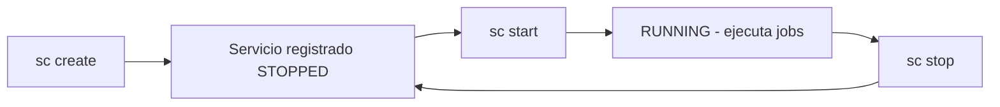
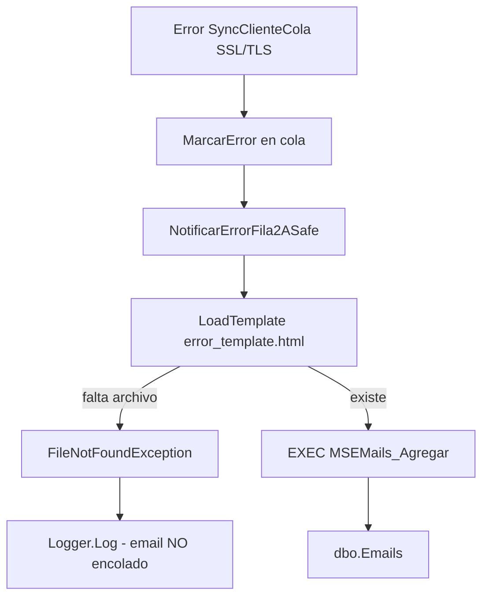

# Plan: servicio Windows + error SSL/TLS en batch HubSpot

## Diagnóstico

### Por qué no se veía "levantado" tras `sc create`

`sc create` **solo registra** el servicio en Windows; **no lo inicia**.

Estado observado en tu máquina:

| Campo | Valor | Significado |
|-------|-------|-------------|
| `ESTADO` | `STOPPED` (código salida Win32 **1077**) | El servicio nunca fue iniciado |
| `TIPO_INICIO` | `3` = **DEMAND_START** | Arranque manual; no sube solo al boot |

Comandos correctos:

```powershell
# 1. Crear (una sola vez; incluir start= auto para que arranque con Windows)
sc.exe create MastersoftInterfazHubSpot binPath= "C:\MsDna\InterfazHubSpot\ServicioFinalImple\MSScheduler452Service.exe" start= auto DisplayName= "Mastersoft Interfaz HubSpot"

# 2. Iniciar (obligatorio tras create si no usaste start= auto)
sc.exe start MastersoftInterfazHubSpot

# 3. Verificar
sc.exe query MastersoftInterfazHubSpot

# 4. Detener
sc.exe stop MastersoftInterfazHubSpot

# 5. Eliminar y recrear (si el binPath cambió)
sc.exe stop MastersoftInterfazHubSpot
sc.exe delete MastersoftInterfazHubSpot
```

Hoy `MastersoftInterfazHubSpot` ya figura **RUNNING** tras `sc start`.



### Por qué el error SSL/TLS **no** es por DLLs faltantes

Stack trace:

```
System.Net.WebException: No se puede crear un canal seguro SSL/TLS
  → HubSpotCrmClient.SendWithRetryAsyncCore
  → SearchCompanyIdByMastersoftIdAsync
```

El job **sí corre** (llegó a HubSpot API). El fallo es negociación TLS al llamar `https://api.hubapi.com`.

**Causa raíz:** en MVC, TLS 1.2 se habilita en [`InterfazHubSpot/Global.asax.cs`](InterfazHubSpot/Global.asax.cs) línea 28:

```csharp
ServicePointManager.SecurityProtocol = SecurityProtocolType.Tls12;
```

El servicio Windows **no pasa por MVC** → `HubSpotCrmClient` usa `HttpClient` sin fijar protocolo. En .NET Framework 4.5.2 el default puede ser SSL3/TLS1.0, rechazado por HubSpot.

**Comparación con [`C:\MsDna\InterfazHubSpot\MSProcFacturacionML`](C:\MsDna\InterfazHubSpot\MSProcFacturacionML):**

- Tiene ~150 DLLs de **otros productos** (Ventas, Comprobantes, MVC, ActiveReports, Owin, etc.).
- Tu carpeta [`ServicioFinalImple`](C:\MsDna\InterfazHubSpot\ServicioFinalImple) ya tiene el subconjunto correcto de InterfazHubSpot + Framework + Scheduler452.
- Copiar MSProcFacturacionML **no resuelve SSL** y puede introducir conflictos de versión.
- El único DLL “de red” extra allí (`System.Net.Http.dll`) viene del GAC/NuGet del framework; no corrige TLS.

**Gaps de despliegue** en `ServicioFinalImple`:

- Faltan `InterfazHubSpot.Business.dll.config` e `InterfazHubSpot.Mapping.dll.config` (config EF embebida).
- **Falta `Templates/error_template.html`** (confirmado: `Test-Path` → `False`). Sin esto, el email **no se encola**.

### Por qué el error de cola no grabó email (aunque el código lo intenta)

El flujo en error de fila 2A **sí llama** a notificación:

```220:225:InterfazHubSpot.Business/HubSpot/HubSpotIntegracionRunner.cs
catch (Exception ex)
{
    _cola.MarcarError(item.ProcesoId, ex.Message);
    NotificarErrorFila2ASafe(item.ProcesoId, clienteCola, "SyncClienteCola", ex);
}
```

`NotificarErrorFila2A` → `EmailsManager.GrabarEmailErrores` → `ConstruirHtmlErrores` → `LoadTemplate()` busca:

```
{BaseDirectory}/Templates/error_template.html
```

En MVC existe en [`InterfazHubSpot/Templates/error_template.html`](InterfazHubSpot/Templates/error_template.html). En `ServicioFinalImple` **no está** → `FileNotFoundException`.

Esa excepción se **traga en silencio** en `NotificarErrorFila2ASafe`:

```352:361:InterfazHubSpot.Business/HubSpot/HubSpotIntegracionRunner.cs
catch (Exception notifyEx)
{
    Logger.Log("No se pudo encolar email (2A): " + notifyEx.Message);
}
```

Por eso ves el error en `MensajeUltimoError` de la cola pero **no** fila en `dbo.Emails`.

**Referencia:** `MSProcFacturacionML` sí tiene `Templates/error_template.html` — es lo único relevante a copiar de esa carpeta para emails (no sus 150 DLL de otros módulos).

**Requisitos adicionales** en `MSScheduler452Service.exe.config` (ya presentes en tu config):

| Clave | Rol |
|-------|-----|
| `EmailErrPara` | Obligatorio; si vacío, `GrabarEmailErrores` retorna sin encolar |
| `EmailErrDE` o `EmailDe` | Remitente para `MSEMails_Agregar` |
| `MSGestion` | SP `dbo.MSEMails_Agregar` encola el correo |



---

## Cambios a implementar

### 1. Documentación — ampliar guía batch

Actualizar [`docs/BatchProcess_Desarrollo_e_Implementacion.md`](docs/BatchProcess_Desarrollo_e_Implementacion.md) con nueva sección **"Instalación del servicio Windows (Calzetta)"**:

- Comandos `sc create` / `start` / `stop` / `query` / `delete` con nombre real `MastersoftInterfazHubSpot`
- Ruta real: `C:\MsDna\InterfazHubSpot\ServicioFinalImple\MSScheduler452Service.exe`
- Explicar `sc create` ≠ servicio corriendo; `start= auto` vs `DEMAND_START`
- Tabla de estados (`STOPPED` 1077 = nunca iniciado; `RUNNING` = OK)
- Checklist post-`sc start`: `sc query`, revisar `Debug.txt` / `PathLog`, insertar fila cola
- Sección **Troubleshooting SSL/TLS** con síntoma, causa (TLS 1.2), fix en código
- Sección **Qué NO copiar de MSProcFacturacionML** (lista resumida: MVC, Ventas, etc.)
- Lista mínima de DLL obligatorios para `ServicioFinalImple`
- Sección **Emails de error en batch**: copiar `Templates/error_template.html`; claves `EmailErrPara` / `EmailErrDE`; verificar `dbo.Emails` tras error
- Qué copiar de MSProcFacturacionML: **solo** `Templates/` (no el resto de DLL)

Actualizar [`implementacion/ServicioInterfazHubSpot_Implementacion/README.md`](implementacion/ServicioInterfazHubSpot_Implementacion/README.md) con los mismos comandos `sc` y carpeta `Templates/`.

### 2. Fix de código — TLS 1.2 en el batch

Agregar inicialización TLS en [`InterfazHubSpot.Business/HubSpot/HubSpotCrmClient.cs`](InterfazHubSpot.Business/HubSpot/HubSpotCrmClient.cs):

```csharp
static HubSpotCrmClient()
{
    ServicePointManager.SecurityProtocol = SecurityProtocolType.Tls12;
}
```

(o helper estático llamado una vez antes del primer `HttpClient`). Esto alinea batch con MVC sin depender de `Global.asax`.

**Alternativa descartada:** solo documentar registry `SchUseStrongCrypto` — el fix en código es más portable y explícito para este repo.

### 3. Fix emails de error en servicio Windows

**Despliegue (obligatorio):**

```powershell
$dst = "C:\MsDna\InterfazHubSpot\ServicioFinalImple"
New-Item -ItemType Directory -Path "$dst\Templates" -Force
Copy-Item "InterfazHubSpot\Templates\error_template.html" "$dst\Templates\" -Force
```

Origen alternativo: `MSProcFacturacionML\Templates\error_template.html` (mismo archivo).

**Código (recomendado — robustez):** en [`EmailsManager.cs`](InterfazHubSpot.Business/Managers/EmailsManager.cs), si `LoadTemplate()` falla, usar HTML mínimo embebido en lugar de lanzar `FileNotFoundException`. Así el batch encola email aunque falte el archivo en un despliegue incompleto.

**Opcional:** ampliar log en `NotificarErrorFila2ASafe` para incluir `notifyEx.ToString()` en `PathLog` / `Debug.txt` y facilitar diagnóstico.

### 4. Despliegue tras los fixes

1. Build Release: `pwsh -NoProfile -File InterfazHubSpot/Scripts/agent/Build-InterfazHubSpot.ps1 -LibrariesOnly`
2. Copiar a `ServicioFinalImple`:
   - `InterfazHubSpot.Business.dll` (TLS + email fallback si se implementa)
   - `InterfazHubSpot.BatchProcess.dll` (si cambió)
   - `InterfazHubSpot.Business.dll.config`, `InterfazHubSpot.Mapping.dll.config`
   - `Templates/error_template.html`
3. Reiniciar servicio:

```powershell
sc.exe stop MastersoftInterfazHubSpot
sc.exe start MastersoftInterfazHubSpot
```

4. Smoke cola: fila sin error SSL (o `Ok` tras fix TLS).
5. Smoke email: forzar error (ej. token inválido temporal) y verificar fila nueva en `dbo.Emails` vía `MSEMails_Agregar`.

### 5. Verificación

- `sc.exe query MastersoftInterfazHubSpot` → `RUNNING`
- Cola: sin error SSL en `MensajeUltimoError` tras fix TLS
- `ServicioFinalImple\Templates\error_template.html` existe
- Tras error de fila: registro en `dbo.Emails` (o log sin "No se pudo encolar email")
- Tests: `IntegracionErrorNotifierTests`, `EmailsManagerTests` siguen pasando
- Opcional: paridad MVC vs servicio con misma config

---

## Resumen para el usuario

| Pregunta | Respuesta |
|----------|-----------|
| ¿Por qué no estaba levantado? | `sc create` no inicia; faltaba `sc start` (y `start= auto` si querés arranque automático) |
| ¿Faltan DLL de MSProcFacturacionML? | **No** para SSL; esa carpeta es otro producto con decenas de DLL irrelevantes |
| ¿Por qué falla HubSpot en servicio pero MVC funciona? | MVC fuerza TLS 1.2 en `Global.asax`; el servicio no |
| ¿Por qué no llegó el email del error? | Falta `Templates/error_template.html` en `ServicioFinalImple`; fallo silenciado en `NotificarErrorFila2ASafe` |
| ¿Qué hacer? | Documentar `sc` + fix TLS + copiar `Templates/` + (opcional) fallback HTML en `EmailsManager` + redeploy |
