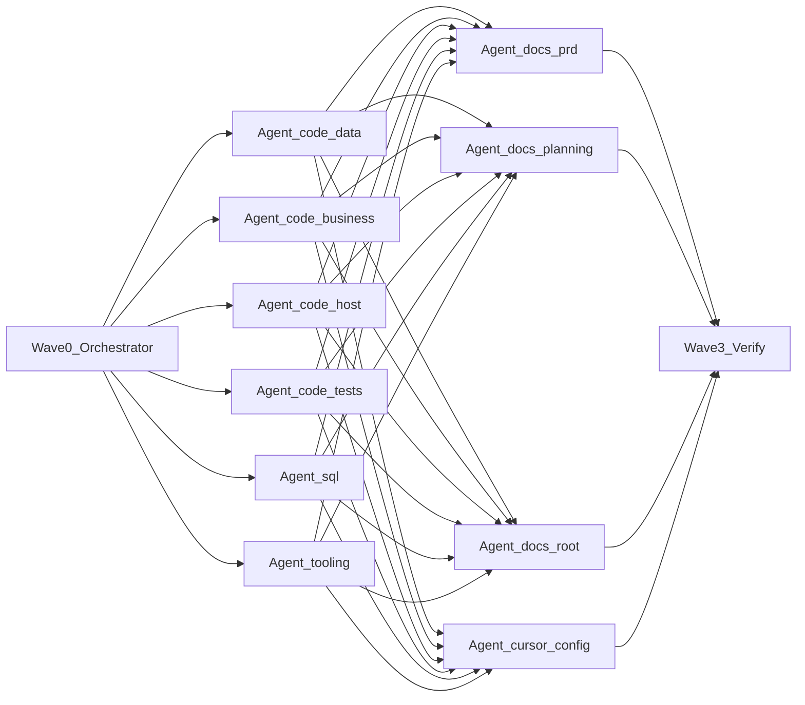
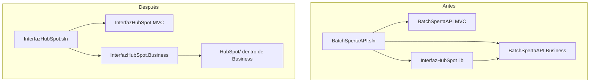
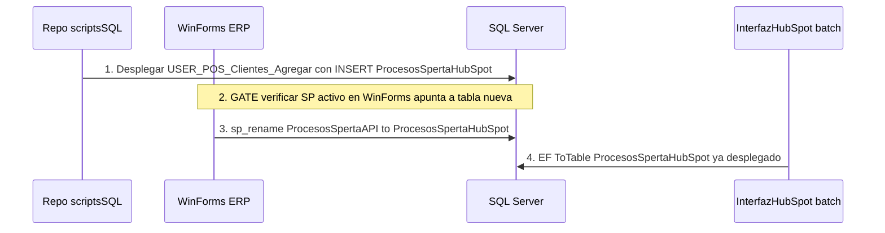

# Plan: Unificación de nombres InterfazHubSpot

## Objetivo

Unificar nomenclatura en código, BD, documentación y tooling bajo **`InterfazHubSpot`**, eliminando referencias a `BatchSpertaAPI` y `ProcesosSpertaAPI`. Los stored procedures **`USER_HS_*`** no cambian.

## Convenciones acordadas (bloqueadas)

**Regla de casing — sin excepciones:** siempre `HubSpot` con **S mayúscula** (marca). Prohibido `Hubspot` en código, SQL, EF, docs o scripts.

| Antes | Después |
|-------|---------|
| `BatchSpertaAPI.sln` | `InterfazHubSpot.sln` |
| `BatchSpertaAPI/` (MVC) | `InterfazHubSpot/` |
| `BatchSpertaAPI.*` (capas) | `InterfazHubSpot.*` |
| Proyecto `InterfazHubSpot/` (3 archivos .cs) | **Fusionado** en `InterfazHubSpot.Business/HubSpot/` |
| Tabla `dbo.ProcesosSpertaAPI` | `dbo.ProcesosSpertaHubSpot` |
| Clase `ProcesosSpertaApi` | `ProcesosSpertaHubSpot` |
| Manager / Map EF | `ProcesosSpertaHubSpotManager`, `ProcesosSpertaHubSpotMap` |
| SPs `USER_HS_*` | Sin cambios |
| SP `USER_POS_Clientes_Agregar` | Mismo nombre; `INSERT` apunta a `ProcesosSpertaHubSpot` |

## Alcance del PRD

**Decisión:** el PRD ([`docs/PRD_Integracion_HubSpot_2A_2B.md`](docs/PRD_Integracion_HubSpot_2A_2B.md)) se actualiza **en su totalidad** para reflejar este refactor, no solo .NET + SQL. Incluye:

- Estructura de solución `InterfazHubSpot.sln` y fusión del conector en Business
- Tabla/cola `ProcesosSpertaHubSpot` y orden de despliegue con WinForms
- Scripts canónicos `InterfazHubSpot/Scripts/agent/*.ps1`
- Convenciones operativas para agentes (`AGENTS.md`, reglas Cursor)

Las fases 3–5 del plan **no son un refactor separado**: son parte del mismo entregable documentado en el PRD.

---

## Ejecución multi-agente (paralelo)

El refactor se ejecuta en **4 ondas**. Solo la Wave 0 y la Wave 3 son secuenciales (orquestador). Las Waves 1 y 2 lanzan **agentes en paralelo** en un único turno con múltiples `Task` (patrón `dispatching-parallel-agents`).



### Reglas de coordinación

| Regla | Detalle |
|-------|---------|
| Ownership estricto | Cada agente solo edita los paths de su columna en la matriz inferior |
| Sin contexto compartido | Cada `Task` recibe prompt autocontenido con convenciones bloqueadas (`InterfazHubSpot`, `ProcesosSpertaHubSpot`) |
| Un mensaje, N agentes | Wave 1 y Wave 2: disparar todos los `Task` en el **mismo mensaje** del orquestador |
| Commits por ola | Wave 0 → commit checkpoint; Wave 3 → commit final (evitar commits parciales de agentes salvo conflictos) |
| Prohibido en paralelo | Editar `InterfazHubSpot.sln` fuera de Wave 0; tocar carpetas de otro agente |
| Reintentos | Si un agente falla, relanzar solo ese agente; no repetir la ola entera |

### Wave 0 — Orquestador (1 agente, bloqueante)

**Agente:** `generalPurpose` o agente principal.

**Alcance exclusivo:**

1. `git mv` de las 8 carpetas `BatchSpertaAPI.*` → `InterfazHubSpot.*`
2. Renombrar `BatchSpertaAPI.sln` → `InterfazHubSpot.sln`
3. Renombrar cada `.csproj` al nuevo nombre
4. Mover 3 archivos de `InterfazHubSpot/` (viejo) → `InterfazHubSpot.Business/HubSpot/`; eliminar carpeta y entrada del .sln del proyecto suelto
5. Actualizar **solo rutas** en `.sln` y `ProjectReference` (paths físicos); **no** reemplazo masivo de namespaces aún
6. Commit: `refactor(wave0): rename solution folders and sln`

**Entregable para Waves 1–2:** estructura de carpetas final; agentes downstream asumen paths `InterfazHubSpot.*` ya existentes.

---

### Wave 1 — Código, SQL y tooling (6 agentes en paralelo)

Lanzar los 6 `Task` simultáneamente tras completar Wave 0.

| ID | Agente | Paths permitidos | Entregable |
|----|--------|------------------|------------|
| **1A** | `code-data` | `InterfazHubSpot.Entities/`, `InterfazHubSpot.Interfaces/`, `InterfazHubSpot.Mapping/` | Namespaces; `ProcesosSpertaHubSpot` entity + map + `ToTable`; su `.csproj` |
| **1B** | `code-business` | `InterfazHubSpot.Business/` (incl. `HubSpot/`) | Namespaces; `ProcesosSpertaHubSpotManager`; runners fusionados; su `.csproj` |
| **1C** | `code-host` | `InterfazHubSpot/` (MVC), `InterfazHubSpot.BatchProcess/` | Controllers, jobs, filtros; namespaces; sus `.csproj` |
| **1D** | `code-tests` | `InterfazHubSpot.Tests.Unit/`, `InterfazHubSpot.IntegrationTests/` | Referencias a Business; namespaces tests; `InternalsVisibleTo` |
| **1E** | `sql` | `scriptsSQL/`, `sql/` (crear carpeta) | `USER_POS` → `ProcesosSpertaHubSpot`; `001` migración; checklist gate WinForms en comentario SQL |
| **1F** | `tooling` | `InterfazHubSpot/Scripts/agent/` únicamente | `Build-`, `Test-`, `Verify-InterfazHubSpot.ps1` |

**Prompt mínimo por agente (plantilla):**

```
Convenciones bloqueadas: InterfazHubSpot, ProcesosSpertaHubSpot (S mayúscula). Prohibido BatchSpertaAPI, ProcesosSpertaAPI, Hubspot.
Ownership: solo [PATHS]. No editar .sln ni carpetas ajenas.
Tarea: [ENTREGABLE]. Devolver: archivos tocados + grep residual en tu scope.
```

**Dependencias cruzadas resueltas en Wave 0:** paths de `ProjectReference` ya apuntan a `InterfazHubSpot.*`. Los agentes 1A–1D no modifican referencias entre proyectos salvo su propio `.csproj`.

---

### Wave 2 — Documentación y Cursor (4 agentes en paralelo)

Lanzar tras **todos** los agentes de Wave 1 completos (el código y scripts ya existen para documentar rutas reales).

| ID | Agente | Paths permitidos | Entregable |
|----|--------|------------------|------------|
| **2A** | `docs-prd` | `docs/PRD_Integracion_HubSpot_2A_2B.md` | PRD completo incl. §15 tooling + gate WinForms |
| **2B** | `docs-planning` | `.planning/**` | PROJECT, ROADMAP, REQUIREMENTS, STATE, research/* |
| **2C** | `docs-root` | `README.md`, `Web.config.example` (crear si falta) | Estructura solución, scripts, deploy |
| **2D** | `cursor-config` | `AGENTS.md`, `.cursor/rules/interfaz-hubspot.mdc`, `.cursor/skills/get-shit-done/SKILL.md` | Comandos canónicos; regla always-on |

**Orden interno sugerido para 2A:** PRD es fuente; 2B y 2C alinean con PRD ya actualizado (2A debe terminar primero **o** 2B/2C esperan — mitigación: lanzar 2A y 2D en paralelo; 2B y 2C **30s después** o en sub-ola 2b tras confirmar 2A).

**Sub-ola 2 optimizada (3+1):**

- **Paralelo inmediato:** 2A (`docs-prd`) + 2D (`cursor-config`) + 1F ya entregó scripts en W1
- **Paralelo tras 2A:** 2B (`docs-planning`) + 2C (`docs-root`)

---

### Wave 3 — Orquestador verificación (1 agente)

1. `git status` — detectar conflictos entre agentes
2. Ejecutar `Verify-InterfazHubSpot.ps1`
3. Grep global: `BatchSpertaAPI`, `ProcesosSpertaAPI`, `Hubspot` → 0 en `.cs`, `.sql`, `.md`
4. Corregir archivos huérfanos que ningún agente cubrió (p. ej. logs `.txt`, `PostBuild.bat`)
5. Commit: `refactor: unify solution as InterfazHubSpot`

**Gate WinForms (deploy BD):** queda **fuera** de las ondas automatizables — checklist en PRD §5.1 y comentario en `sql/001`; ejecución manual/coordinada con Calzetta post-merge.

---

### Dispatch técnico (Cursor)

Ejemplo de lanzamiento Wave 1 por el orquestador:

```
Task(description="code-data rename", subagent_type="generalPurpose", prompt="...")
Task(description="code-business rename", subagent_type="generalPurpose", prompt="...")
Task(description="code-host rename", subagent_type="generalPurpose", prompt="...")
Task(description="code-tests rename", subagent_type="generalPurpose", prompt="...")
Task(description="sql scripts", subagent_type="generalPurpose", prompt="...")
Task(description="ps1 tooling", subagent_type="shell", prompt="...")
```

Usar `subagent_type="shell"` para 1F (scripts PS1). Usar `explore` solo lectura si un agente necesita inventario previo — no en la misma ola que edición.



---

## Fase 1 — Renombrado físico de la solución (git mv)

Renombrar carpetas y archivos `.csproj` / `.sln` preservando GUIDs de proyecto (evita romper referencias internas de VS):

| Carpeta actual | Nueva carpeta |
|----------------|---------------|
| [`BatchSpertaAPI/`](BatchSpertaAPI/) | `InterfazHubSpot/` |
| [`BatchSpertaAPI.Business/`](BatchSpertaAPI.Business/) | `InterfazHubSpot.Business/` |
| [`BatchSpertaAPI.Entities/`](BatchSpertaAPI.Entities/) |
| [`BatchSpertaAPI.Interfaces/`](BatchSpertaAPI.Interfaces/) |
| [`BatchSpertaAPI.Mapping/`](BatchSpertaAPI.Mapping/) |
| [`BatchSpertaAPI.BatchProcess/`](BatchSpertaAPI.BatchProcess/) |
| [`BatchSpertaAPI.Tests.Unit/`](BatchSpertaAPI.Tests.Unit/) |
| [`BatchSpertaAPI.IntegrationTests/`](BatchSpertaAPI.IntegrationTests/) |
| [`BatchSpertaAPI.sln`](BatchSpertaAPI.sln) | `InterfazHubSpot.sln` |

Eliminar carpeta [`InterfazHubSpot/`](InterfazHubSpot/) tras mover sus 3 archivos a Business:

- `HubSpotIntegracionRunner.cs`
- `HubSpotCrmClient.cs`
- `DevelopmentHubSpotStubHandler.cs`

Destino propuesto: `InterfazHubSpot.Business/HubSpot/` con namespace `InterfazHubSpot.Business.HubSpot`.

---

## Fase 2 — Actualización de código (.NET)

### 2.1 Proyectos y referencias

En cada `.csproj` y [`InterfazHubSpot.sln`](BatchSpertaAPI.sln):

- `RootNamespace`, `AssemblyName`, rutas `ProjectReference`, `HintPath` relativos
- Quitar entrada y referencia al proyecto `InterfazHubSpot` independiente
- [`BatchSpertaAPI.BatchProcess`](BatchSpertaAPI.BatchProcess/BatchSpertaAPI.BatchProcess.csproj): referenciar solo `InterfazHubSpot.Business` (ya contiene runners)
- [`BatchSpertaAPI.Tests.Unit`](BatchSpertaAPI.Tests.Unit/BatchSpertaAPI.Tests.Unit.csproj): quitar `ProjectReference` a `InterfazHubSpot`; tests de HubSpot apuntan a `InterfazHubSpot.Business`
- `InternalsVisibleTo` → `InterfazHubSpot.Tests.Unit`

### 2.2 Namespaces masivos (~108 archivos)

Reemplazo sistemático con verificación grep final:

```
BatchSpertaAPI          → InterfazHubSpot
BatchSpertaAPI.Business → InterfazHubSpot.Business
... (todas las capas)
namespace InterfazHubSpot → namespace InterfazHubSpot.Business.HubSpot  (solo archivos fusionados)
```

Archivos críticos a revisar manualmente:

- [`HomeController.cs`](BatchSpertaAPI/Controllers/HomeController.cs) — `ProcesosSpertaApiManager`
- [`ProcesosSpertaApiManager.cs`](BatchSpertaAPI.Business/Managers/ProcesosSpertaApiManager.cs)
- [`ProcesosSpertaApiMap.cs`](BatchSpertaAPI.Mapping/Mapping/ProcesosSpertaApiMap.cs) — `ToTable("ProcesosSpertaHubSpot")`
- [`MSGestionContext.cs`](BatchSpertaAPI.Mapping/Context/MSGestionContext.cs)
- Jobs en [`BatchSpertaAPI.BatchProcess/`](BatchSpertaAPI.BatchProcess/)

### 2.3 Renombrado entidad cola

| Artefacto | Nuevo nombre |
|-----------|--------------|
| `ProcesosSpertaApi.cs` | `ProcesosSpertaHubSpot.cs` |
| `ProcesosSpertaApiMap.cs` | `ProcesosSpertaHubSpotMap.cs` |
| `ProcesosSpertaApiManager.cs` | `ProcesosSpertaHubSpotManager.cs` |
| EF `ToTable(...)` | `"ProcesosSpertaHubSpot"` |

### 2.4 Configuración runtime (Web.config local, no versionado)

Actualizar claves que hoy dicen `BatchSpertaAPI`:

- `Title`, `FrameworkCNPrefix`, `ErrorLogConnectionName`
- Forms auth `name`
- `PathLog` (ruta de log)

Documentar en `.config.example` los valores esperados post-rename.

### 2.5 SQL y gate WinForms (orden crítico)

Evitar ventana donde el ERP inserta en la tabla vieja mientras el batch lee la nueva (o viceversa).

**Secuencia obligatoria en BD:**



**Paso explícito — Gate WinForms (antes de `sp_rename`):**

1. Actualizar [`scriptsSQL/USER_POS_Clientes_Agregar.sql`](scriptsSQL/USER_POS_Clientes_Agregar.sql): `INSERT INTO dbo.ProcesosSpertaHubSpot`
2. Desplegar el SP en BD de desarrollo/staging
3. **Verificar** en el código WinForms de Calzetta que la post-grabación de cliente invoca `USER_POS_Clientes_Agregar` y que la versión desplegada en servidor usa `ProcesosSpertaHubSpot` (consultar `OBJECT_DEFINITION` o script del SP en la BD)
4. Coordinar con Calzetta: ventana de mantenimiento si hace falta pausar grabación de clientes
5. **Solo entonces** ejecutar migración de tabla (`sp_rename` o recreate según política DBA)

**Artefactos SQL en repo:**

- `sql/001_ProcesosSpertaHubSpot.sql` — DDL tabla nueva o `sp_rename` desde `ProcesosSpertaAPI`
- `sql/002_USER_POS_Clientes_Agregar.sql` — copia versionada del SP (alineada con `scriptsSQL/`)
- Mantener `USER_HS_*` sin cambios

---

## Fase 3 — Scripts PowerShell canónicos (ahorro de tokens)

**Ubicación:** `InterfazHubSpot/Scripts/agent/` (subcarpeta separada de los ~1294 archivos JS/Kendo en `Scripts/`)

| Script | Responsabilidad |
|--------|-----------------|
| `Build-InterfazHubSpot.ps1` | `nuget restore InterfazHubSpot.sln` + MSBuild; parámetro `-LibrariesOnly` (sin sitio MVC) |
| `Test-InterfazHubSpot.ps1` | `dotnet test` en `InterfazHubSpot.Tests.Unit` + `InterfazHubSpot.IntegrationTests`; excluye `Category=Live` por defecto |
| `Verify-InterfazHubSpot.ps1` | Orquesta Build + Test + grep legacy (`BatchSpertaAPI`, `ProcesosSpertaAPI`, `Hubspot` con s minúscula) → 0 hits |

**Descubrimiento MSBuild** (orden de prioridad, sin búsquedas ad hoc del agente):

1. `$env:SPERTA_MSBUILD`
2. `$env:MSBUILD_EXE`
3. `vswhere` → última VS con MSBuild
4. Falla explícita con mensaje de configuración

Ejemplo de invocación única para agentes:

```powershell
pwsh -NoProfile -File .\InterfazHubSpot\Scripts\agent\Verify-InterfazHubSpot.ps1
```

---

## Fase 4 — Documentación (PRD como fuente canónica)

Actualizar **todos** los archivos que hoy referencian nombres legacy (15 identificados). El **PRD es el documento maestro**; README y `.planning/` derivan de él.

**PRD — secciones a reescribir** ([`docs/PRD_Integracion_HubSpot_2A_2B.md`](docs/PRD_Integracion_HubSpot_2A_2B.md)):

| Sección PRD | Cambio |
|-------------|--------|
| §1 Contexto | `BatchSpertaAPI` → `InterfazHubSpot` |
| §4 Estructura proyecto | Árbol `InterfazHubSpot.sln`; sin proyecto `InterfazHubSpot` suelto; `Business/HubSpot/` |
| §5.1 Tabla cola | `ProcesosSpertaHubSpot` + gate WinForms antes de rename BD |
| §6 Flujo 2A | Referencias cola/manager con nombre nuevo |
| §8 Web.config | Claves `InterfazHubSpot` / `FrameworkCNPrefix` |
| §13 Scripts SQL | Rutas `sql/001_ProcesosSpertaHubSpot.sql`, etc. |
| **Nueva §15** | Convenciones de nombres + scripts agent (`Build/Test/Verify`) + reglas Cursor |

**Raíz y operación:**
- [`README.md`](README.md) — estructura, scripts, tabla cola, build/test, orden despliegue WinForms
- [`AGENTS.md`](AGENTS.md) — stack, comandos canónicos, gate WinForms

**GSD `.planning/`:**
- [`PROJECT.md`](.planning/PROJECT.md), [`ROADMAP.md`](.planning/ROADMAP.md), [`REQUIREMENTS.md`](.planning/REQUIREMENTS.md), [`STATE.md`](.planning/STATE.md)
- Research: `STACK.md`, `ARCHITECTURE.md`, `SUMMARY.md`, `FEATURES.md`, `PITFALLS.md`

Cambios transversales en docs:
- `BatchSpertaAPI` → `InterfazHubSpot`
- `ProcesosSpertaAPI` → `ProcesosSpertaHubSpot` (nunca `Hubspot`)
- Rutas scripts → `InterfazHubSpot/Scripts/agent/*.ps1`
- Diagrama solución sin proyecto `InterfazHubSpot` separado (fusionado en Business)

---

## Fase 5 — Reglas Cursor y skills

### Nueva regla always-on

[`.cursor/rules/interfaz-hubspot.mdc`](.cursor/rules/) con:

- Nombre unificado `InterfazHubSpot` (prohibido reintroducir `BatchSpertaAPI`)
- Tabla cola: `ProcesosSpertaHubSpot`; SPs datos: `USER_HS_*`
- **Comandos obligatorios** para build/test/verify (rutas exactas de los `.ps1`)
- Prohibido improvisar MSBuild/dotnet sin pasar por scripts
- Stack: .NET Framework 4.5.2 (no aplicar `dotnet-best-practices` de .NET 8)

### Actualizar skills existentes

- [`.cursor/skills/get-shit-done/SKILL.md`](.cursor/skills/get-shit-done/SKILL.md) — referencias a solución y scripts
- Opcional: snippet en [`dotnet-best-practices`](.cursor/skills/dotnet-best-practices/SKILL.md) aclarando que **este repo** es excepción Framework 4.5.2

### AGENTS.md — sección "Comandos canónicos"

```markdown
| Acción | Comando |
|--------|---------|
| Build completo | pwsh -File InterfazHubSpot/Scripts/agent/Build-InterfazHubSpot.ps1 |
| Solo librerías | ... -LibrariesOnly |
| Tests | pwsh -File InterfazHubSpot/Scripts/agent/Test-InterfazHubSpot.ps1 |
| Verificar todo | pwsh -File InterfazHubSpot/Scripts/agent/Verify-InterfazHubSpot.ps1 |
```

---

## Fase 6 — Verificación final

1. Ejecutar `Verify-InterfazHubSpot.ps1` — debe pasar build + tests
2. Grep global: 0 hits de `BatchSpertaAPI`, `ProcesosSpertaAPI` en `.cs`, `.sql`, `.md` (excluir historial git / logs)
3. Abrir `InterfazHubSpot.sln` en VS — 8 proyectos, sin proyecto huérfano
4. Commit atómico sugerido: `refactor: rename solution to InterfazHubSpot and unify naming`

---

## Riesgos y mitigaciones

| Riesgo | Mitigación |
|--------|------------|
| Ventana ERP → tabla vieja / batch → tabla nueva | **Gate WinForms** (§2.5): SP desplegado y verificado antes de `sp_rename` |
| Tabla `ProcesosSpertaAPI` ya en BD producción | `sp_rename` solo tras gate; script en `sql/001` |
| Inconsistencia `Hubspot` vs `HubSpot` | Convención bloqueada; grep en `Verify-InterfazHubSpot.ps1` incluye `Hubspot` como error |
| Web.config local con rutas legacy | `.config.example` + nota en README deploy |
| MSBuild no encontrado en CI/agente | Variables `SPERTA_MSBUILD` documentadas en scripts y AGENTS |
| Tests que referencian assembly `InterfazHubSpot` antiguo | Agente `code-tests` (Wave 1D) |
| Carpeta `Scripts/` mezcla JS y PS1 | Agente `tooling` solo en `Scripts/agent/` |
| Conflictos merge entre agentes paralelos | Wave 3 orquestador; ownership estricto en Waves 1–2 |
| Agente edita archivo fuera de scope | Relanzar agente con prompt más estricto; revertir cambio conflictivo |

---

## Orden de ejecución (resumen multi-agente)

| Ola | Agentes | Paralelo | Commit |
|-----|---------|----------|--------|
| **0** | Orquestador | No | `refactor(wave0): rename solution folders and sln` |
| **1** | 1A–1F (código, SQL, PS1) | **Sí (6)** | — (acumular para Wave 3) |
| **2a** | 2A PRD + 2D Cursor | **Sí (2)** | — |
| **2b** | 2B planning + 2C README | **Sí (2)** | — |
| **3** | Orquestador verify | No | `refactor: unify solution as InterfazHubSpot` |
| **Deploy** | Calzetta + DBA | Manual | Gate WinForms → `sp_rename` tabla |

**Tiempo estimado:** Wave 0 ~10 min; Waves 1+2 en paralelo ~15–25 min; Wave 3 ~10 min.
