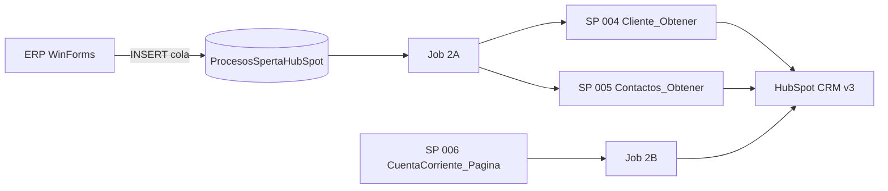

# InterfazHubSpot

[](https://dotnet.microsoft.com/)
[](https://developers.hubspot.com/docs/api/crm/understanding-the-crm)
[](https://www.microsoft.com/sql-server)
[](InterfazHubSpot.Tests.Unit/)

Integración **ERP Mastersoft → HubSpot CRM** para Calzetta: batch en segundo plano (flujos **2A** y **2B**) y consola web MVC para desarrollo y trazas.

Los datos salen de **SQL Server** (`MSGestion`) vía stored procedures. HubSpot se consume con **Private App Token** (CRM v3). No hay llamada HTTP a SpertaAPI en runtime.

---

## Flujos

| Flujo | Job | Qué hace |
|-------|-----|----------|
| **2A** | `ProcesarColaIntegracionesHubSpotJob` | Cola → SP 004 (empresa + direcciones) → upsert company HubSpot → SP 005 (contactos) → upsert/asociar contactos |
| **2B** | `HubSpotSincronizarCuentaCorrienteJob` | Pagina cuenta corriente por SP y actualiza propiedad `manejo_cuenta_corriente` en batch (100 companies/página) |



---

## Inicio rápido

### Requisitos

- Windows con **Visual Studio** o **MSBuild** + **NuGet**
- **PowerShell 7+** (`pwsh`) para scripts del repo
- **SQL Server** con base `MSGestion` y scripts en `scriptsSQL/` (o copias en `sql/`) aplicados
- Token HubSpot (Private App) — **no versionar**; usar `Web.config` local

### Clonar y compilar

```powershell
git clone https://github.com/AlanLyok/InterfazHubSpot.git
cd InterfazHubSpot
copy SolucionInterfazHubSpot\Web.config.example SolucionInterfazHubSpot\InterfazHubSpot\Web.config
# Editar Web.config: connectionString MSGestion + HubSpot:PrivateAppToken (o UseDevelopmentMock=true en dev)

pwsh -NoProfile -File SolucionInterfazHubSpot/InterfazHubSpot/Scripts/agent/Build-InterfazHubSpot.ps1
pwsh -NoProfile -File SolucionInterfazHubSpot/InterfazHubSpot/Scripts/agent/Test-InterfazHubSpot.ps1
```

Verificación completa (build + tests + grep legacy):

```powershell
pwsh -NoProfile -File SolucionInterfazHubSpot/InterfazHubSpot/Scripts/agent/Verify-InterfazHubSpot.ps1
```

Servicio Windows (batch producción): ver [`implementacion/README.md`](implementacion/README.md) y [`docs/BatchProcess_Desarrollo_e_Implementacion.md`](docs/BatchProcess_Desarrollo_e_Implementacion.md). Deploy: `implementacion/Deploy-ServicioHubSpot.ps1`.

### Consola MVC (desarrollo)

Abrir `SolucionInterfazHubSpot/InterfazHubSpot.sln` en Visual Studio, ejecutar el proyecto web y usar la Home para lanzar jobs o trazas JSON (`POST /Home/ProcesarColaHubSpot`, `…TrazaCola`, `…TrazaCliente?clienteId=n`).

---

## Documentación

| Recurso | Descripción |
|---------|-------------|
| [`docs/PRD_Integracion_HubSpot_2A_2B.md`](docs/PRD_Integracion_HubSpot_2A_2B.md) | Requisitos funcionales y técnicos |
| [`docs/BatchProcess_Desarrollo_e_Implementacion.md`](docs/BatchProcess_Desarrollo_e_Implementacion.md) | Servicio Windows, jobs batch, TLS, emails |
| [`docs/integracion_hubspot_mastersoft.md`](docs/integracion_hubspot_mastersoft.md) | Notas de integración |
| [`SolucionInterfazHubSpot/README.md`](SolucionInterfazHubSpot/README.md) | Código fuente .NET (sln y proyectos) |
| [`implementacion/README.md`](implementacion/README.md) | Paquete `MSScheduler452Service` |
| [`AGENTS.md`](AGENTS.md) | Guía para agentes AI / desarrolladores |
| [`CLAUDE.md`](CLAUDE.md) | Contexto de arquitectura y convenciones |

---

## Stack

| Componente | Tecnología |
|------------|------------|
| Framework | .NET Framework 4.5.2 |
| Web dev | ASP.NET MVC 5 (consola interna, sin login) |
| Batch | `InterfazHubSpot.BatchProcess` (`IScheduler`) |
| Datos ERP | EF6 + SQL Server — cola `dbo.ProcesosSpertaHubSpot` + SPs en MSGestion (`ClienteIntegracionManager`) |
| API HubSpot | HubSpot CRM v3 — Private App Token |
| Tests | xUnit (`InterfazHubSpot.Tests.Unit`, `InterfazHubSpot.IntegrationTests`) |

---

## Estructura del repositorio

```
INTERFAZHUBSPOT/
├── SolucionInterfazHubSpot/              # Solución .NET (todo el código)
│   ├── InterfazHubSpot.sln
│   ├── InterfazHubSpot/                  # MVC consola
│   ├── InterfazHubSpot.Business/HubSpot/ # Runners 2A y 2B
│   ├── InterfazHubSpot.BatchProcess/     # Jobs IScheduler
│   └── Componentes/                      # DLL Mastersoft
├── implementacion/                       # Servicio Windows (MSScheduler452Service)
├── docs/                                 # PRD, guías
├── scriptsSQL/                           # Deploy MSGestion
├── sql/                                  # Copias versionadas
└── publish/                              # Publish MVC (gitignored)
```

---

## Base de datos

Ejecutar en `MSGestion` (orden canónico vía orquestador):

```powershell
# SSMS: abrir scriptsSQL/000_Deploy_All.sql y ejecutar contra MSGestion
# o sqlcmd -S <server> -d MsGestion_CALZETTA -i scriptsSQL/000_Deploy_All.sql
```

| Script | Contenido |
|--------|-----------|
| [`scriptsSQL/000_Deploy_All.sql`](scriptsSQL/000_Deploy_All.sql) | Orquestador (cleanup legacy + 001–006, 008–009) |
| [`scriptsSQL/001_ProcesosSpertaHubSpot.sql`](scriptsSQL/001_ProcesosSpertaHubSpot.sql) | Tabla cola `dbo.ProcesosSpertaHubSpot` |
| [`scriptsSQL/002_ProcesosSpertaHubSpotLog.sql`](scriptsSQL/002_ProcesosSpertaHubSpotLog.sql) | Log `dbo.ProcesosSpertaHubSpotLog` |
| [`scriptsSQL/003_USER_CALZETTA_POS_Clientes_Agregar.sql`](scriptsSQL/003_USER_CALZETTA_POS_Clientes_Agregar.sql) | SP outbox `USER_POS_Clientes_Agregar` |
| [`scriptsSQL/004_InterfazHubSpot_Cliente_Obtener.sql`](scriptsSQL/004_InterfazHubSpot_Cliente_Obtener.sql) | Empresa + direcciones flujo 2A |
| [`scriptsSQL/005_InterfazHubSpot_Clientes_Contactos_Obtener.sql`](scriptsSQL/005_InterfazHubSpot_Clientes_Contactos_Obtener.sql) | Contactos cliente flujo 2A |
| [`scriptsSQL/006_InterfazHubSpot_CuentaCorriente_Pagina.sql`](scriptsSQL/006_InterfazHubSpot_CuentaCorriente_Pagina.sql) | Paginación cuenta corriente 2B |
| [`scriptsSQL/008_InterfazHubSpot_VendedoresHabilitados.sql`](scriptsSQL/008_InterfazHubSpot_VendedoresHabilitados.sql) | Vendedores habilitados HubSpot |
| [`scriptsSQL/009_Indices.sql`](scriptsSQL/009_Indices.sql) | Índices de performance SPs 004/006 |

Desde el ERP WinForms se insertan filas pendientes en la cola (`Destino=HubSpot`, columna `Identificador`). Detalle en el PRD § outbox.

---

## Configuración

### `connectionStrings`

Una única connection string en `Web.config` / `App.config`:

- **`MSGestion`** — ERP DB; cola, EF6 y todos los SPs de integración.

No se requiere `MSFwk`; el sitio MVC es consola interna sin autenticación.

### HubSpot (`appSettings`)

| Clave | Uso |
|--------|-----|
| `HubSpot:PrivateAppToken` | Obligatorio salvo `HubSpot:UseDevelopmentMock=true` (solo dev). **No versionar.** |
| `HubSpot:BaseUrl` | Opcional; default `https://api.hubapi.com`. |
| `HubSpot:PropertyMastersoftId` | Propiedad company para id ERP (default `mastersoft_id_`). |
| `HubSpot:PropertyManejoCuentaCorriente` | Propiedad texto CC en 2B (default `manejo_cuenta_corriente`). |
| `HubSpot:DelayMillisecondsBetweenCalls` | Pausa entre REST (default `120`). |
| `HubSpot:CuentaCorrientePageSize` | Página SP cuenta corriente (default `500`). |
| `HubSpot:UseDevelopmentMock` | Mock CRM v3 en desarrollo; no usar en producción. |

Plantillas: [`Web.config.example`](Web.config.example) (MVC), [`InterfazHubSpot.BatchProcess/App.config.example`](InterfazHubSpot.BatchProcess/App.config.example) (servicio Windows).

**Desarrollo e implementación del batch (servicio Windows, `Config.xml`, despliegue DLLs):** [docs/BatchProcess_Desarrollo_e_Implementacion.md](docs/BatchProcess_Desarrollo_e_Implementacion.md).

---

## Jobs (`IScheduler`)

- **`GrabarEmailError`** — Encola correo de prueba vía `EmailsManager`.
- **`ProcesarColaIntegracionesHubSpotJob`** — Flujo **2A**: cola → SP 004 → upsert company → SP 005 → contactos HubSpot.
- **`HubSpotSincronizarCuentaCorrienteJob`** — Flujo **2B**: SP cuenta corriente → batch update companies.

Endpoints MVC útiles:

| Método | Ruta | Uso |
|--------|------|-----|
| POST | `/Home/ProcesarColaHubSpot` | Ejecutar job 2A |
| POST | `/Home/HubSpotCuentaCorrienteBatch` | Ejecutar job 2B |
| POST | `/Home/ProcesarColaHubSpotTrazaCola` | Vista previa cola (JSON) |
| POST | `/Home/ProcesarColaHubSpotTrazaCliente?clienteId=n` | Traza SP 004 (empresa + direcciones, sin HubSpot) |
| POST | `/Home/TrazaHubSpotBuscarEmpresa?clienteId=n` | Buscar company por `mastersoft_id_` |
| POST | `/Home/TrazaHubSpotUpsertEmpresa?clienteId=n` | SP 004 + crear/actualizar company |
| POST | `/Home/TrazaHubSpotBuscarContacto?email=...` | Buscar contact por email |
| POST | `/Home/TrazaHubSpotSincronizarContactos?clienteId=n&hubCompanyId=...` | SP 005 + upsert/asociar contactos |
| POST | `/Home/ProcesarColaHubSpotTraza` | Corrida completa 2A con pasos JSON |

---

## Tests

| Proyecto | Rol |
|----------|-----|
| `InterfazHubSpot.Tests.Unit` | HubSpot internals (HTTP mockeado), diagnósticos, cola |
| `InterfazHubSpot.IntegrationTests` | Humo/compilación; `Category=Live` requiere BD/API real |

```powershell
pwsh -NoProfile -File InterfazHubSpot/Scripts/agent/Test-InterfazHubSpot.ps1
pwsh -NoProfile -File InterfazHubSpot/Scripts/agent/Build-InterfazHubSpot.ps1 -LibrariesOnly
```

Variables opcionales de build: `SPERTA_MSBUILD`, `MSBUILD_EXE`, `SPERTA_NUGET_EXE`.

---

## Seguridad

- **Nunca** commitear `Web.config`, `App.config` ni tokens HubSpot.
- Errores en cola 2A → estado `Error`; **no** hay reintento automático de cola (reclamar de nuevo manualmente).
- **Intentos** en cola: incrementa al **reclamar** (Pendiente→EnProceso) y en cada fallo HTTP **reintentable** (429/5xx) durante el procesamiento 2A.
- HTTP HubSpot: delay 120 ms entre calls; **401 fail-fast** (sin reintentos); **429/500/502/503/504** reintentan hasta `HubSpot:MaxHttpRetries` (default 3) con backoff `HubSpot:HttpRetryBackoffMilliseconds` (default 1000 ms).
- Email de error por fila 2A al fallar; por batch 2B si agotan reintentos; 401 detiene job 2B con email de autenticación.

---

## Licencia

Uso interno Calzetta / Mastersoft. Consultar al mantenedor del repositorio antes de redistribuir.
