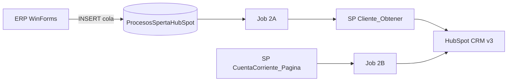

# InterfazHubSpot

[](https://dotnet.microsoft.com/)
[](https://developers.hubspot.com/docs/api/crm/understanding-the-crm)
[](https://www.microsoft.com/sql-server)
[](InterfazHubSpot.Tests.Unit/)

Integración **ERP Mastersoft → HubSpot CRM** para Calzetta: batch en segundo plano (flujos **2A** y **2B**) y consola web MVC para desarrollo y trazas.

Los datos salen de **SQL Server** (`MSGestion`) vía stored procedures. HubSpot se consume con **Private App Token** (CRM v3). No hay llamada HTTP a SpertaAPI en runtime.

---

## Flujos

| Flujo | Job | Qué hace |
|-------|-----|----------|
| **2A** | `ProcesarColaIntegracionesHubSpotJob` | Lee cola `dbo.ProcesosSpertaHubSpot`, obtiene cliente por SP y crea/actualiza company + contact en HubSpot |
| **2B** | `HubSpotSincronizarCuentaCorrienteJob` | Pagina cuenta corriente por SP y actualiza propiedad `manejo_cuenta_corriente` en batch (100 companies/página) |



---

## Inicio rápido

### Requisitos

- Windows con **Visual Studio** o **MSBuild** + **NuGet**
- **PowerShell 7+** (`pwsh`) para scripts del repo
- **SQL Server** con base `MSGestion` y scripts en `sql/` aplicados
- Token HubSpot (Private App) — **no versionar**; usar `Web.config` local

### Clonar y compilar

```powershell
git clone https://github.com/AlanLyok/InterfazHubSpot.git
cd InterfazHubSpot
copy Web.config.example Web.config
# Editar Web.config: connectionString MSGestion + HubSpot:PrivateAppToken (o UseDevelopmentMock=true en dev)

pwsh -NoProfile -File InterfazHubSpot/Scripts/agent/Build-InterfazHubSpot.ps1
pwsh -NoProfile -File InterfazHubSpot/Scripts/agent/Test-InterfazHubSpot.ps1
```

Verificación completa (build + tests + grep legacy):

```powershell
pwsh -NoProfile -File InterfazHubSpot/Scripts/agent/Verify-InterfazHubSpot.ps1
```

### Consola MVC (desarrollo)

Abrir `InterfazHubSpot.sln` en Visual Studio, ejecutar el proyecto web y usar la Home para lanzar jobs o trazas JSON (`POST /Home/ProcesarColaHubSpot`, `…TrazaCola`, `…TrazaCliente?clienteId=n`).

---

## Documentación

| Recurso | Descripción |
|---------|-------------|
| [`docs/PRD_Integracion_HubSpot_2A_2B.md`](docs/PRD_Integracion_HubSpot_2A_2B.md) | Requisitos funcionales y técnicos |
| [`docs/integracion_hubspot_mastersoft.md`](docs/integracion_hubspot_mastersoft.md) | Notas de integración |
| [`AGENTS.md`](AGENTS.md) | Guía para agentes AI / desarrolladores |
| [`CLAUDE.md`](CLAUDE.md) | Contexto de arquitectura y convenciones |

---

## Stack

| Componente | Tecnología |
|------------|------------|
| Framework | .NET Framework 4.5.2 |
| Web dev | ASP.NET MVC 5 (consola interna, sin login) |
| Batch | `InterfazHubSpot.BatchProcess` (`IScheduler`) |
| Datos ERP | EF6 + SQL Server — cola `dbo.ProcesosSpertaHubSpot` + SPs en MSGestion (`ClienteIntegracionManager`) |
| API HubSpot | HubSpot CRM v3 — Private App Token |
| Tests | xUnit (`InterfazHubSpot.Tests.Unit`, `InterfazHubSpot.IntegrationTests`) |

---

## Estructura

```
InterfazHubSpot.sln
├── InterfazHubSpot/                    # MVC
├── InterfazHubSpot.Business/           # Managers + ClienteIntegracionManager + cola integraciones
├── InterfazHubSpot.Business/HubSpot/   # Runners CRM HubSpot (2A cola + 2B cuenta corriente)
├── InterfazHubSpot.Entities/
├── InterfazHubSpot.Interfaces/
├── InterfazHubSpot.Mapping/
├── InterfazHubSpot.BatchProcess/       # IScheduler (jobs + HubSpot)
├── sql/                                # Scripts SQL (cola + SPs integración)
├── InterfazHubSpot.IntegrationTests/
└── Componentes/                      # DLL Mastersoft mínimas para compilar
```

---

## Base de datos

Ejecutar en `MSGestion` (orden sugerido):

| Script | Contenido |
|--------|-----------|
| [`sql/001_ProcesosSpertaHubSpot.sql`](sql/001_ProcesosSpertaHubSpot.sql) | Tabla cola `dbo.ProcesosSpertaHubSpot` |
| [`sql/002_USER_POS_Clientes_Agregar.sql`](sql/002_USER_POS_Clientes_Agregar.sql) | SP outbox desde ERP WinForms |
| [`sql/003_USP_Integracion_HubSpot_Cliente_Obtener.sql`](sql/003_USP_Integracion_HubSpot_Cliente_Obtener.sql) | Datos cliente para flujo 2A |
| [`sql/004_USP_Integracion_HubSpot_CuentaCorriente_Pagina.sql`](sql/004_USP_Integracion_HubSpot_CuentaCorriente_Pagina.sql) | Paginación cuenta corriente 2B |
| [`sql/005_IntegracionEjecucionLog.sql`](sql/005_IntegracionEjecucionLog.sql) | Log de ejecuciones |

Desde el ERP WinForms se insertan filas pendientes en la cola (`Destino=HubSpot`, columna `Identificador`). Detalle en el PRD § outbox.

---

## Configuración

### `connectionStrings`

Una única connection string en `Web.config` / `App.config`:

- **`MSGestion`** — ERP DB; cola, EF6 y todos los SPs de integración.

No se requiere `MSFwk`; el sitio MVC es consola interna sin autenticación.

### HubSpot (`appSettings`)

| Clave | Uso |
|--------|-----|
| `HubSpot:PrivateAppToken` | Obligatorio salvo `HubSpot:UseDevelopmentMock=true` (solo dev). **No versionar.** |
| `HubSpot:BaseUrl` | Opcional; default `https://api.hubapi.com`. |
| `HubSpot:PropertyMastersoftId` | Propiedad company para id ERP (default `mastersoft_id_`). |
| `HubSpot:PropertyManejoCuentaCorriente` | Propiedad texto CC en 2B (default `manejo_cuenta_corriente`). |
| `HubSpot:DelayMillisecondsBetweenCalls` | Pausa entre REST (default `120`). |
| `HubSpot:CuentaCorrientePageSize` | Página SP cuenta corriente (default `500`). |
| `HubSpot:UseDevelopmentMock` | Mock CRM v3 en desarrollo; no usar en producción. |

Plantilla: [`Web.config.example`](Web.config.example).

---

## Jobs (`IScheduler`)

- **`GrabarEmailError`** — Encola correo de prueba vía `EmailsManager`.
- **`ProcesarColaIntegracionesHubSpotJob`** — Flujo **2A**: cola → SP cliente → upsert HubSpot.
- **`HubSpotSincronizarCuentaCorrienteJob`** — Flujo **2B**: SP cuenta corriente → batch update companies.

Endpoints MVC útiles:

| Método | Ruta | Uso |
|--------|------|-----|
| POST | `/Home/ProcesarColaHubSpot` | Ejecutar job 2A |
| POST | `/Home/HubSpotCuentaCorrienteBatch` | Ejecutar job 2B |
| POST | `/Home/ProcesarColaHubSpotTrazaCola` | Vista previa cola (JSON) |
| POST | `/Home/ProcesarColaHubSpotTrazaCliente?clienteId=n` | Traza SP sin secretos |
| POST | `/Home/ProcesarColaHubSpotTraza` | Corrida completa 2A con pasos |

---

## Tests

| Proyecto | Rol |
|----------|-----|
| `InterfazHubSpot.Tests.Unit` | HubSpot internals (HTTP mockeado), diagnósticos, cola |
| `InterfazHubSpot.IntegrationTests` | Humo/compilación; `Category=Live` requiere BD/API real |

```powershell
pwsh -NoProfile -File InterfazHubSpot/Scripts/agent/Test-InterfazHubSpot.ps1
pwsh -NoProfile -File InterfazHubSpot/Scripts/agent/Build-InterfazHubSpot.ps1 -LibrariesOnly
```

Variables opcionales de build: `SPERTA_MSBUILD`, `MSBUILD_EXE`, `SPERTA_NUGET_EXE`.

---

## Seguridad

- **Nunca** commitear `Web.config`, `App.config` ni tokens HubSpot.
- Errores en cola 2A → estado `Error`; **no** hay reintento automático.
- Rate limit HubSpot: 120 ms entre calls; backoff en 429 (máx. 3); detener en 401.

---

## Licencia

Uso interno Calzetta / Mastersoft. Consultar al mantenedor del repositorio antes de redistribuir.
