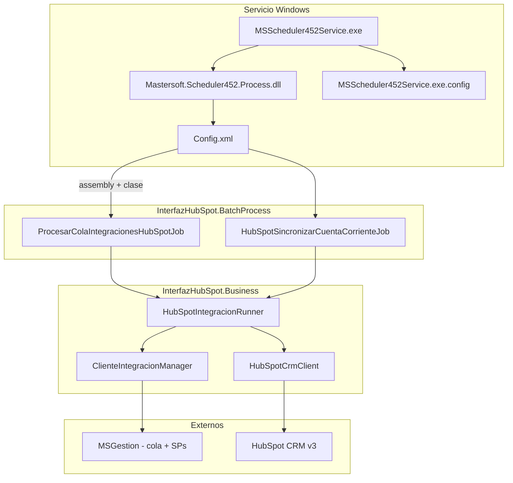

# BatchProcess InterfazHubSpot — desarrollo e implementación

Guía para entender, desarrollar y desplegar jobs batch HubSpot en InterfazHubSpot. Complementa el [PRD](PRD_Integracion_HubSpot_2A_2B.md) (qué hace cada flujo) con el **cómo** técnico del stack Mastersoft Scheduler452.

**Layout del repo:** código en [`SolucionInterfazHubSpot/`](../SolucionInterfazHubSpot/); paquete del servicio en [`implementacion/`](../implementacion/); deploy automatizado: `implementacion/Deploy-ServicioHubSpot.ps1`.

**Audiencia:** desarrolladores .NET Framework 4.5.2 y quien despliega el servicio Windows en Calzetta.

---

## 1. Explicación — arquitectura en tres capas

El batch HubSpot no es un ejecutable propio del repo. Son **tres capas** que se ensamblan en una carpeta del servidor:

| Capa | Componente | Origen | Rol |
|------|------------|--------|-----|
| **Host** | `MSScheduler452Service.exe` + `Mastersoft.Scheduler452.Process.dll` | Paquete Mastersoft (`implementacion/`) | Servicio Windows; lee `Config.xml`, programa ejecuciones, carga DLLs por reflexión |
| **Jobs** | `InterfazHubSpot.BatchProcess.dll` | Compilado en este repo | Clases que implementan `IScheduler` (2A, 2B, diagnósticos) |
| **Lógica** | `InterfazHubSpot.Business.dll` (+ Entities, Mapping, Interfaces) | Compilado en este repo | Runners HubSpot, managers, SPs MSGestion, cliente CRM v3 |



### Contrato `IScheduler`

El host Mastersoft solo conoce esta interfaz (`Mastersoft.Scheduler452.Intefaces`):

```csharp
public interface IScheduler
{
    MSContext Contexto { get; set; }
    bool Finished { get; set; }
    void Execute(XmlElement oParam, XmlElement oReturn);
}
```

En cada tick programado el host:

1. Lee `<proceso assembly="..." clase="...">` de `Config.xml`.
2. Hace `Assembly.Load` del DLL (sin extensión `.dll`).
3. Instancia la clase y asigna `Contexto` desde `<mscfg cnprefix empresaid>` + `appSettings` del `.exe.config`.
4. Invoca `Execute(oParam, oReturn)`.

La consola MVC usa **el mismo contrato** sin scheduler: instancia el job, asigna `Contexto` y llama `Execute(null, null)` (ver `HomeController.ProcesarColaHubSpot`).

### Jobs actuales

| Clase | Flujo | Programación (prod) | Descripción |
|-------|-------|---------------------|-------------|
| `ProcesarColaIntegracionesHubSpotJob` | 2A | Cada 5 min (`minutosespera="5"`) | Cola `dbo.ProcesosSpertaHubSpot` → SP 004/005 → HubSpot |
| `HubSpotSincronizarCuentaCorrienteJob` | 2B | Diario 3:00 (`horafija="3:00"`) | SP cuenta corriente → batch update companies |
| `GrabarEmailError` | — | Solo prueba manual | Encola email de prueba vía `EmailsManager` |

### Qué NO es el batch

- **`Prueba.exe`** y **`Mastersoft.Prueba.BatchProcess.dll`** son artefactos de prueba Mastersoft; **no** son el host del servicio en Calzetta. El ejecutable correcto es **`MSScheduler452Service.exe`**.
- **`Mastersoft.Procesos.BatchProcess.dll`** en `implementacion/` es plantilla de otro producto Mastersoft. **No** enlaza automáticamente con HubSpot; los procesos deben apuntar a `InterfazHubSpot.BatchProcess`.
- **`publish/bin`** es salida del **sitio MVC**, no un paquete de servicio. Sirve para extraer DLLs HubSpot, pero incluye dependencias web innecesarias.
- **`ISpertaApiClient` / jobs Sperta** en el repo son legado; el runtime productivo lee MSGestion por SP.

---

## 2. Desarrollo — crear o modificar un job

### 2.1 Estructura del proyecto

```
InterfazHubSpot.BatchProcess/
├── InterfazHubSpot.BatchProcess.csproj   # net452, referencia Scheduler452 + Business
├── ProcesarColaIntegracionesHubSpotJob.cs
├── HubSpotSincronizarCuentaCorrienteJob.cs
├── GrabarEmailError.cs                   # plantilla mínima
└── App.config.example                  # plantilla config del host
```

La lógica de negocio **no** va en el job: el job delega en `InterfazHubSpot.Business` (runners, managers). El job solo:

- Recibe `MSContext` del host.
- Llama al runner/manager.
- Captura excepciones, loguea, graba en `Errores` y notifica por email (`IntegracionErrorNotifier`).

### 2.2 Plantilla para un job nuevo

Usar `GrabarEmailError.cs` como esqueleto mínimo:

```csharp
using System.Xml;
using Mastersoft.Framework.Standard;
using Mastersoft.Scheduler452.Intefaces;

namespace InterfazHubSpot.BatchProcess
{
    public sealed class MiNuevoJob : IScheduler
    {
        public MSContext Contexto { get; set; }
        public bool Finished { get; set; }

        public void Execute(XmlElement oParam, XmlElement oReturn)
        {
            // Delegar en Business; no duplicar lógica HubSpot aquí.
        }
    }
}
```

Reglas al desarrollar:

- Namespace: `InterfazHubSpot.BatchProcess`.
- Clase `public sealed` con nombre explícito (será el valor de `clase` en `Config.xml`).
- Leer configuración con `ConfigurationManager` del **host** (`MSScheduler452Service.exe.config` / `Web.config`), no hardcodear secretos.
- Errores de cola 2A: marcar `Error` en BD; **no** reintentar automáticamente (PRD).
- Rate limit HubSpot: 120 ms entre calls; backoff 429 (máx. 3); detener en 401 (implementado en `HubSpotCrmClient`).

### 2.3 Compilar

Requisito: `Componentes/Mastersoft.Scheduler452.Intefaces.dll` (DLL real de Mastersoft; en dev puede usarse el shim de `Componentes/_shim_src/` solo para compilar localmente).

```powershell
# Librerías + BatchProcess (recomendado en iteración de jobs)
pwsh -NoProfile -File SolucionInterfazHubSpot/InterfazHubSpot/Scripts/agent/Build-InterfazHubSpot.ps1 -LibrariesOnly

# Solución completa (MVC + batch)
pwsh -NoProfile -File SolucionInterfazHubSpot/InterfazHubSpot/Scripts/agent/Build-InterfazHubSpot.ps1
```

Output del batch: `SolucionInterfazHubSpot/InterfazHubSpot.BatchProcess/bin/Release/net452/` (o `Debug`).

Tests:

```powershell
pwsh -NoProfile -File SolucionInterfazHubSpot/InterfazHubSpot/Scripts/agent/Test-InterfazHubSpot.ps1
```

### 2.4 Probar sin servicio Windows (MVC)

Antes de desplegar el servicio, validar la misma lógica desde la consola web:

| Acción | Endpoint MVC |
|--------|----------------|
| Ejecutar job 2A | `POST /Home/ProcesarColaHubSpot` |
| Ejecutar job 2B | `POST /Home/HubSpotCuentaCorrienteBatch` |
| Traza paso a paso 2A | `POST /Home/ProcesarColaHubSpotTraza` |
| Vista previa cola | `POST /Home/ProcesarColaHubSpotTrazaCola` |

Si MVC funciona con `Web.config`, el servicio funcionará con un `MSScheduler452Service.exe.config` equivalente (misma `MSGestion`, mismas claves `HubSpot:*`).

### 2.5 Registrar el job en `Config.xml`

Tras crear la clase, agregar un `<proceso>` en `implementacion/.../Config.xml`:

```xml
<proceso id="03"
         assembly="InterfazHubSpot.BatchProcess"
         clase="MiNuevoJob"
         horafija=""
         minutosespera="10"
         habilitado="true">
  <mscfg cnprefix="MSGestion" cn="" empresaid="1" />
  <parametros multitenant="N" enablelog="S" />
</proceso>
```

| Atributo | Uso |
|----------|-----|
| `assembly` | Nombre del DLL **sin** `.dll` |
| `clase` | Nombre de clase **sin** namespace (convención Mastersoft en este despliegue) |
| `minutosespera` | Intervalo en minutos si `horafija` está vacío |
| `horafija` | Hora diaria `H:mm` (ej. `3:00`); si se usa, `minutosespera` suele ir vacío |
| `habilitado` | `true` / `false` |
| `mscfg/@cnprefix` | Debe coincidir con `connectionStrings` (`MSGestion`) |
| `mscfg/@empresaid` | Debe coincidir con `appSettings/EmpresaId` |

---

## 3. Implementación — desplegar el servicio Windows

### 3.1 Carpeta objetivo

Referencia en el repo: [`implementacion/ServicioInterfazHubSpot_Implementacion/`](../implementacion/ServicioInterfazHubSpot_Implementacion/).

En el servidor, todos los archivos deben vivir **juntos** en la ruta del `binPath` de `sc create`:

```
C:\Ruta\ServicioInterfazHubSpot\
├── MSScheduler452Service.exe               # Host Windows (Mastersoft Scheduler452)
├── MSScheduler452Service.exe.config        # Config runtime (NO versionar secretos)
├── Config.xml                              # Programación de procesos
├── Mastersoft.Scheduler452.Process.dll
├── Mastersoft.Scheduler452.Intefaces.dll
├── InterfazHubSpot.BatchProcess.dll        # Desde build Release
├── InterfazHubSpot.Business.dll (+ .config)
├── InterfazHubSpot.Entities.dll
├── InterfazHubSpot.Interfaces.dll
├── InterfazHubSpot.Mapping.dll (+ .config)
├── Mastersoft.Framework.Cache.dll
├── Mastersoft.Framework.Standard.dll
├── Mastersoft.Framework.Interfaces.dll
├── Mastersoft.Framework.DataRepository.dll
├── EntityFramework.dll
├── EntityFramework.SqlServer.dll
├── Newtonsoft.Json.dll
├── Google.Authenticator.dll
└── Templates/
    └── error_template.html                 # Obligatorio para emails de error
```

### 3.2 Copiar binarios HubSpot

**Opción recomendada** — output mínimo del proyecto batch:

```powershell
$src = "SolucionInterfazHubSpot\InterfazHubSpot.BatchProcess\bin\Release\net452"
$dst = "implementacion\ServicioInterfazHubSpot_Implementacion"
# o: powershell -NoProfile -File implementacion\Deploy-ServicioHubSpot.ps1
$files = @(
  "InterfazHubSpot.BatchProcess.dll",
  "InterfazHubSpot.Business.dll",
  "InterfazHubSpot.Business.dll.config",
  "InterfazHubSpot.Entities.dll",
  "InterfazHubSpot.Interfaces.dll",
  "InterfazHubSpot.Mapping.dll",
  "InterfazHubSpot.Mapping.dll.config",
  "Mastersoft.Framework.Cache.dll",
  "Newtonsoft.Json.dll",
  "Google.Authenticator.dll"
)
foreach ($f in $files) {
  Copy-Item (Join-Path $src $f) $dst -Force
}
```

**Opción alternativa:** extraer el mismo subconjunto desde `publish/bin` (publish MVC). No copiar todo el folder: evita DLLs web (`System.Web.Mvc`, `Autofac`, `InterfazHubSpot.dll`, etc.).

**Versiones:** si un DLL Mastersoft Framework ya existe en la carpeta del servicio, preferir la del **paquete Mastersoft**; usar build del repo solo para `InterfazHubSpot.*` y NuGet (`Newtonsoft.Json`, `Google.Authenticator`, `Framework.Cache`).

### 3.3 Configurar `MSScheduler452Service.exe.config`

Plantilla sin secretos: [`implementacion/.../App.config.example`](../implementacion/ServicioInterfazHubSpot_Implementacion/App.config.example).

El archivo de config **debe llamarse igual que el exe** (`MSScheduler452Service.exe.config`). Alinear con `InterfazHubSpot/Web.config`:

| Sección | Clave | Obligatorio prod |
|---------|-------|------------------|
| `connectionStrings` | `MSGestion` | Sí |
| `appSettings` | `HubSpot:PrivateAppToken` | Sí si mock desactivado |
| `appSettings` | `HubSpot:UseDevelopmentMock` | `false` en prod |
| `appSettings` | `EmpresaId` | Sí (= `mscfg empresaid`) |
| `appSettings` | `FrameworkCNPrefix` | Recomendado (`InterfazHubSpot`) |
| `appSettings` | `EmailErrDE`, `EmailErrPara` | Recomendado (alertas de error) |
| `appSettings` | `PathLog` | Opcional (log a archivo) |

El proceso del servicio lee **su** `.exe.config`, no el config embebido en los DLL.

### 3.4 `Config.xml` de producción (HubSpot)

Configuración actual en el repo:

```xml
<msscheduler debug="true" debugstatus="false">
  <procesos>
    <proceso id="01" assembly="InterfazHubSpot.BatchProcess"
             clase="ProcesarColaIntegracionesHubSpotJob"
             minutosespera="5" habilitado="true">...</proceso>
    <proceso id="02" assembly="InterfazHubSpot.BatchProcess"
             clase="HubSpotSincronizarCuentaCorrienteJob"
             horafija="3:00" habilitado="true">...</proceso>
  </procesos>
</msscheduler>
```

`debug="true"` ayuda al primer despliegue; revisar log en `PathLog` o salida del host.

### 3.5 Instalar / actualizar el servicio Windows (Calzetta)

**Importante:** `sc create` solo **registra** el servicio; no lo inicia. Tras crear, ejecutar `sc start`.

| Estado `sc query` | Significado |
|-----------------|-------------|
| `STOPPED` + Win32 **1077** | Registrado pero nunca iniciado |
| `RUNNING` | Servicio activo, scheduler ejecutando jobs |
| `TIPO_INICIO: DEMAND_START` | Arranque manual (no sube solo al boot) |
| `TIPO_INICIO: AUTO_START` | Arranca con Windows (`start= auto` en create) |

Comandos (producción Calzetta):

```powershell
# Crear (una vez; start= auto para arranque con Windows)
sc.exe create MastersoftInterfazHubSpot binPath= "C:\MsDna\InterfazHubSpot\ServicioFinalImple\MSScheduler452Service.exe" start= auto DisplayName= "Mastersoft Interfaz HubSpot"

# Iniciar (obligatorio tras create)
sc.exe start MastersoftInterfazHubSpot

# Estado
sc.exe query MastersoftInterfazHubSpot

# Detener
sc.exe stop MastersoftInterfazHubSpot

# Eliminar y recrear (si cambió binPath)
sc.exe stop MastersoftInterfazHubSpot
sc.exe delete MastersoftInterfazHubSpot
```

Tras copiar DLLs o cambiar config:

```powershell
sc.exe stop MastersoftInterfazHubSpot
sc.exe start MastersoftInterfazHubSpot
```

Verificar:

- La cuenta del servicio (`LocalSystem` o la que configuren) puede conectar a SQL Server.
- `binPath` apunta a `MSScheduler452Service.exe` en la carpeta con **todos** los DLL, `Config.xml` y `Templates/`.

### 3.6 Plantilla de emails de error (`Templates/`)

Los errores de cola 2A/2B llaman a `IntegracionErrorNotifier` → `EmailsManager.GrabarEmailErrores` → `dbo.MSEMails_Agregar`.

La plantilla HTML se busca en:

```
{BaseDirectory}/Templates/error_template.html
```

**Desplegar obligatoriamente:**

```powershell
$dst = "C:\MsDna\InterfazHubSpot\ServicioFinalImple"
New-Item -ItemType Directory -Path "$dst\Templates" -Force
Copy-Item "SolucionInterfazHubSpot\InterfazHubSpot\Templates\error_template.html" "$dst\Templates\" -Force
```

Origen alternativo (otro batch Mastersoft): `MSProcFacturacionML\Templates\error_template.html`.

Desde v100.2.1+, si falta el archivo, `EmailsManager` usa HTML mínimo embebido (el email igual se encola). Igual conviene copiar la plantilla para el formato completo.

Claves en `MSScheduler452Service.exe.config`:

| Clave | Rol |
|-------|-----|
| `EmailErrPara` | Destinatario; si vacío, no se encola |
| `EmailErrDE` o `EmailDe` | Remitente en `MSEMails_Agregar` |

Verificar tras un error de cola:

```sql
SELECT TOP 5 Id, De, Para, Asunto, FechaAlta FROM dbo.Emails ORDER BY Id DESC;
```

### 3.7 Qué NO copiar de `MSProcFacturacionML`

Esa carpeta tiene ~150 DLL de otros productos (Ventas, Comprobantes, MVC, ActiveReports, Owin, etc.). **No** resuelven SSL/TLS ni son necesarios para HubSpot.

| Copiar | No copiar |
|--------|-----------|
| `Templates/error_template.html` | `System.Web.Mvc.dll`, `Autofac*.dll`, `BatchFacturacionML.*`, módulos Ventas/Comprobantes, etc. |

---

## 4. Verificación post-despliegue

### 4.1 Checklist de archivos

- [ ] `InterfazHubSpot.BatchProcess.dll` presente
- [ ] Dependencias listadas en §3.1 presentes
- [ ] `Config.xml` apunta a clases HubSpot (no `Mastersoft.Procesos.BatchProcess`)
- [ ] `MSScheduler452Service.exe.config` con `MSGestion` y token HubSpot
- [ ] `EmpresaId` = `mscfg empresaid`

### 4.2 Verificar carga de tipos (local)

```powershell
$dir = "implementacion\ServicioInterfazHubSpot_Implementacion"
$asm = [Reflection.Assembly]::LoadFrom("$dir\InterfazHubSpot.BatchProcess.dll")
$iface = [Reflection.Assembly]::LoadFrom("$dir\Mastersoft.Scheduler452.Intefaces.dll").GetType("Mastersoft.Scheduler452.Intefaces.IScheduler")
$job = $asm.GetType("InterfazHubSpot.BatchProcess.ProcesarColaIntegracionesHubSpotJob")
$iface.IsAssignableFrom($job)  # debe ser True
```

### 4.3 Smoke 2A (cola)

1. Confirmar fila pendiente en `dbo.ProcesosSpertaHubSpot` (`Destino = 'HubSpot'`, estado pendiente).
2. Esperar intervalo del proceso 01 (5 min) o reducir `minutosespera` temporalmente en prueba.
3. Verificar transición de estado (`Ok` / `Error`) y datos en HubSpot.

Consulta útil:

```sql
SELECT TOP 10 ProcesoId, Identificador, Estado, Destino, FechaCreacion, MensajeUltimoError
FROM dbo.ProcesosSpertaHubSpot
WHERE Destino = 'HubSpot'
ORDER BY FechaCreacion DESC;
```

### 4.4 Smoke 2B (cuenta corriente)

1. Proceso `02` con `habilitado="true"`.
2. Para prueba, ajustar `horafija` a una hora cercana o ejecutar antes vía MVC (`POST /Home/HubSpotCuentaCorrienteBatch`).
3. Verificar propiedad `manejo_cuenta_corriente` en companies HubSpot.

### 4.5 Paridad MVC ↔ servicio

| Entorno | Config | Disparo |
|---------|--------|---------|
| Desarrollo | `InterfazHubSpot/Web.config` | Botones / POST en Home |
| Producción batch | `MSScheduler452Service.exe.config` | Scheduler según `Config.xml` |

Misma lógica, distinto host. Si falla solo en servicio: comparar connection string, `EmpresaId`, token HubSpot y permisos de la cuenta del servicio.

---

## 5. Referencia rápida — errores frecuentes

| Síntoma | Causa probable | Acción |
|---------|----------------|--------|
| `Could not load file or assembly 'InterfazHubSpot.BatchProcess'` | DLL no copiado al folder del `.exe` | Copiar desde `bin/Release/net452` |
| Job no corre | `Config.xml` apunta a assembly/clase incorrectos | Usar `InterfazHubSpot.BatchProcess` + nombre de job real |
| `Configure HubSpot:PrivateAppToken` | Falta token en `.exe.config` | Completar `HubSpot:PrivateAppToken` o activar mock solo en dev |
| Error SQL / login | Connection string o permisos servicio | Alinear `MSGestion` con MVC; revisar cuenta Windows del servicio |
| 2B nunca ejecuta | `habilitado="false"` o `horafija` incorrecta | Habilitar proceso 02; validar zona horaria del servidor |
| Build sin BatchProcess | Falta `Mastersoft.Scheduler452.Intefaces.dll` en `Componentes/` | Copiar DLL Mastersoft real |
| Copié todo `publish/bin` y hay conflictos | DLLs MVC vs batch mezclados | Usar subconjunto §3.2; no sobrescribir Framework del paquete Mastersoft |
| Servicio `STOPPED` tras `sc create` | `create` no inicia el proceso | `sc start MastersoftInterfazHubSpot`; usar `start= auto` en create |
| `No se puede crear un canal seguro SSL/TLS` | Servicio sin TLS 1.2 (MVC lo pone en `Global.asax`) | Redeploy `InterfazHubSpot.Business.dll` con fix en `HubSpotCrmClient` |
| Error en cola pero sin email en `dbo.Emails` | Falta `Templates/error_template.html` o `EmailErrPara` vacío | Copiar plantilla §3.6; revisar `MSScheduler452Service.exe.config` y log `No se pudo encolar email` |

---

## 6. Documentos relacionados

| Documento | Contenido |
|-----------|-----------|
| [PRD_Integracion_HubSpot_2A_2B.md](PRD_Integracion_HubSpot_2A_2B.md) | Requisitos de negocio, cola, SPs, frecuencias |
| [README.md](../README.md) | Inicio rápido, endpoints MVC, configuración HubSpot |
| [AGENTS.md](../AGENTS.md) | Guía para agentes AI del repo |
| `InterfazHubSpot.BatchProcess/App.config.example` | Plantilla config host (genérica) |
| `implementacion/.../App.config.example` | Plantilla config `MSScheduler452Service.exe` (Calzetta) |
| `Web.config.example` | Plantilla MVC (referencia para alinear batch) |

---

## 7. Flujo de trabajo recomendado


1. Implementar o cambiar lógica en **Business**; el job solo orquesta.
2. Compilar y probar en **MVC** (trazas JSON).
3. Ejecutar **tests** unitarios.
4. Copiar DLLs Release a la carpeta del servicio.
5. Actualizar `Config.xml` si hay job nuevo o cambio de frecuencia.
6. Reiniciar servicio y validar en BD + HubSpot.
