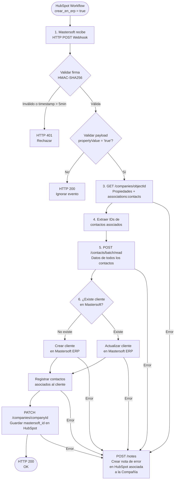

# Integración HubSpot → Mastersoft ERP
**Módulo:** Creación / Actualización de Clientes via Webhook  
**Versión:** 1.0 — Marzo 2026

---

## Diagrama de Flujo

---

## Alcance de Desarrollo — Backend Mastersoft

### 1. Endpoint receptor de webhook
HTTP POST listener expuesto hacia HubSpot. Debe responder en menos de **30 segundos** o HubSpot considera el intento fallido. Se recomienda responder HTTP 200 rápidamente y procesar el resto en **background** (worker/queue) para no bloquear la respuesta.

### 2. Validación de firma HMAC-SHA256
Middleware de seguridad que reconstruye el hash con `método + URL + body + timestamp` y lo compara contra el header `X-HubSpot-Signature-v3`. Rechaza con **HTTP 401** si no coincide o si el timestamp supera los **5 minutos** de tolerancia.

### 3. Validación del payload
Lógica de guardado simple antes de gastar llamadas a APIs externas. Verificar:
- `propertyValue === "true"`
- `propertyName === "crear_en_erp"`
- `objectId` presente y numérico
- `attemptNumber === 0` (para evitar duplicaciones en reintentos)

### 4. Consumo de API HubSpot
Tres calls HTTP salientes hacia HubSpot:
- **GET** `/companies/{objectId}?properties=...&associations=contacts` → propiedades de la compañía e IDs de contactos asociados (en un solo request)
- **POST** `/contacts/batch/read` → datos de todos los contactos en una sola llamada (batch)

### 5. Lógica de creación/actualización de cliente en Mastersoft
Lógica interna contra la propia base de datos de Mastersoft: buscar por dominio o identificador, luego **crear o actualizar** el cliente y registrar sus contactos asociados.

### 6. Escritura del ID de Mastersoft en HubSpot
Un call HTTP saliente **PATCH** a `/companies/{companyId}` para guardar el `mastersoft_id` generado, una vez que el cliente fue creado/actualizado exitosamente.

### 7. Manejo de errores con nota en HubSpot
`try/catch` global sobre todo el flujo. Si cualquier paso falla, ejecutar un **POST** a `/notes` en HubSpot para crear una nota asociada a la compañía afectada con:
- Nombre e ID de la compañía
- Acción fallida
- Motivo del error (sanitizado)
- Timestamp del fallo
- Recomendación de acción correctiva

---

## Notas Técnicas

| Aspecto | Detalle |
|---|---|
| Tipo de proceso | Event-driven (no es batch) — una ejecución por compañía |
| Rate limit HubSpot | 100 requests / 10 segundos por token |
| Timeout por request | Máximo 10s recomendado |
| Autenticación HubSpot | `Bearer {HUBSPOT_PRIVATE_APP_TOKEN}` — nunca hardcodear |
| Batch de contactos | Un solo POST agrupa todos los contactos de la compañía |
