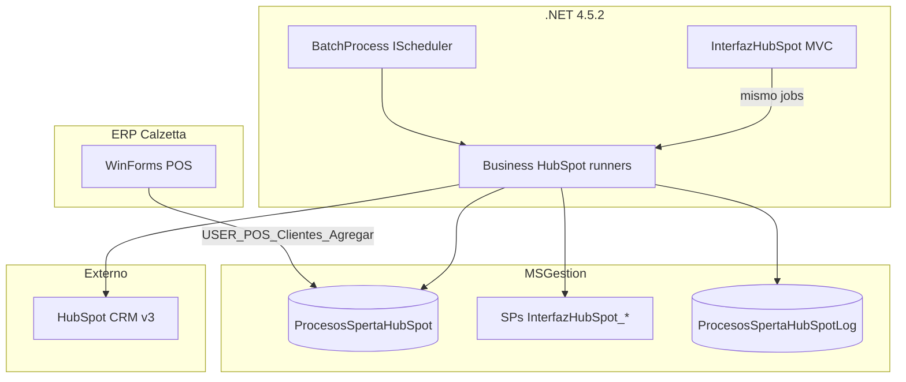

# Arquitectura — InterfazHubSpot

**Tipo:** Explanation (comprensión del sistema).  
**Detalle funcional:** [`../PRD_Integracion_HubSpot_2A_2B.md`](../PRD_Integracion_HubSpot_2A_2B.md).  
**Implementación batch/servicio:** [`../BatchProcess_Desarrollo_e_Implementacion.md`](../BatchProcess_Desarrollo_e_Implementacion.md).

---

## Propósito

Sincronizar datos de clientes ERP Mastersoft (Calzetta) hacia **HubSpot CRM v3**, leyendo **directamente MSGestion** (stored procedures + cola outbox). No hay HTTP a SpertaAPI en runtime.

Dos flujos independientes: **2A** (event-driven por cola) y **2B** (batch diario cuenta corriente). Modelo de dominio: [`dominio.md`](dominio.md). Flujos: [`flujos-2a-2b.md`](flujos-2a-2b.md).

---

## Vista de componentes

---

## Capas de la solución .NET

Dependencias **top → down** (layout Mastersoft clásico):

| Capa | Proyecto | Responsabilidad |
|------|----------|-----------------|
| Consola dev | `InterfazHubSpot` | MVC sin login; ejecuta jobs y trazas JSON |
| Jobs | `InterfazHubSpot.BatchProcess` | `IScheduler`: 2A, 2B, diagnósticos |
| Negocio | `InterfazHubSpot.Business` | Runners, managers, cola, emails, `HubSpotCrmClient` |
| Datos | `InterfazHubSpot.Entities` | EF6 sobre MSGestion |
| Contratos | `InterfazHubSpot.Interfaces` | Interfaces compartidas |
| Mapeo | `InterfazHubSpot.Mapping` | AutoMapper |

Mapa de clases: [`../reference/mapas-codigo.md`](../reference/mapas-codigo.md).

---

## Dos modos de ejecución

| Modo | Host | Uso |
|------|------|-----|
| **Desarrollo** | IIS Express / IIS + MVC | Botones Home, trazas paso a paso |
| **Producción** | `MSScheduler452Service.exe` (Windows) | Cron vía `Config.xml` |

Ambos cargan las **mismas** clases `IScheduler` y la **misma** lógica en `InterfazHubSpot.Business.dll`. El MVC instancia el job y llama `Execute(null, null)` sin scheduler.

---

## Datos: una sola base

Una connection string **`MSGestion`** en `Web.config` / `App.config`:

- Tabla cola y log de integración
- SPs de lectura cliente, contactos, cuenta corriente
- EF6 para managers auxiliares (emails, etc.)

No se requiere `MSFwk` ni multitenancy en Calzetta.

---

## Integración HubSpot

- Autenticación: **Private App Token** (`Authorization: Bearer`)
- Cliente: `HubSpotCrmClient` en `InterfazHubSpot.Business/HubSpot/`
- Mock dev: `HubSpot:UseDevelopmentMock=true` → `DevelopmentHubSpotStubHandler`

Endpoints y política HTTP: [`../reference/hubspot-crm.md`](../reference/hubspot-crm.md).

---

## Legacy (no extender)

Clases `ISpertaApiClient`, `HttpSpertaApiClient`, jobs `…Sperta…` son **andamiaje histórico**. El path productivo es SP + cola + runners HubSpot.

---

## Decisiones clave

| Decisión | Razón |
|----------|-------|
| SP directos vs SpertaAPI | Menor latencia, un solo punto SQL, alineado a despliegue Calzetta |
| Cola outbox en ERP | Desacopla WinForms del batch; reintentos controlados en batch |
| Errores 2A sin auto-retry | Evita loops; operador reclama manualmente (PRD) |
| Rate limit 120 ms + backoff 429 | Límites HubSpot; 401 fail-fast (token inválido) |
| Consola MVC sin login | Herramienta interna de operaciones/desarrollo |
