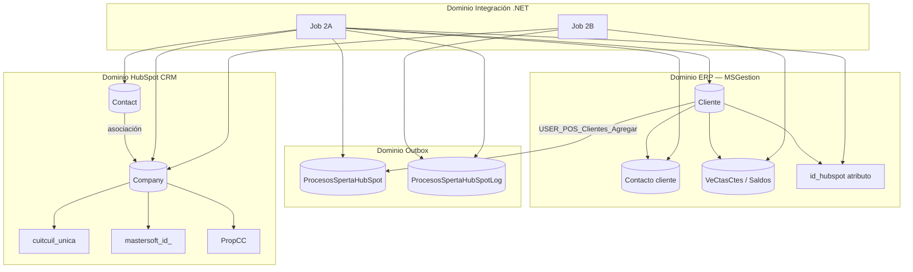

# Dominio — Integración HubSpot Calzetta

**Tipo:** Explanation (modelo de negocio y límites).  
**Flujos técnicos:** [`flujos-2a-2b.md`](flujos-2a-2b.md).  
**Contrato cola/campos:** [`../PRD_Integracion_HubSpot_2A_2B.md`](../PRD_Integracion_HubSpot_2A_2B.md).

---

## Contexto del dominio

La integración conecta el **ERP Mastersoft** (gestión de clientes y deuda) con **HubSpot CRM** (compañías y contactos comerciales). No es un ETL genérico: hay dos procesos de negocio distintos con triggers y SLAs diferentes.

| Subdominio | Responsabilidad |
|------------|-----------------|
| **Ventas / Clientes ERP** | Alta y modificación de clientes WinForms |
| **Outbox integración** | Desacoplar ERP del batch HubSpot |
| **Sincronización CRM 2A** | Reflejar cliente + contactos en HubSpot |
| **Sincronización CRM 2B** | Publicar snapshot de cuenta corriente en HubSpot |

---

## Diagrama de dominio



---

## Entidades principales

### Cliente (ERP)

- **Identificador:** `ClienteID` / `Identificador` en cola.
- **Correlación HubSpot:** propiedad `cuitcuil_unica` (NroDocumento normalizado) para búsqueda/upsert; `mastersoft_id_` informativo (ClienteId); opcionalmente `id_hubspot` persistido en ERP vía `InterfazHubSpot_Cliente_GuardarIdHubSpot`.
- **Eventos que importan:** alta, modificación (disparan outbox 2A).

### Cola outbox (`ProcesosSpertaHubSpot`)

- **Propósito:** patrón outbox — el ERP escribe; el batch consume.
- **Agregado:** fila por intención de sync (`Destino=HubSpot`, `TipoEntidad=Cliente`).
- **Estados:** `Pendiente` → `EnProceso` → `Ok` | `Error` (sin retry automático de fila en error).
- **Regla de negocio:** no duplicar fila `Pendiente` para el mismo cliente.

### Company / Contact (HubSpot)

- **Company:** representación comercial del cliente (`name`, direcciones, categoría, etc.).
- **Contact:** personas vinculadas al cliente; deduplicación por **email**.
- **2B:** company recibe texto agregado de deuda en `manejo_cuenta_corriente`.

### Cuenta corriente (vista 2B)

- No se sincroniza línea a línea como objetos CRM.
- Se **formatea** texto en SP 006 o en memoria y se envía como **una propiedad** por company.
- Paginación keyset por `ClienteID` (no carga total en memoria).

---

## Eventos y triggers

| Evento de negocio | Trigger técnico | Flujo |
|-------------------|-----------------|-------|
| Cliente creado/modificado en POS | `USER_POS_Clientes_Agregar` | 2A |
| Cron diario (ej. 03:00) | `Config.xml` → Job 2B | 2B |
| Depuración manual | POST MVC Home | 2A o 2B |

---

## Límites entre contextos

```text
┌─────────────────┐     outbox      ┌──────────────────┐     REST v3     ┌─────────────┐
│  ERP WinForms   │ ──────────────► │  InterfazHubSpot │ ──────────────► │   HubSpot   │
│  (escritura     │   solo INSERT   │  (batch + MVC)   │   Bearer PAT    │   CRM       │
│   cola)         │                 │  lectura SPs     │                 │             │
└─────────────────┘                 └──────────────────┘                 └─────────────┘
         │                                    │
         │                                    │ EF6 + SPs
         └──────────── MSGestion ─────────────┘
```

- **ERP no llama HubSpot** directamente.
- **HubSpot no escribe** en MSGestion (solo lectura SP + persistencia `id_hubspot` tras create).
- **Token HubSpot** vive solo en config batch/MVC, nunca en BD.

---

## Glosario rápido

| Término | Significado |
|---------|-------------|
| **2A** | Sync reactiva cliente → company + contacts |
| **2B** | Sync batch diaria cuenta corriente → propiedad company |
| **Identificador** | Columna cola = `ClienteID` ERP |
| **PAT** | Private App Token HubSpot |
| **Keyset pagination** | SP 006 avanza por `@Cursor` = último `ClienteID` |

---

## SPs canónicos por concepto de dominio

| Concepto | SP / componente |
|----------|-----------------|
| Encolar sync cliente | `USER_POS_Clientes_Agregar` |
| Datos company | `InterfazHubSpot_Cliente_Obtener` |
| Datos contacts | `InterfazHubSpot_Clientes_Contactos_Obtener` |
| Snapshot CC paginado | `InterfazHubSpot_CuentaCorriente_Pagina` |
| Persistir id HubSpot | `InterfazHubSpot_Cliente_GuardarIdHubSpot` (010) |
| Estado cola | `ProcesosSpertaHubSpotManager` (EF6) |

Detalle SQL: [`../reference/base-datos.md`](../reference/base-datos.md).
