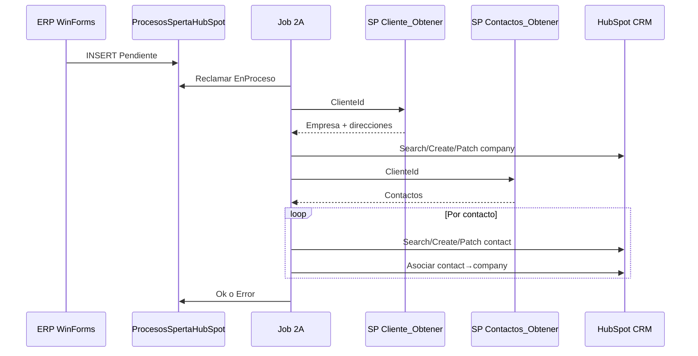
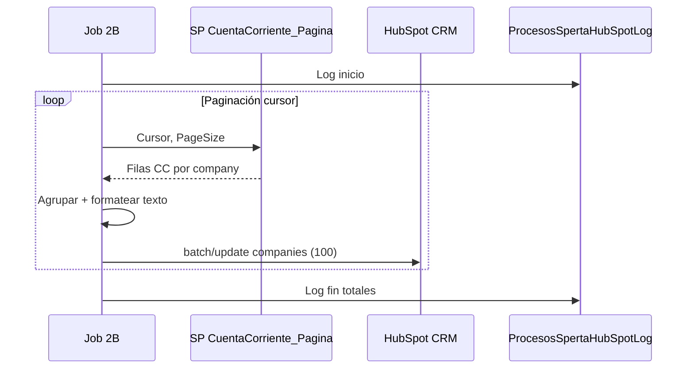

# Flujos 2A y 2B

**Tipo:** Explanation.  
**Contrato funcional completo (cola, estados, campos HubSpot):** [`../PRD_Integracion_HubSpot_2A_2B.md`](../PRD_Integracion_HubSpot_2A_2B.md).  
**Modelo de dominio:** [`dominio.md`](dominio.md).

---

## Resumen

| Flujo | Trigger | Job | Salida HubSpot |
|-------|---------|-----|----------------|
| **2A** | INSERT en cola (`Destino=HubSpot`) | `ProcesarColaIntegracionesHubSpotJob` | Company + contactos asociados |
| **2B** | Cron diario (servicio) o botón MVC | `HubSpotSincronizarCuentaCorrienteJob` | Propiedad `manejo_cuenta_corriente` en companies |

---

## Flujo 2A (cola → CRM)

**Puntos clave:**

- Identificador de fila cola: columna `Identificador` (cliente ERP).
- Búsqueda company por propiedad custom `mastersoft_id_` (configurable).
- Fallo → estado `Error` en cola; **no** reintento automático de fila (ver PRD).
- Reintentos HTTP solo para 429/5xx durante el procesamiento (ver [`../reference/hubspot-crm.md`](../reference/hubspot-crm.md)).

**SPs:** [`../reference/base-datos.md`](../reference/base-datos.md) — scripts 004, 005.

**Código:** `HubSpotIntegracionRunner` → `ClienteIntegracionManager`.

---

## Flujo 2B (cuenta corriente batch)

**Puntos clave:**

- Paginación vía SP 006 (`@Cursor`, `@PageSize`); tamaño página config `HubSpot:CuentaCorrientePageSize`.
- Updates en chunks de **100** companies por llamada batch HubSpot.
- 401 en HubSpot detiene el job y dispara email de autenticación.

**SP:** script 006. **Código:** runner 2B en `HubSpotIntegracionRunner` + `HubSpotCrmClient.BatchUpdateCompaniesAsync`.

---

## Outbox ERP → cola

El WinForms inserta vía `USER_POS_Clientes_Agregar` (script 003). Gate de despliegue: PRD §5.1 — verificar SP activo antes de renombrar tabla cola.

---

## Depuración

Trazas MVC descomponen 2A en pasos aislados: [`../how-to/debug-integracion.md`](../how-to/debug-integracion.md).
